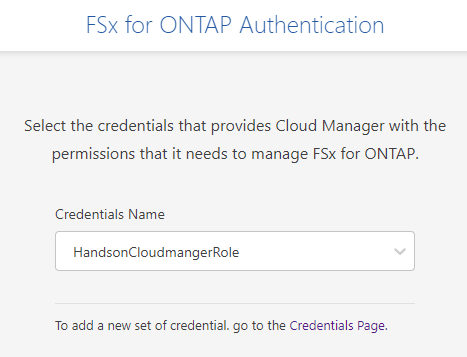
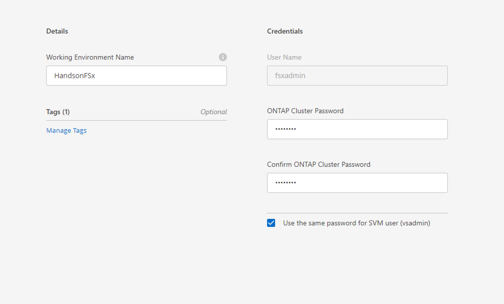
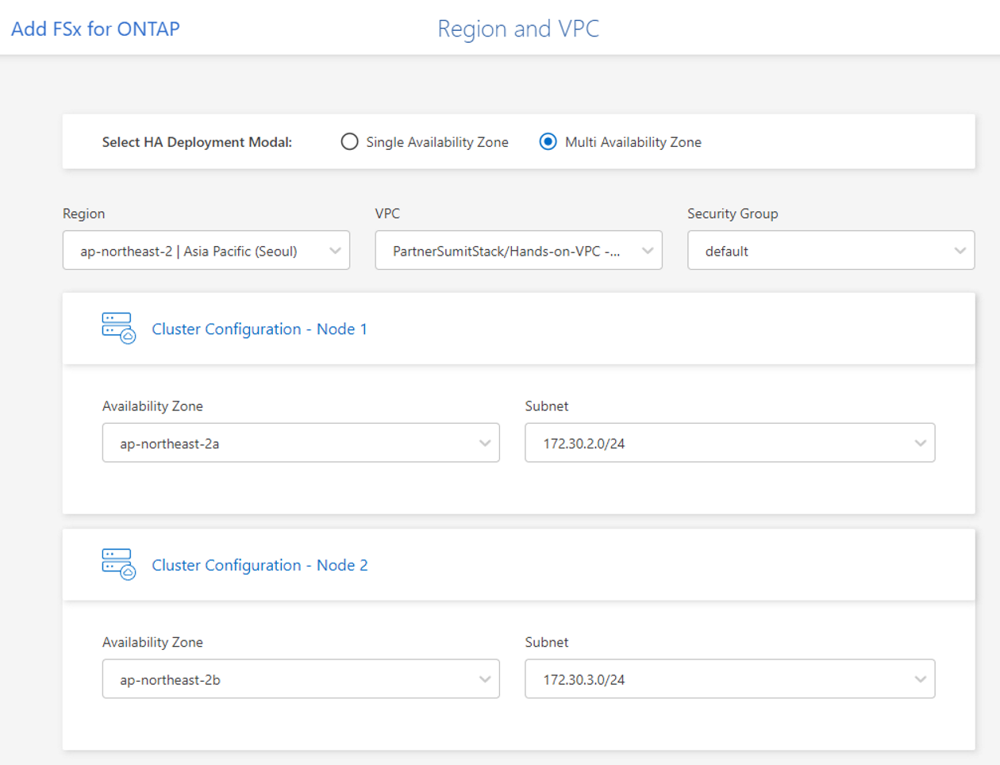
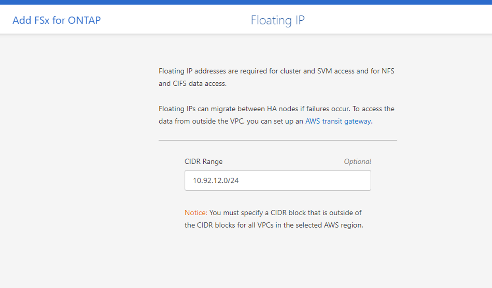
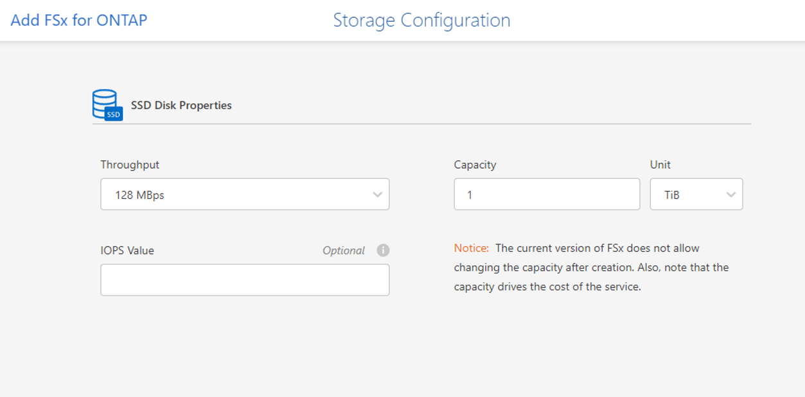

# Amazon FSx for NetApp ONTAP
Amazon FSx for NetApp ONTAP은 ONTAP의 데이터 액세스 및 관리 기능을 제공하는 AWS 클라우드 기반의 완전관리형 공유 스토리지를 제공합니다. 
 Amazon FSx for NetApp ONTAP에 대한 소개는 [README.md](./README.md) 파일을 참조합니다.
## 시작하기 전에
Cloud Manager에서 FSx for ONTAP 작업 환경을 만들기 전에 다음이 필요합니다.

- Cloud Manager에게 FSx for ONTAP 작업 환경을 생성하는 데 필요한 권한을 부여하는 IAM 역할의 ARN입니다. 자세한 내용 은 Cloud Manager에 AWS 자격 증명 추가 를 참조 하십시오.
- FSx for ONTAP 인스턴스를 생성할 지역 및 VPN 정보.

AWS Management Console에서 이미 FSx for ONTAP 파일 시스템을 생성한 경우 Cloud Manager를 사용하여 이를 검색 할 수 있습니다 .

## Cloudmanger를 통해 Amazon FSx for NetApp ONTAP 생성
1. Cloud Manager에서 새 작업 환경을 추가하고 Amazon Web Services 위치를 선택한 후 다음 을 클릭 합니다.

2. ONTAP용 Amazon FSx를 선택 하고 다음 을 클릭 합니다.
    

3. Cloud Manager에서 ONTAP용 FSx를 인증합니다.
   1. 계정에 FSx for ONTAP에 대한 올바른 AWS 권한이 있는 기존 IAM 역할이 있는 경우 드롭다운에서 선택합니다.
      - Credentials Name: HandsonCloudmanagerRole 
      

4. FSx for ONTAP 인스턴스에 대한 정보를 입력하고 다음을 클릭합니다.
   - Working Environment Name: HandsonFSx 
   - Credentials
      - User Name : fsxadmin
      - PW : Netapp1!
   - [X] Use the same password for SVM user ( vsadmin)
   

5. Region 및 VPC 정보를 입력하고 다음을 클릭합니다.
    - Select HA Deployment Modal: Multiple AZ 
    - Region: Seoul
    - Security Group : default
    - VPC : PartnerSumitStack/Hands-on-VPC
    - Node 1 AZ & subnet: ap-northeast-2a, 172.30.2.0/24
    - Node 2 AZ & subnet: ap-northeast-2b, 172.30.3.0/24
    

6. Floating IP 선택  
CIDR 범위 를 비워 두고 다음 을 클릭 하여 사용 가능한 범위를 자동으로 설정합니다. 선택적 으로 AWS Transit Gateway 를 사용하여 범위를 수동으로 구성할 수 있습니다.
    - CIDR 에 10.92.12.0/24를 입력합니다.
    

7. 유동 IP 주소에 대한 경로가 포함된 경로 테이블을 선택합니다.  
처리량 및 용량 단위를 선택합니다.( 처리량과 용량은 언제든지 변경할 수 있습니다.)
선택적으로 IOPS 값을 지정할 수 있습니다. IOPS 값을 지정하지 않으면 Cloud Manager는 입력된 총 용량의 GiB당 3IOPS를 기준으로 기본값을 설정합니다. 예를 들어 총 용량에 2000GiB를 입력하고 IOPS에 값을 입력하지 않으면 유효 IOPS 값은 6000으로 설정됩니다.
    - Throughput : 128MBps
    - IOPS Value : "Null"
    - Capacity: 1 TiB
    

10. 구성검토  
구성내용이 올바른지 검토 후 추가를 클릭하여 설정을 적용하고 작업환경을 생성합니다.
> ### Tips
> Cloudmanager Timeline 또는 AWS console에서 생성과정을 모니터링할 수 있습니다.
> 자동구성에 시간이 걸림으로 기다리지 말고 다음스탭을 수행하고 계시기 바랍니다.

## 결과
Cloud Manager는 Canvas 페이지에 FSx for ONTAP 구성을 표시합니다. 

# 다음과정
EKS 와 FSXontap을 연동하는 방법에 대해 알아봅니다. 
- 다음주제: [EKS 와 FSXontap을 연동 Trident 설치](../Trident/install_Trident.md)
- 이전주제: [Cloudmanager를 배포합니다.](./DeployCloudmanager.md)

## 참조
- [Netapp DOC creating fsx working environment](https://docs.netapp.com/us-en/cloud-manager-fsx-ontap/use/task-creating-fsx-working-environment.html)