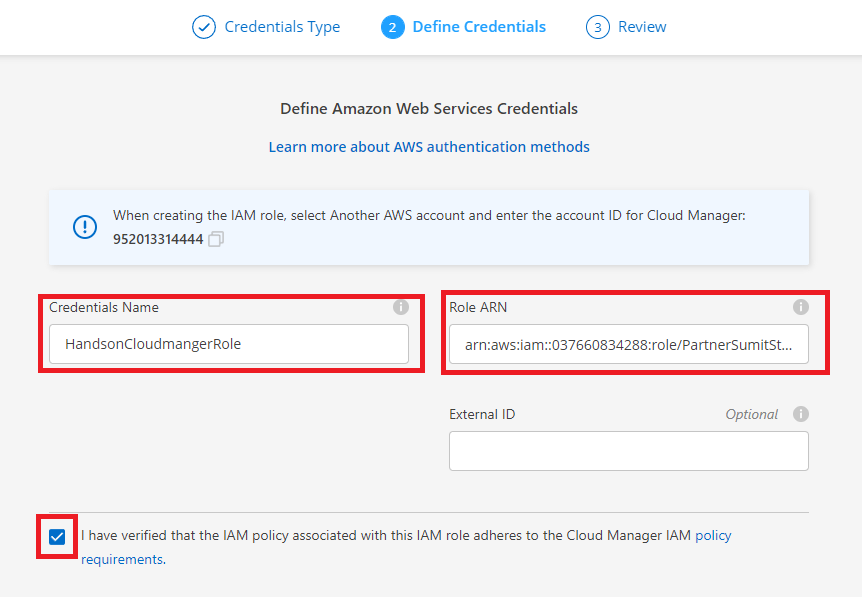
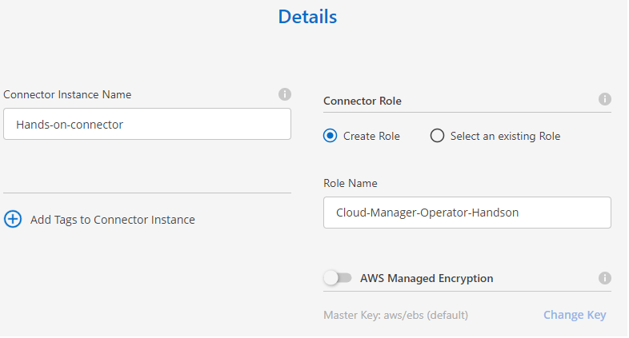
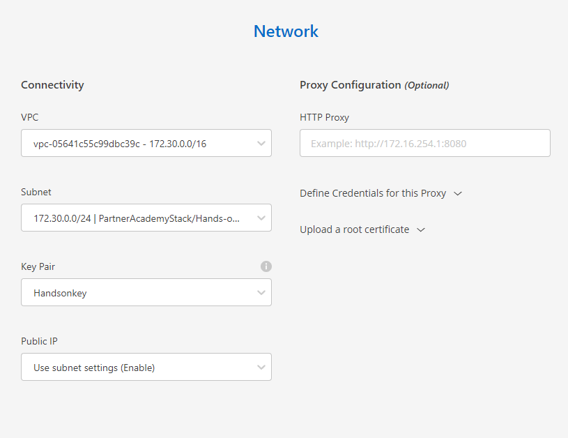
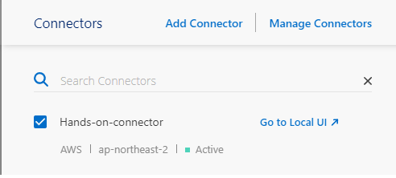

# Cloudmanager (connector) 배포
Cloud Manager를 사용하면 IT 전문가와 클라우드 설계자가 NetApp의 클라우드 솔루션을 사용하여 하이브리드 멀티 클라우드 인프라를 중앙에서 관리할 수 있습니다.

## 선행조건
- [Cloud Central](https://cloud.netapp.com/) 계정이 필요합니다.  
계정이 없으신분들은 회원가입을 해주세요   
[Sign-in Guide](https://docs.netapp.com/us-en/cloud-manager-setup-admin/task-signing-up.html)
- connector는 Cloud Central과 통신하기 위해 인터넷 연결이 필요합니다. 
- Cloud Manager는 172.17.0.0/16 및 172.18.0.0/16 범위의 IP 주소가 있는 두 개의 가상 인터페이스(VIP)로 커넥터를 배포합니다. 서브넷 CIDR이 중복되지 않도록 구성해주세요.   
자세한 확인사항은 [Getting started checklist](https://docs.netapp.com/us-en/cloud-manager-setup-admin/reference-checklist-cm.html) 문서를 확인해주세요.

## Cloudmanager 로그인
1. 웹 브라우저를 열고 https://cloudmanager.netapp.com 으로 이동합니다 .

2. NetApp Cloud Central 자격 증명을 입력하거나 NetApp으로 로그인 을 클릭 하고 NetApp 지원 사이트 자격 증명을 입력하여 로그인합니다.

3. Cloud Central에 가입할 때 사용한 옵션을 선택해야 합니다.

4. 이메일과 비밀번호를 입력하여 가입한 경우 로그인할 때마다 해당 자격 증명을 입력해야 합니다.

5. NetApp 지원 사이트 자격 증명으로 로그인하여 등록한 경우 매번 해당 로그인 옵션을 사용해야 합니다.

## 자격증명 추가
Cloudmanager(SaaS)가 connector를 배포하기 위한 자격증명을 추가합니다.

1. Cloud Manager 콘솔의 오른쪽 상단에서 설정 아이콘을 클릭하고 자격 증명 을 선택 합니다.

2. 자격 증명 추가 를 클릭 하고 마법사의 단계를 따릅니다.
    1. 자격 증명 위치 : Amazon Web Services > Cloud Manager 를 선택 합니다.
    2. 자격 증명 정의 : IAM 역할의 ARN(Amazon 리소스 이름)을 제공합니다.
        
        - Credentials Name: HandsonCloudmangerRole
        - RoleARN: PartnerAcademyStack-HandsonCloudmangerRole의 ARN 번호 (Cloudformation 스택의 리소스항목에서 확인 가능합니다.)
    3. 검토 : 새 자격 증명에 대한 세부 정보를 확인하고 **Add** 를 클릭 합니다.

## AWS connector 생성
1. 처음 작업 환경을 만드는 경우 **작업 환경 추가** 를 클릭하고 화면의 지시를 따릅니다.  
그렇지 않으면 **connector를 클릭하고 드롭다운 된 메뉴중 커넥터 추가** 를 선택합니다.

2. **Amazon Web Services** 를 클라우드 공급자로 선택 하고 **Continue**를 클릭 합니다.
    - 커넥터에는 생성 중인 작업 환경 유형 및 활성화하려는 서비스에 대한 네트워크 연결이 있어야 합니다.
    - ["Connector의 네트워킹 요구 사항에 대해 자세히 알아보십시오".](https://docs.netapp.com/ko-kr/cloud-manager-setup-admin/reference-networking-cloud-manager.html)
        * 모든 필요한 환경은 이미 자동생성되었습니다. ( ^ㅅ^👍)

3. 콘솔에 제시 된 단계에 따라 커넥터를 생성합니다.
    1. Get Ready : 필요한 것을 검토합니다.
    2. AWS Credentials 정보를 입력합니다.
        - Select the Authentication Method : Assume Role
        - Region : seoul
        - Credentials Name: HandsonCloudmanagerRole 
        > ### Tips
        > 역할을 선택 하면 커넥터 배포 마법사에서 첫 번째 자격 증명 집합을 생성할 수 있습니다.  
        > 자격 증명 페이지에서 추가 자격 증명 집합을 만들어야 합니다.  
        > 그런 다음 드롭다운 목록의 마법사에서 사용할 수 있습니다.  
        > 추가 자격 증명을 추가하는 방법을 알아보세요 .  
        > 세부 정보 : 커넥터에 대한 세부 정보를 제공합니다.  

    3. 인스턴스의 이름을 입력합니다.
        - Connector Instance Name : Hands-on-connector
        - Role Name : Cloud-Manager-Operator-Handson
        

    4. (선택)인스턴스에 사용자 정의 태그(메타데이터)를 추가합니다.

    5. Cloud Manager가 필요한 권한이 있는 새 역할을 생성하도록 **Create Role**을 선택합니다.

    6. (선택) 커넥터의 EBS 디스크를 암호화할지 여부를 선택합니다. 기본 암호화 키를 사용하거나 사용자 지정 키를 사용하는 옵션이 있습니다.

    7. 네트워크 : 인스턴스에 대한 VPC, 서브넷 및 키 페어를 지정하고, 퍼블릭 IP 주소를 활성화할지 여부를 선택하고, 선택적으로 프록시 구성을 지정합니다.
        - vpc : 172.30.0.0/16
        - subnet : 172.30.0.0/24 (**private subnet을 선택하는 경우 외부와 인터넷 통신이 가능한지 확인이 필요합니다.**)
        - Key pair : Handsonkey
        - Public IP : 기본값을 따릅니다.  
        

    8. 보안 그룹 : 새로운 보안 그룹을 생성할 것인지, 인바운드 HTTP, HTTPS, SSH 접근을 허용하는 기존 보안 그룹을 선택할 것인지 선택합니다.
        - Assign a security group: Create a new security group
        - Http : Source Type Anywhere
        - Https : Source Type Anywhere
        - ssh : Source Type Anywhere
        > ### Tips
        > 커넥터 VM을 시작하지 않는 한 커넥터로 들어오는 트래픽이 없습니다.   
        > HTTP 및 HTTPS는 드문 상황에서 사용할 로컬 UI 에 대한 액세스를 제공합니다.   
        > SSH는 문제 해결을 위해 호스트에 연결해야 하는 경우에만 필요합니다.  

    9. 검토 : 선택을 검토하여 설정이 올바른지 확인합니다.
    10. Add 를 클릭 합니다.

# 결과
인스턴스는 약 7분~15분 안에 준비됩니다.  
프로세스가 완료될 때까지 페이지에 머물러 있어야 합니다. 
 
커넥터를 생성한 동일한 AWS 계정에 Amazon S3 버킷이 있는 경우 캔버스에 Amazon S3 작업 환경이 자동으로 표시됩니다.

# 다음과정
Netapp Cloudmanager를 이용해 AWS FSXontap을 생성하는 과정에 대해 알아 봅니다. 
- 다음주제: [Create AWS FSx for ontap](../FSXforOntap/CreateFSXontap.md)
- 이전주제: [Hands on 환경을 생성합니다.](../QuickStart/CreateLabQuickstartGuide.md)

# 참조
- [ Netapp DOC Connector NW ](https://docs.netapp.com/us-en/cloud-manager-setup-admin/reference-networking-cloud-manager.html#endpoints-to-manage-resources-in-your-public-cloud-environment)
- [ Netapp DOC AWS permissions for the Connector ](https://docs.netapp.com/us-en/cloud-manager-setup-admin/reference-permissions-aws.html)