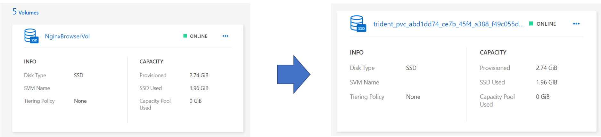
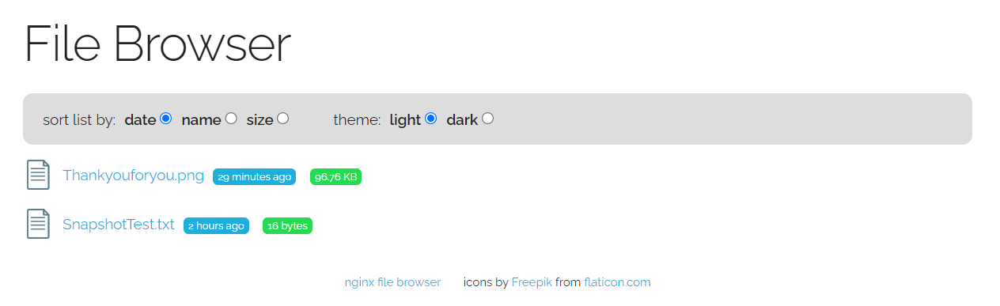

# 볼륨 가져오기
tridentctl import를 사용하여 기존 스토리지 볼륨을 Kubernetes PV로 가져올 수 있습니다.

## 볼륨 가져오기를 지원하는 드라이버

|Driver	|Release|
|-----|---|
|ontap-nas | 19.04|
|ontap-nas-flexgroup|19.04|
|solidfire-san| 19.04|
|aws-cvs | 19.04|
|azure-netapp-files | 19.04|
|gcp-cvs | 19.04|
|ontap-san| 19.04|

## 볼륨 가져오기

PVC 파일은 볼륨 가져오기 프로세스에서 기존 볼륨을 PV로 정의하는 데 사용됩니다. 다음 예와 같이 PVC 파일에는 name, namespace, accessModes 및 storageClassName 필드가 포함되어야 합니다.

1. bastionhost에서 pvc.yaml파일을 작성합니다.
    - vim import-volume-pvc.yaml
    ```yaml
    kind: PersistentVolumeClaim
    apiVersion: v1
    metadata:
      name: nginx-filebrowser-vol
      namespace: default
    spec:
      accessModes:
        - ReadWriteMany
      storageClassName: fsxontap-nas
    ```

2. tridentctl import 명령으로 볼륨을 EKS로 가져옵니다.
- $ tridentctl import volume <'backendName'> <'volumeName'> -f <'path-to-pvc-file'>
    ```bash
    [root@ ~ ]# tridentctl import volume Hands-on-fsx-svm NginxBrowserVol -f import-volume-pvc.yaml
    +------------------------------------------+---------+---------------+----------+--------------------------------------+--------+---------+
    |                   NAME                   |  SIZE   | STORAGE CLASS | PROTOCOL |             BACKEND UUID             | STATE  | MANAGED |
    +------------------------------------------+---------+---------------+----------+--------------------------------------+--------+---------+
    | pvc-abd1dd74-ce7b-45f4-a388-f49c055d5efb | 2.7 GiB | fsxontap-nas  | file     | b18968e1-9c4a-4184-bc37-19667c7e896a | online | true    |
    +------------------------------------------+---------+---------------+----------+--------------------------------------+--------+---------+
    ```
    [root@ip-172-31-0-48 trident-installer]# tridentctl import volume Hands-on-fsx-svm NginxBrowserVol -f import-volume-pvc.yaml -n trident

- 가져오기에 성공하면 Volume 이름이 'PVC-난수' 로 변경됩니다.

-  kubectl get pvc
    ```
    [root@ ~ ]# k get pvc
    NAME                 STATUS   VOLUME                                     CAPACITY   ACCESS MODES   STORAGECLASS   AGE
    nginx-filebrowser-vol   Bound    pvc-abd1dd74-ce7b-45f4-a388-f49c055d5efb   2870596Ki   RWX            fsxontap-nas   2m47s
    ```

3. NginxBrowser app에 가져온 볼륨 연결
- nginx-file-browser 정의 파일을 열고 claimName을 NginxBrowserVol으로 변경합니다.
/opt/testapp/nginx-file-browser-deployment.yaml
```yaml
apiVersion: apps/v1
kind: Deployment
metadata:
  labels:
    app: nginx-file-bro
    alb: handson-eks-alb
  name: nginx-file-bro
spec:
  replicas: 1
  selector:
    matchLabels:
      app: nginx-file-bro
  template:
    metadata:
      labels:
        app: nginx-file-bro
        alb: handson-eks-alb
    spec:
      containers:
      - image: docker.io/mohamnag/nginx-file-browser:latest
        name: nginx-file-browser
        volumeMounts:
        - mountPath: /opt/www/files
          name: fsxontap-volume

      volumes:
      - name: fsxontap-volume
        persistentVolumeClaim:
          claimName: nginx-filebrowser-vol #변경
      affinity:
        nodeAffinity:
          requiredDuringSchedulingIgnoredDuringExecution:
            nodeSelectorTerms:
            - matchExpressions:
              - operator: In
                key: owner
                values:
                - handsonadmin
```
- k apply -f /opt/DeployTestapp/nginx-file-browser/nginx-file-browser-deployment.yaml
4. 적용여부를 브라우저에서 확인합니다.
- k get ingress 명령을 통해 확인한 주소를 복사하고 브라우저에 붙여넣습니다.
```
[root@ip-172-31-0-48 trident-installer]# k get ingress
NAME           CLASS   HOSTS   ADDRESS                                                    PORTS   AGE
eksalb-nginx   alb     *       wyahn-eksalb-1256379308.ap-northeast-2.elb.amazonaws.com   80      109d
```
- 브라우저에 현재 볼륨에 있는 파일들을 확인 할 수 있습니다.

- Bastionhost에서 NFS 볼륨에 파일을 다운로드 합니다. 
```bash
[root@ ~ ]# cd /fsxontap/NginxBrowserVol/
[root@ ~ ]# wget https://netappkr-wyahn-s3.s3.ap-northeast-2.amazonaws.com/public/DeployTestapp/Thankyouforyou.png
```
- 브라우저를 새로고침하고 Thankyouforyou.png를 클릭합니다.



## 결과
기존 볼륨을 EKS에 가져와서 사용할 수 있었습니다.

# 다음과정
EKS와 fsxontap을 활용한 statfulpod 구성에 대해 알아봅니다.</br>
- 다음주제: [AWS FSxontap 활용 K8S statful pod](../FSXforOntap/K8SWithFSxOntap_Stateful.md)
- 이전주제: [Volume Backup & restore](../FSXforOntap/VolumeBackupAndRestore.md)

# 참조
- [Netapp Doc Import volumes](https://docs.netapp.com/us-en/trident-2110/trident-use/vol-import.html#how-does-the-import-work)