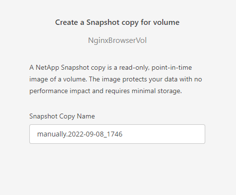
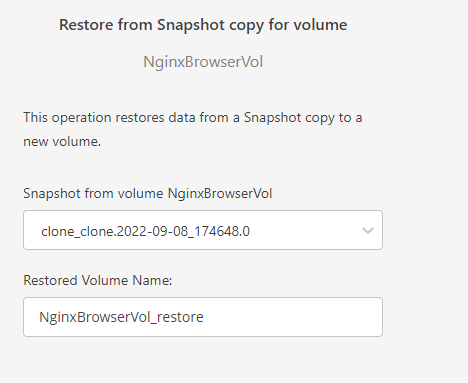

# NetApp Snapshot을 사용한 백업 및 복원
NetApp 스냅샷 복사본은 시스템 장애 또는 데이터 손실 시 복원에 사용할 수 있는 Unified Manager 데이터베이스 및 구성 파일의 시점 이미지를 생성합니다. 항상 최신 복사본을 사용할 수 있도록 ONTAP 클러스터 중 하나의 볼륨에 정기적으로 스냅샷 복사본을 기록하도록 예약합니다.

# 스냅샷 작동 방식


스냅샷을 만들면 데이터 블록에 대한 포인터가 복사되고 수정 내용이 새 데이터 위치에 기록됩니다. </br>
스냅샷 포인터는 스냅샷을 만들 때 파일이 점유한 원래 데이터 블록을 계속 가리키며 데이터에 대한 실시간 및 기록 보기를 제공합니다. </br>
새 스냅샷을 만들려는 경우 현재 포인터(즉, 가장 최근의 추가 및 수정 후에 만든 포인터)가 새 스냅샷 Snapshot2에 복사됩니다. </br>
이렇게 하면 전체 복사본 3개가 필요한 볼륨 공간을 차지하지 않고 3세대 데이터(라이브 데이터 Snapshot2및 Snapshot1연령순)에 액세스할 수 있습니다.

# 스냅샷 생성
1. 작업 환경을 엽니다.</br>

2. View Volumes 을 선택하고 볼륨 보기 화면으로 이동합니다.
3. NginxBrowserVol볼륨 카드를 찾고 ```º º º``` 선택합니다.
4. Create a Snapshot Copy를 선택합니다.
5. Create를 선택하여 스냅샷을 생성합니다.</br>

6. Bastionhost에서 볼륨에 데이터를 추가합니다.
    ```bash
    [root@ ~ ]# rm -rf /fsxontap/NginxBrowserVol/testdata-2g.csv
    [root@ ~ ]# touch /fsxontap/NginxBrowserVol/SnapshotTest.txt
    [root@ ~ ]# echo '"Hello Netapp!"' > /fsxontap/NginxBrowserVol/SnapshotTest.txt
    [root@ip-172-31-0-48 data]# ls -alh /fsxontap/NginxBrowserVol/
    합계 1G
    drwxrwxrwx 2 nobody nobody 4.0K  9월 12 07:09 .
    drwxr-xr-x 4 root   root     60  9월 12 07:19 ..
    -rw-r--r-- 1 nobody nobody   16  9월 12 07:10 SnapshotTest.txt
    -rw-r--r-- 1 nobody nobody 1.0G  9월 12 06:40 AllSameByteFile1G
    ```

# 볼륨 복원
1. 작업 환경을 엽니다.</br>

2. View Volumes 을 선택하고 볼륨 보기 화면으로 이동합니다.
3. NginxBrowserVol볼륨 카드를 찾고 ```º º º``` 선택합니다.
4. Restore from Snapshot Copy를 선택합니다.
5. 이전 생성했던 스냅샷을 선택하고 Resotre를 선택합니다.</br>

6. 복원된 볼륨을 Bastionhost에 마운트합니다.
    ```bash
    [root@ ~ ]# mkdir /fsxontap/NginxBrowserVol_restore
    [root@ ~ ]# mount 10.0.7.125:/NginxBrowserVol_restore /fsxontap/NginxBrowserVol_restore
    [root@ ~ ]# ls -alh
    [root@ip-172-31-0-48 data]# ls -alh /fsxontap/NginxBrowserVol_restore/
    합계 3.1G
    drwxrwxrwx 2 nobody nobody 4.0K  9월 12 07:09 .
    drwxr-xr-x 4 root   root     60  9월 12 07:19 ..
    -rw-r--r-- 1 nobody nobody 1.0G  9월 12 06:40 AllSameByteFile1G
    -rw-r--r-- 1 nobody nobody 2.1G  9월  8 16:38 testdata-2g.csv
    ```

## 결과
스냅샷을 통해 이전 시점으로 볼륨을 복원할 수 있었습니다.

# 다음과정
EKS에 볼륨을 등록하는 과정을 알아봅니다.</br>
- 다음주제: [Import Volume to EKS](../FSXforOntap/ImportVolumeToEKS.md)
- 이전주제: [Create Volume](../FSXforOntap/StorageEfficiency.md)

# 참조
- [Netapp Doc manage-backups-ontap](https://docs.netapp.com/us-en/cloud-manager-backup-restore/task-manage-backups-ontap.html#adding-a-new-backup-policy)
- [Netapp Doc Restoring ONTAP data from backup files](https://docs.netapp.com/us-en/cloud-manager-backup-restore/task-restore-backups-ontap.html#the-restore-dashboard)