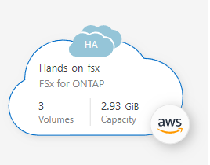

# Manage volumes for Amazon FSx for ONTAP
클라우드매니저를 통해 손쉽게 볼륨을 관리하는 방법에 대해 알아봅니다.

# 전제조건
 Cloudmanager가 배포되어 있어야 합니다. 이전세션 중 Cloudmanager 배포를 수행해주세요. 
 

# 볼륨 수정
볼륨을 생성한 후에는 언제든지 수정할 수 있습니다.

## 단계
1. 작업 환경을 엽니다. 

2. 볼륨 메뉴를 열고 편집 을 선택 합니다.
  - NFS의 경우 크기와 태그를 수정할 수 있습니다.
  - CIFS의 경우 필요에 따라 공유 이름, 사용자, 권한 및 스냅샷 정책을 수정할 수 있습니다.

3. 적용 을 클릭 합니다.

# 볼륨 복제
볼륨을 생성한 후 새 스냅샷에서 새 읽기-쓰기 볼륨을 생성할 수 있습니다.

## 단계
1. 작업 환경을 엽니다.
2. 볼륨 메뉴를 열고 복제 를 선택 합니다.
3. 복제된 볼륨의 이름을 입력합니다.
4. 복제를 클릭 합니다.

# 스냅샷 복사본 관리
스냅샷 복사본은 볼륨의 특정 시점 복사본을 제공합니다. 스냅샷 복사본을 만들고 데이터를 새 볼륨으로 복원합니다.

## 단계
1. 작업 환경을 엽니다.
2. 볼륨 메뉴를 열고 사용 가능한 옵션 중 하나를 선택하여 스냅샷 복사본을 관리합니다.
  - 스냅샷 복사본 만들기
  - 스냅샷 복사본에서 복원

3. 프롬프트에 따라 선택한 작업을 완료합니다.

# 계층화 정책(tiering policy) 변경
볼륨에 대한 계층화 정책을 변경합니다.

## 단계
1. 작업 환경을 엽니다.
2. 볼륨 메뉴를 열고 계층화 정책 변경 을 선택합니다 .
3. 새 볼륨 계층화 정책을 선택하고 변경 을 클릭 합니다.

# 데이터 복제 및 동기화
Cloud Manager를 사용하여 스토리지 환경 간에 데이터를 복제할 수 있습니다. ONTAP 복제를 위해 FSx를 구성하려면 시스템 간 데이터 복제를 참조하십시오 .
Cloud Manager에서 Cloud Sync를 사용하여 동기화 관계를 생성할 수 있습니다. 동기화 관계를 구성하려면 동기화 관계 생성 을 참조하십시오 .

# 볼륨 삭제
더 이상 필요하지 않은 볼륨을 삭제합니다.

## 시작하기 전에
Cloud Manager를 사용하여 이전에 SnapMirror 관계의 일부였던 볼륨은 삭제할 수 없습니다. SnapMirror 볼륨은 AWS Management 콘솔 또는 CLI를 사용하여 삭제해야 합니다.

## 단계
1. 작업 환경을 엽니다.
2. 볼륨 메뉴를 열고 삭제 를 선택 합니다.
3. 작업 환경 이름을 입력하고 볼륨 삭제를 확인합니다. 볼륨이 Cloud Manager에서 완전히 제거되기까지 최대 1시간이 소요될 수 있습니다.

# 참고
[Manage volumes for Amazon FSx for ONTAP](https://docs.netapp.com/us-en/cloud-manager-fsx-ontap/use/task-manage-fsx-volumes.html#edit-volumes)