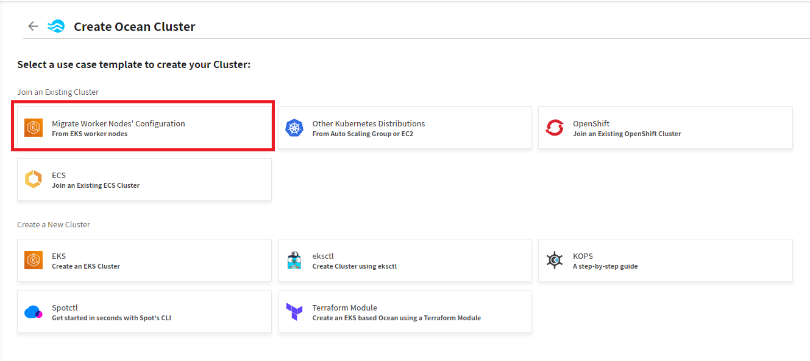
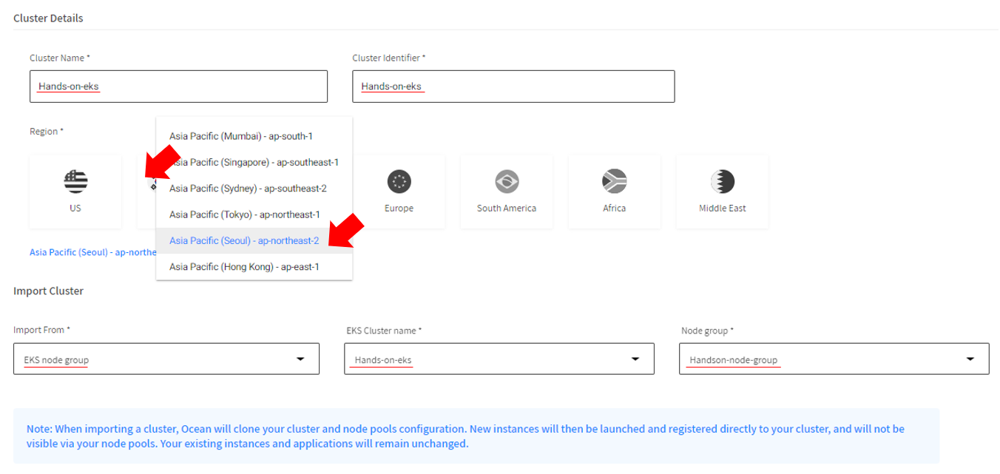
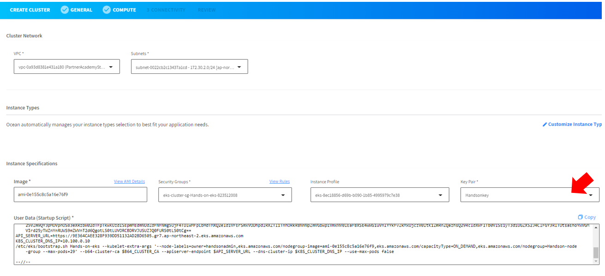
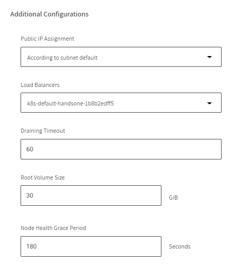
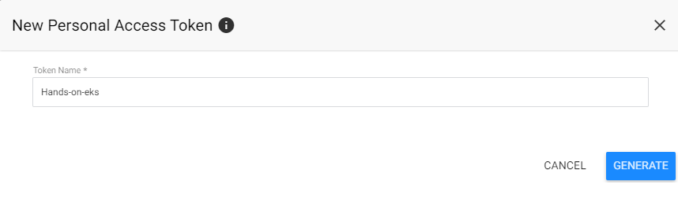
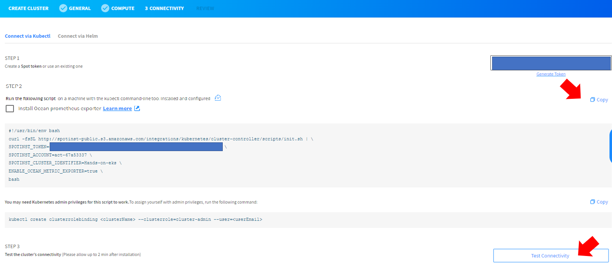

# Ocean
Ocean은 포드, 컨테이너 및 애플리케이션의 요구 사항을 충족하도록 인프라 용량과 크기를 자동으로 조정하는 Kubernetes용 관리형 인프라 서비스입니다.

이 절차에서는 스팟 콘솔 을 사용하여 기존 EKS 클러스터를 Ocean에 연결합니다.

# 전제 조건
- AWS 계정을 Spot에 연결합니다 .
- EKS 클러스터를 가동하고 실행합니다.

# 기존 EKS 클러스터 연결
1. Spot Console의 왼쪽 메뉴에서 Ocean/Cloud Clusters를 클릭하고 Create Cluster를 클릭합니다.


2. Create Ocean Cluster 페이지가 나타나면  템플릿을 선택해야 합니다. 
   - 기존 클러스터 연결에서 EKS 작업자 노드에서를 클릭합니다.
 
<!---->


## 1단계: 일반
1. 일반 페이지에서 클러스터 이름 및 클러스터 식별자를 입력하고 클러스터가 실행 중인 지역을 클릭합니다.
2. 클러스터 정보를 입력합니다. 
   - Cluster Name : Hands-on-eks
   - Cluster Identifier : Hands-on-eks
    > ### Tips
    > 가져오는 클러스터의 경우 원래 클러스터와 동일한 이름을 지정하는 것이 좋습니다. 이렇게 하면 각 시스템에서 관련 엔터티를 쉽게 식별할 수 있습니다.

3. "Import Cluster"항목에서 다음을 완료합니다. </br>
Import from: 대부분의 경우 기본값인 EKS 노드 그룹을 선택합니다. </br>
EKS Cluster Name: 선택한 지역의 클러스터 이름 목록입니다. 가져올 EKS 클러스터 이름을 선택합니다. </br>
Node Group: 선택한 클러스터의 노드 그룹 목록입니다. 선택한 노드 그룹은 생성된 가상 노드 그룹 의 기본값으로 사용됩니다. </br>
    - Import from : EKS node Group
    - EKS Cluster Name : Hands-on-eks
    - Node group : Handson-node-group </br>
    
4. 다음을 클릭합니다.

## 2단계: Computing
1. Ocean은 EKS 노드 그룹에서 컴퓨팅 구성을 가져와 컴퓨팅 페이지에 표시합니다. 필요한 경우 구성을 확인하거나 변경합니다.

- 클러스터 네트워크:
  - VPC : PartnerAcademyStack/Hands-on-vpc
  - 서브넷 : PartnerAcademyStack/Hands-on-VPC/private-subnetSubnet1,2

- 머신 유형 모든 유형은 기본적으로 Ocean에 최대한의 작업 자유를 부여하기 위해 선택됩니다. 조정이 필요한 경우 사용자 정의를 클릭합니다.
   > 기본값을 사용합니다. 변경하지 않습니다.
- 인스턴스 사양:
  - Security Groups : default
  - Instance Profile : default
  - Key Pair : "HandsonKey"
  - User Data (Startup Script) : default
   
- 고급설정  
  - LoadBalaners: K8s-default-handson-<"난수">
  - Draing Timeout: 60
  - Node Health Grace Period : null
  > #### 고급설정
  > - LoadBalaners : aws 타겟그룹이름을 선택합니다. 다중선택이 가능하며 클러스터에 노드가 배포되면 해당 그룹에 등록됩니다.
  > - Draing Timeout : 로드벨런서가 대상그룹에서 등록해제하기 전 대기하는 시간입니다.
  > - Node Health Grace Period: 노드가 시작되고 완전히 부팅되기를 기다리며 헬스체크를 미루는 시간입니다.

  

2. 다음을 클릭합니다.

## 3단계: 연결
연결 페이지는 Ocean Controller를 설치하고 Ocean SaaS와 클러스터 간의 연결을 설정하는 단계를 제공합니다. 

1. **STEP 1**의 "Generate Token"을 스팟 토큰을 생성합니다.
  - Token Name : Hands-on-eks
    > ### Tips
    > 토큰 생성 시 Ocean 이름과 동일한 이름으로 토큰을 생성하는것이 좋습니다.</br>

    

2. kubectl 명령줄 도구를 사용하여 Ocean Controller Pod를 설치합니다. </br>
**STEP 2**의 Copy 버튼을 누르고 Bastionhost에 복사된 스크립트를 붙여넣어 실행합니다. </br>
    ```bash
    [root@ ~ ]# curl -fsSL http://spotinst-public.s3.amazonaws.com/integrations/kubernetes/cluster-controller/scripts/init.sh | \
    SPOTINST_TOKEN="< your token >" \
    SPOTINST_ACCOUNT="< your account >" \
    SPOTINST_CLUSTER_IDENTIFIER=hands-on-eks \
    ENABLE_OCEAN_METRIC_EXPORTER=false \
    bash

    2022-10-04T13:04:26.856Z downloading
    2022-10-04T13:04:27.617Z rendering
    2022-10-04T13:04:27.633Z applying
    secret/spotinst-kubernetes-cluster-controller created
    configmap/spotinst-kubernetes-cluster-controller-config created
    serviceaccount/spotinst-kubernetes-cluster-controller created
    clusterrole.rbac.authorization.k8s.io/spotinst-kubernetes-cluster-controller created
    clusterrolebinding.rbac.authorization.k8s.io/spotinst-kubernetes-cluster-controller created
    deployment.apps/spotinst-kubernetes-cluster-controller created
    ```
  > ### (선택 사항) Ocean Prometheus Exporter
  > Ocean은 프로메테우스에서 수집할 수 있는 Ocean Metric을 제공합니다. </br>
  > 클러스터에 Prometheus 와 Grabhana가 설치되어 있다면 해당 체크박스를 선택합니다. </br>
  > 지금 선택하지 않아도 추후에 설치 가능합니다.

3. **STEP 3**의 "Test Connectivity"를 클릭하여 컨트롤러 기능을 확인합니다. 테스트가 완료될 때까지 약 2~5분 정도 기다립니다.
</br>

4. 다음을 클릭합니다.

## 4단계: 검토
구성한 모든 Ocean 설정을 검토합니다. </br>
**생성**을 클릭하여 완료하거나 JSON 또는 Terraform 생성 템플릿을 사용하여 다른 도구를 사용하여 Ocean 클러스터를 생성합니다.

# 결과
Ocean 생성되며 대쉬보드화면이 보입니다. </br>
Ocean은 이제 클러스터에 대해 가능한 가장 비용 효율적인 용량과 크기를 보장합니다.

# 다음과정
Ocean으로 workload migration을 진행합니다.</br>
- 다음주제: [workload migration ](./WorkloadMigration.md)
- 이전주제: [Test app 배포](../Trident/deploy_testapp.md)

# 참조
- [Migrate the Workload to Ocean](https://docs.spot.io/ocean/getting-started/eks/join-an-existing-cluster)
