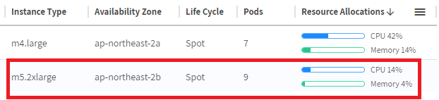
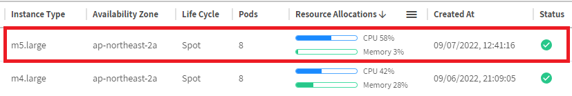

# Revert to Lower-Cost Node
확장 , 축소 및 다양한 최적화 프로세스(예: 예약 용량으로 되돌리기, Savings Plans 및 Spot으로 되돌리기) </br>
외에도 Ocean은 추가적인 지속적인 최적화 프로세스를 사용합니다 . </br>
저비용 노드로 되돌리기는 **클러스터 노드 집합에서 축소할 수 없는 컴퓨팅 리소스가 충분히 활용되지 않는 노드에 적용되는 프로세스**입니다.

사전 예방적 비용 최적화 프로세스는 다음과 같은 Ocean의 기존 최적화 프로세스와 함께 실행됩니다.

- RI 또는 ​​Savings Plan 프로세스로 되돌리기 - Ocean은 계정에서 사용 가능한 RI 또는 ​​Savings Plan을 지속적으로 모니터링합니다(strategy.utilizeReservedInstances 또는 activateCommitments 플래그가 활성화된 경우). </br>
스팟 또는 OD로 실행되는 Ocean 모니터링 노드가 있는 경우 Ocean은 이를 사용 가능한 RI 또는 ​​Savings Plan 노드로 교체하려고 시도합니다.

- 스팟으로 되돌리기 프로세스 - 시장에 사용 가능한 스팟 노드가 없기 때문에 노드가 주문형으로 시작된 경우 Ocean은 사용 가능한 스팟 노드에 대해 시장을 계속 스캔하고 사용 가능한 스팟 노드가 있는 즉시 되돌립니다.

# 작동 원리
Ocean은 클러스터의 노드 활용도를 지속적으로 스캔합니다. 저비용 노드 최적화 프로세스로 되돌리기 는 다음 조건이 모두 충족 될 때 적용됩니다.

- 특정 VNG에서 지난 30분 동안 확장 이벤트가 발생하지 않았습니다(확장 또는 축소 이벤트 없음).
- CPU 및 메모리 사용량이 50% 미만 이거나 GPU 사용량이 50% 미만입니다.
- 노드가 최소 10분 동안 충분히 활용되지 않았습니다.
- 노드 수명 주기는 스팟 인스턴스입니다.
- 관련 VNG에서 진행 중인 교체가 없습니다.
- 실행 중인 인스턴스 유형보다 작은 인스턴스 유형이 구성에 구성됩니다.

더 자세한 내용은 [revert-to-lower-cost-node](https://docs.spot.io/ocean/features/revert-to-lower-cost-node?id=revert-to-lower-cost-node) 에서 확인 할 수 있습니다.

# 실습
- 설정된 VNG에 2개의 2xlarge 타입만 실행되며 cpu 및 메모리 사용량이 50%가 넘지 않도록 설정합니다.
1. VNG 최소용량 값을 2로 수정합니다.
2. workload들의 리소스 할당을 최소로 설정합니다.
- ngrinder-agent.yaml, nginx-file-browser.yaml 파일을 수정 후 k apply 명령을 통해 적용합니다.
    - replica=1
    - resource 구문 삭제
3. VNG 인스턴스 타입에 m5.2xlarge, m4.2xlarge 타입만 선택 합니다.
4. 노드를 자동 또는 수동으로 교체합니다.</br>
노드 교체가 완료되었다면 두개의 노드만 실행되며 CPU 및 메모리 사용율이 50% 미만상태가 됩니다.

5. VNG의 인스턴스 타입을 아래와 같이 변경합니다.
    - m4.large
    - m4.xlarge
    - m4.2xlarge
    - m5.large
    - m5.xlarge
    - m5.2xlarge
    - t3.large
    - t2.large
6. Ocean에서 적은 비용되돌리기가 발생할 떄 까지 기다립니다.
> 이 프로세스는 최소 10분이상의 대기시간을 필요로 합니다. 여기서 대기하지 마시고 다음 단계를 진행하고 계시기 바랍니다.

# 결과 
- Ocean이 더 저렴한 노드로 인스턴스를 변경했습니다.

- 이력 확인
    ```log
    07/09/2022, 12:44:12 PM	WARN	Can't scale down nodes from Virtual Node Groups: [eks-Handson-vng (ols-fdb135c4)]. These Virtual Node Groups have reached the minimum capacity
    07/09/2022, 12:43:13 PM	INFO	Instances: [i-08d65cb6b5d6f953f (ip-172-30-3-237.ap-northeast-2.compute.internal)] have been detached. Reason: Replacement of type 'Revert to lower cost node' has finished
    07/09/2022, 12:43:12 PM	INFO	Instances i-08d65cb6b5d6f953f was successfully deregistered from TARGET_GROUP Load Balancer: k8s-default-handsone-1b8b2edff5
    07/09/2022, 12:41:58 PM	INFO	Instance [i-0726dcb35dc8da7dd] successfully registered to load balancer: k8s-default-handsone-1b8b2edff5
    07/09/2022, 12:41:18 PM	INFO	Instances: [i-0726dcb35dc8da7dd] have been launched. Reason: Replacement of type 'Revert to lower cost node'
    07/09/2022, 12:40:05 PM	INFO	Revert to lower cost node: Replacing instance(s) i-08d65cb6b5d6f953f (ip-172-30-3-237.ap-northeast-2.compute.internal). Reason: Unable to perform scale down, trying to replace with cheaper instance.
    ```
# 다음과정
AWS FSx ontap의 볼륨 생성하는 과정을 알아봅니다.</br>
- 다음주제: [CreateVolume](../FSXforOntap/CreateVolume.md)
- 추가주제: [Cost Anlaysis](../OceanforEKS/CostAnalysis.md)
- 이전주제: [Headroom](../OceanforEKS/Headroom.md)

# 참조
- [revert-to-lower-cost-node](https://docs.spot.io/ocean/features/revert-to-lower-cost-node?id=revert-to-lower-cost-node)