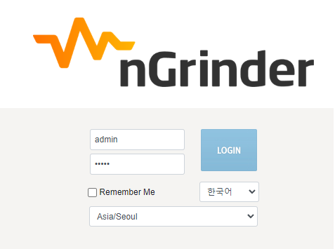
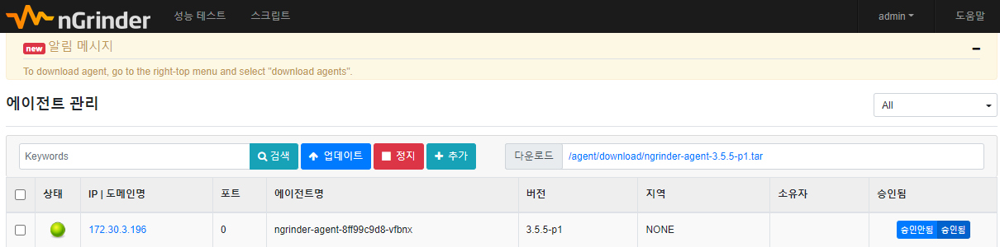
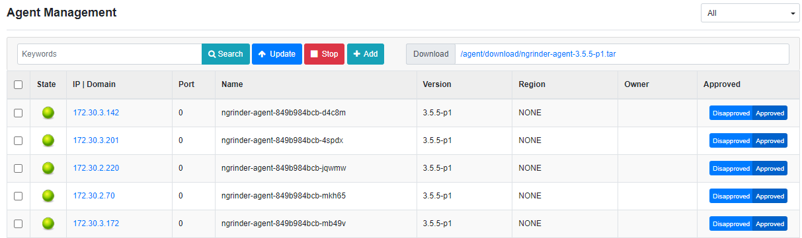
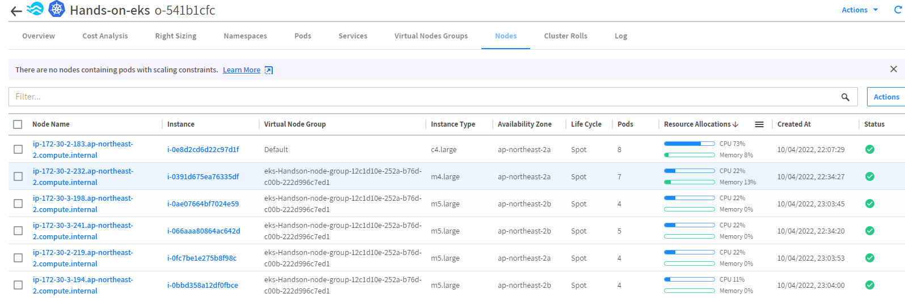
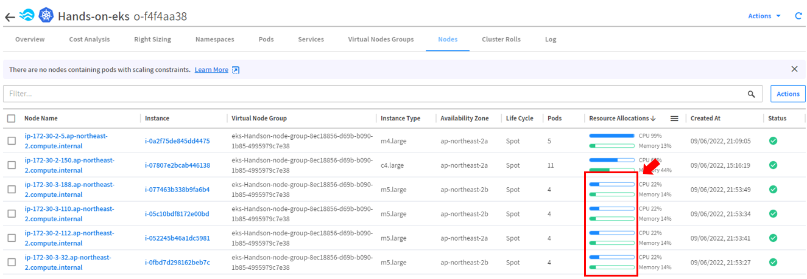
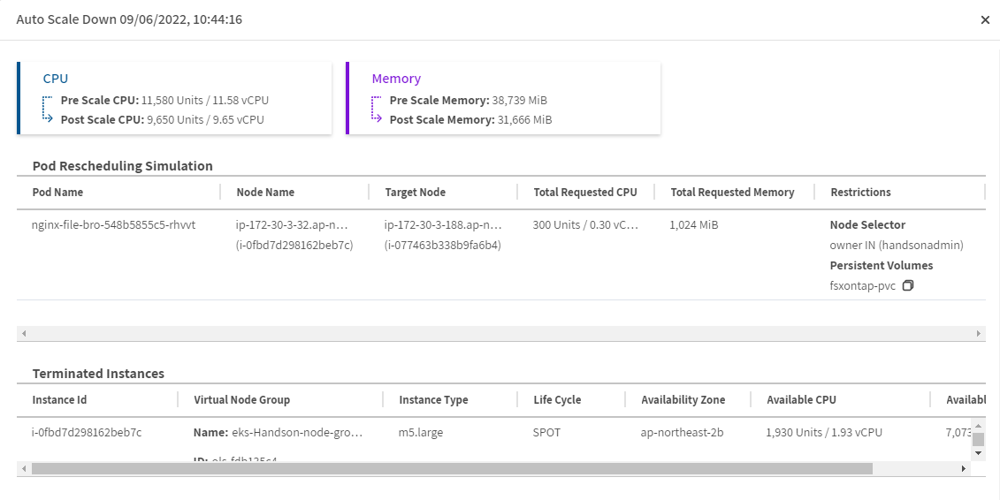
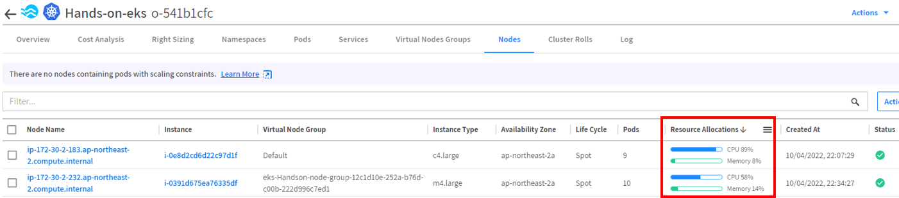

# 확장과 축소(Kubernetes)
Kubernetes 클러스터에 대한 Ocean의 포드 기반 확장은 세 가지 주요 목표를 제공합니다.

- 리소스 부족으로 인해 현재 노드에서 실행에 실패한 포드를 예약합니다.
- 빈번한 확장 포드가 인스턴스가 시작될 때까지 기다릴 필요가 없도록 합니다(자세한 내용은 헤드룸 섹션 참조).
- 클러스터 리소스가 최적으로 활용되는지 확인합니다.

## 확장
Ocean이 클러스터의 Pending job을 감지하여 일어납니다.

## 축소
Ocean은 활용도가 낮은 노드를 사전에 식별 하고 노드의 포드를 보다 효율적으로 빈 포장 하여 노드를 축소하고 클러스터 비용을 줄일 수 있습니다.


자세한 설명은 [Scaling](https://docs.spot.io/ocean/features/scaling-kubernetes?id=scaling-kubernetes) 문서를 참조합니다.

# 스케일링
Pendding event 감지 시 요구사항 많큼 노드가 증가하는지 확인합니다.

1. ngrinder 앱을 배포합니다. 
    ```bash
    kubectl create ns ngrinder
    ```
    ```bash
    kubectl apply -f /opt/DeployTestapp/ngrinder/ngrinder-controller.yaml
    ```
    ```bash
    k apply -f /opt/DeployTestapp/ngrinder/ngrinder-AwsNLB-svc.yaml
    ```
    ```bash
    kubectl apply -f /opt/DeployTestapp/ngrinder/ngrinder-agent.yaml
    ```
    ```bash
    kubectl get svc -n ngrinder 
    ```
    ```
    [root@ip-172-30-0-23 ngrinder]# kubectl get svc -n ngrinder
    NAME       TYPE           CLUSTER-IP     EXTERNAL-IP                                                                          PORT(S)                                                                                                                                                                                        AGE
    ngrinder   LoadBalancer   10.100.139.125   k8s-ngrinder-ngrinder-f6331fdbc5-d5291cec4f3282d2.elb.ap-northeast-2.amazonaws.com   80:30729/TCP,16001:30869/TCP,12000:30484/TCP,12001:31649/TCP,12002:31813/TCP,12003:32007/TCP,12004:30469/TCP,12005:30809/TCP,12006:31784/TCP,12007:31850/TCP,12008:32335/TCP,12009:31423/TCP   87m
    ```
2. EXTERNAL-IP 출력된 도메인으로 접속 시 ngrinder 서비스가 보입니다. 로그인합니다..</br>
    - ID : admin
    - PW : admin</br>
    
      
3. 오른쪽 상단 admin 을 드롭다운 하여 "에이전트 관리" 를 선택합니다.
    - 수분 후 agent 한개가 구동되는것이 확인됩니다.
    
4. BastionHost 에서 Scale up 명령을 시도합니다.
    ```bash
    kubectl scale --replicas=5 deployment ngrinder-agent -n ngrinder
    ```
    - Ocean web console에서 Node가 증가 하였는지 확인합니다.
    - ngrinder "에이전트 관리" 화면에서 agent가 증가하였는지 확인합니다.
    
    - kubectl 명령을 통해 node 수를 확인합니다.
      ```bash
      kubectl get node -o custom-columns=NodeName:metadata.name,labels:metadata.labels.owner,STATUS:status.conditions[3].type,AGE:status.conditions[3].lastTransitionTime
      ```
      ```bash
      [root@ip-172-30-0-23 ~]# kubectl get node -o custom-columns=NodeName:metadata.name,labels:metadata.labels.owner,STATUS:status.conditions[3].type,AGE:status.conditions[3].lastTransitionTime
      NodeName                                          labels         STATUS   AGE
      ip-172-30-2-112.ap-northeast-2.compute.internal   handsonadmin   Ready    2022-09-06T12:54:39Z
      ip-172-30-2-150.ap-northeast-2.compute.internal   handsonadmin   Ready    2022-09-06T06:17:36Z
      ip-172-30-2-5.ap-northeast-2.compute.internal     handsonadmin   Ready    2022-09-06T12:10:50Z
      ip-172-30-3-110.ap-northeast-2.compute.internal   handsonadmin   Ready    2022-09-06T12:54:35Z
      ip-172-30-3-188.ap-northeast-2.compute.internal   handsonadmin   Ready    2022-09-06T12:54:36Z
      ip-172-30-3-32.ap-northeast-2.compute.internal    handsonadmin   Ready    2022-09-06T12:54:28Z
      ```
5. ngrinder agent App의 스팩을 "cpu:1500m"에서 "cpu:300m"으로 수정합니다.
    ```bash
    vim /opt/DeployTestapp/ngrinder/ngrinder-agent.yaml
    ```
    ```yaml
    apiVersion: apps/v1
    kind: Deployment
    metadata:
      name: ngrinder-agent
      namespace: ngrinder
    spec:
      replicas: 5
      selector:
        matchLabels:
          app: ngrinder
          tier: middle
      template:
        metadata:
          labels:
            app: ngrinder
            tier: middle
        spec:
          containers:
          - name: ngrinder-agent
            image: ngrinder/agent:latest
            #imagePullPolicy: Always
            resources:
              requests:
                cpu: 300m #1500m -> 300m 으로 수정
            args:
            - "ngrinder.ngrinder.svc.cluster.local:80"
          affinity:
            nodeAffinity:
              requiredDuringSchedulingIgnoredDuringExecution:
                nodeSelectorTerms:
                - matchExpressions:
                  - operator: In
                    key: owner
                    values:
                    - handsonadmin
    ```
6. 수정된 내용을 적용합니다.
    ```bash
    kubectl apply -f /opt/DeployTestapp/ngrinder/ngrinder-agent.yaml
    ```
    ### 노드의 cpu memory 자원 사용율이 줄어든것이 확인됩니다.
    
    
    > ### 경고!
    > 배포 순서를 지키지 않거나 서로 다른 성능의 노드가 배포되도록 허용하였다면 Pod가 균일하게 배포되지 않은 상태일 수 있습니다.
    > 이 문제의 경우 [Pod Topology Spread Constraints](https://docs.spot.io/ocean/features/scaling-kubernetes?id=pod-topology-spread-constraints) 항목을 참조하여 각 노드에 균일하게 배포될 수 있도록 설정합니다.
    
7. 수분 뒤 노드가 스케일인 되는것이 확인됩니다.
    
    > 빈패킹 프로세스 과정은 조건에 따라 수분이상 걸립니다.</br>
    > 기다리지 마시고 다음과정을 진행하면서 확인하시기 바랍니다.
    > 

# 결과
- Ocean은 Cluster의 Request를 감지하고 자동으로 Scaling 동작을 수행하는것을 확인했습니다.
- binpacking 프로세스를 활용하여 비용 효율적인 컴퓨팅 활용하는 과정을 확인했습니다.
    
    
# 다음과정
헤드룸에 대해 알아봅니다.</br>
- 다음주제: [Headroom](./Headroom.md)
- 이전주제: [Workload Migration](./WorkloadMigration.md)

# 참조
- [Scaling (Kubernetes)](https://docs.spot.io/ocean/features/scaling-kubernetes)
- [aws-load-balancer-controller/v2.4/guide](https://kubernetes-sigs.github.io/aws-load-balancer-controller/v2.4/guide/service/annotations/)