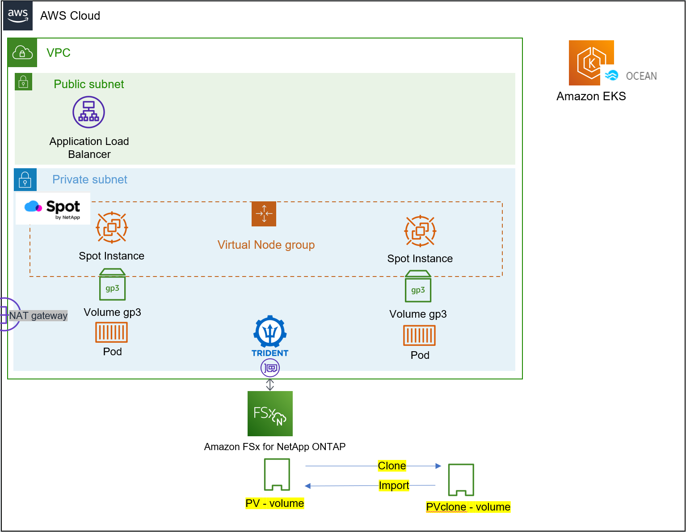

# 2022 Partner Academy Cloud Hands-on
본 과정에서는 Spot Ocean과 AWS FSx for ontap을 이용하여 다양한 서비스들을 배포하고 설정합니다.
이 과정에서 이용할 수 있는 솔루션의 기능에 대해 소개합니다.

## Hands-on 구성

- AWS EKS 환경에서 Netapp의 Spot FSxontap 구성을 활용하여 여러가지 어플리케이션을 배포하고 활용하는 예제입니다.
- Spot Ocean을 활용하여 EKS 환경에서의 컴퓨팅 비용절감에 대해 확인합니다.
- AWS FSx ontap을 통해 EKS로 배포되는 어플리케이션들의 데이터를 관리하고 사용하는 과정을 보여줍니다. 

# 절차
1. [Create Lab Quickstart Guide](./QuickStart/CreateLabQuickstartGuide.md)
2. [Deploy Cloudmanager](./FSXforOntap/DeployCloudmanager.md)
3. [Create FSX on Cloudmanager](./FSXforOntap/CreateFSXontap.md)
4. [Install Trident](./Trident/install_Trident.md)
5. [Deploy testapp](./Trident/deploy_testapp.md)
6. [Connecting Ocean to EKS](./OceanforEKS/ConnectAnEKSCluster.md)
7. [Workload Migrataion EKS to ocean](./OceanforEKS/WorkloadMigration.md) 
8. [Ocean Features & Concept](https://docs.spot.io/ocean/features/) 
  8-1. [Scaling event](./OceanforEKS/ScalingEvent.md) 
  8-2. [Headroom](./OceanforEKS/Headroom.md) 
  8-3. [Revert to Lower-Cost Node](./OceanforEKS/ReverttoLowerCostNdoe.md) 
  **번외** 
  8-4. [Cost Analysis](./OceanforEKS/CostAnalysis.md) 
  8-5. [Right Sizing](./OceanforEKS/RightSizing.md) 
9. [AWS FSx for ontap](./FSXforOntap/README.md) 
  9-1. [Create Volume](./FSXforOntap/CreateVolume.md) 
  9-2. [Storage Efficiency](./FSXforOntap/StorageEfficiency.md) 
  9-3. [Volume Backup & restore](./FSXforOntap/VolumeBackupAndRestore.md) 
  9-4. [Import volume to EKS](./FSXforOntap/ImportVolumeToEKS.md)  
  **번외** 
  9-5. [stateful pod](./FSXforOntap/K8SWithFSxOntap_Stateful.md)
 
    

    