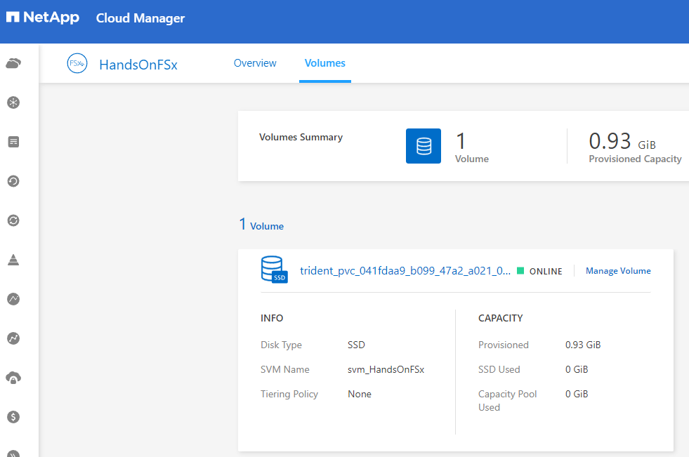
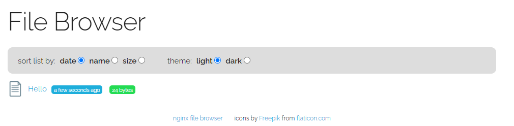

# Hands-on 에 사용할 app을 배포합니다.
1. 파일을 순서대로 작성 후 적용합니다. 
2. kubectl apply -f <작성한 파일이름>
3. 해당 파일은 bastionhost 서버의 /opt/DeployTestapp/에 다운로드 되어 있습니다.
    ```bash
    cd /opt/DeployTestapp/nginx-file-browser
    cd /opt/DeployTestapp/volume
    ```
## TEST APP 정의
### Storage Class
fsxontap-sc.yaml
```yaml
apiVersion: storage.k8s.io/v1
kind: StorageClass
metadata:
  name: fsxontap-nas
provisioner: csi.trident.netapp.io
reclaimPolicy: "Delete"
volumeBindingMode: "Immediate"
parameters:
  backendType: "ontap-nas"
  provisioningType: "thin"
```
```bash
kubectl get sc
```
```bash
[root@ip-172-30-0-29 ~]# kubectl get sc
NAME            PROVISIONER             RECLAIMPOLICY   VOLUMEBINDINGMODE      ALLOWVOLUMEEXPANSION   AGE
fsxontap-nas    csi.trident.netapp.io   Delete          Immediate              false                  10d
gp2 (default)   kubernetes.io/aws-ebs   Delete          WaitForFirstConsumer   false                  10d
```
### PVC
fsxontap-pvc.yaml 
```yaml
apiVersion: v1
kind: PersistentVolumeClaim
metadata:
  name: fsxontap-pvc
  namespace: default
spec:
  accessModes:
    - ReadWriteMany
  resources:
    requests:
      storage: 1G
  storageClassName: fsxontap-nas
```
```bash
kubectl get pvc -o wide
```
```bash
[root@ip-172-30-0-29 ~]# kubectl get pvc -o wide
NAME                    STATUS   VOLUME                                     CAPACITY   ACCESS MODES   STORAGECLASS   AGE   VOLUMEMODE
fsxontap-pvc            Bound    pvc-0b4ffe6d-dbb5-4c02-98ac-74e758e2b9c6   1G         RWX            fsxontap-nas   10d   Filesystem
nginx-filebrowser-vol   Bound    pvc-b7c39f99-49bc-4562-bb9b-6f970d10e70e   2Gi        RWO            fsxontap-nas   9d    Filesystem
```
### deployment
nginx-file-browser-deployment.yaml
```yaml
apiVersion: apps/v1
kind: Deployment
metadata:
  labels:
    app: nginx-file-bro
    alb: handson-eks-alb
  name: nginx-file-bro
spec:
  replicas: 1
  selector:
    matchLabels:
      app: nginx-file-bro
  template:
    metadata:
      labels:
        app: nginx-file-bro
        alb: handson-eks-alb
    spec:
      containers:
      - image: docker.io/mohamnag/nginx-file-browser:latest
        name: nginx-file-browser
        volumeMounts:
        - mountPath: /opt/www/files
          name: fsxontap-volume

      volumes:
      - name: fsxontap-volume
        persistentVolumeClaim:
          claimName: fsxontap-pvc
      affinity:
        nodeAffinity:
          requiredDuringSchedulingIgnoredDuringExecution:
            nodeSelectorTerms:
            - matchExpressions:
              - operator: In
                key: owner
                values:
                - handsonadmin
```
```bash
kubectl get deployment -o wide
```
```bash
[root@ip-172-30-0-124 nginx-file-browser]# k get deployment -o wide
NAME             READY   UP-TO-DATE   AVAILABLE   AGE   CONTAINERS           IMAGES                                         SELECTOR
nginx-file-bro   1/1     1            1           49s   nginx-file-browser   docker.io/mohamnag/nginx-file-browser:latest   app=nginx-file-bro
```
### service
nginx-file-browser-service.yaml
```yaml
apiVersion: v1
kind: Service
metadata:
  name: handson-eks-alb
  namespace: default
spec:
  ports:
    - port: 80
      targetPort: 80
      protocol: TCP
  type: NodePort
  selector:
    app: nginx-file-bro
```
```
kubectl get svc -o wide
```
```bash
[root@ip-172-30-0-29 ~]# kubectl get svc -o wide
NAME              TYPE        CLUSTER-IP      EXTERNAL-IP   PORT(S)        AGE   SELECTOR
handson-eks-alb   NodePort    10.100.34.181   <none>        80:32085/TCP   10d   app=nginx-file-bro
kubernetes        ClusterIP   10.100.0.1      <none>        443/TCP        10d   <none>
```
### ingress
nginx-file-browser-ingress.yaml
```yaml
apiVersion: networking.k8s.io/v1
kind: Ingress
metadata:
  annotations:
    alb.ingress.kubernetes.io/group.name: nginx
    alb.ingress.kubernetes.io/load-balancer-name: handson-eks-alb
    alb.ingress.kubernetes.io/scheme: internet-facing
    alb.ingress.kubernetes.io/tags: Name=handson-eks-alb,owner=handsonadmin
    alb.ingress.kubernetes.io/target-type: instance
  name: handson-eks-alb
  namespace: default
spec:
  ingressClassName: alb
  rules:
  - http:
      paths:
      - backend:
          service:
            name: handson-eks-alb
            port:
              number: 80
        path: /
        pathType: Prefix
```
```
kubectl get ingress
```
3. Cloudmanager 콘솔에서 볼륨이 생성되어 있는지 확인합니다. 


4. 생성된 볼륨카드의 "managed Volume"을 클릭하고 mount 정보를 복사합니다.
  ```bash
  mount 10.92.12.26:/trident_pvc_<"난수"> /mnt
  ```
5. bastion 에서 /mnt 볼륨에 마운트합니다.
6. txt 파일을 생성합니다.
  ```bash
  echo "Hello Netapp" > /mnt/Hello-Netapp.txt
  ```
7. kubectl get ingress 명령에서 출력된 외부 도메인을 브라우저에 입력합니다.
```
NAME              CLASS   HOSTS   ADDRESS                                                      PORTS   AGE
handson-eks-alb   alb     *       handson-eks-alb-990590669.ap-northeast-2.elb.amazonaws.com   80      3m38s
```
8. 브라우저 접속시 Filebrowser 앱이 보입니다.


# 다음과정
Ocean 과 EKS를 연동합니다.</br>
- 다음주제: [EKS Ocean 연동 ](../OceanforEKS/ConnectAnEKSCluster.md)
- 이전주제: [Trident 설치](../Trident/install_Trident.md)


# 참고
- [K8S Doc](https://kubernetes.io/docs/home/)