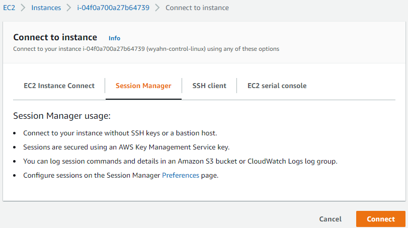
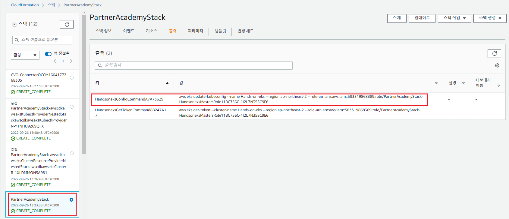
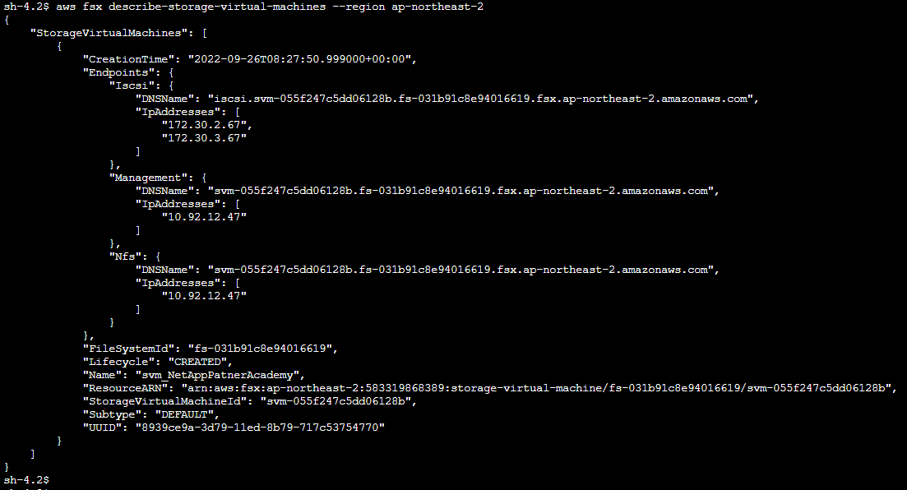
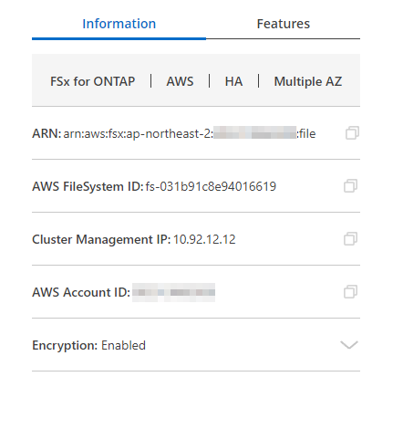
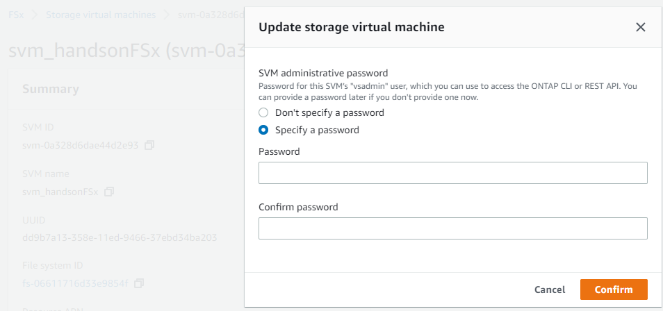

# EKS 와 AWS FSxontap 연결
Netapp CSI 인 Trident를 이용해 FSX for ontap을 EKS의 백앤드 스토리지로 등록합니다. 

### Tips
실습에 이용할 파일은 베스천호스트의 하기 파일경로에서 찾아 보실 수 있습니다.
```
/opt/DeployTestapp/Volume
```
## Astra Trident
Astra Trident는 Astra 제품군 의 일부로 NetApp에서 유지 관리하는 완전히 지원되는 오픈 소스입니다. </br>
CSI(Container Storage Interface)와 같은 업계 표준 인터페이스를 사용하여 컨테이너화된 애플리케이션의 지속성 요구 사항을 충족할 수 있도록 설계되었습니다.

Astra Trident는 Kubernetes 클러스터에 포드로 배포하고 Kubernetes 워크로드에 대한 동적 스토리지 오케스트레이션 서비스를 제공합니다.  </br>
이를 통해 컨테이너화된 애플리케이션은 ONTAP(NetApp ONTAP용 AFF/FAS/Select/Cloud/Amazon FSx), Element 소프트웨어(NetApp HCI/SolidFire), Astra Data Store를 비롯한 NetApp의 광범위한 포트폴리오에서 영구 스토리지를 빠르고 쉽게 사용할 수 있습니다.  </br>
Azure NetApp Files 서비스 및 Google Cloud의 Cloud Volumes Service로 제공됩니다.

Astra Trident는 또한 NetApp의 Astra를 위한 기본 기술로, 스냅샷, 백업, 복제 및 복제를 위한 NetApp의 업계 최고의 데이터 관리 기술을 활용하여 Kubernetes 워크로드에 대한 데이터 보호, 재해 복구, 이식성 및 마이그레이션 사용 사례를 해결합니다.

## 선행조건
  - Trident 설치는 진행할 수 있지만 연결을 위해서는 FSxontap 스토리지가 먼저 배포되어 있는 상태여야 합니다.
  - Trident POD가 FSxontap과 동일한 VPC에 있어야 합니다.

## bastion 서버 접속
1. Handson Bastion 서버에 다음중 하나의 방법을 이용해 접속합니다.
   1. Sesstion manager 활용 </br>
      1. ec2 console에서 Bastion host를 오른쪽 클릭하고 Connect 를 선택합니다. </br>
      2. Session Manager 탭을 선택하고 connect를 선택합니다. </br>
       </br>
      3. 프롬프트를 Root로 변경합니다. </br>
      ```bash
      sudo su -
      ```
  
   2. ssh Tool 활용
      1. KeyPair Download
         - [handsonkey.pem](../keypair/handsonkey.pem)
         - [handsonkey.pub](../keypair/handsonkey.pub)
      2. 사용하고 계신 ssh tool을 이용해 서버에 접속합니다. (PuTTy)
          ```bash
          ssh  -i handsonkey.pem ec2-user@<"bastion server ip">
          ```
    > ### Tips!
    > ### ssh key 오류로 접속이 안되는 경우
    >  1. [aws IAM console로 이동합니다.](https://us-east-1.console.aws.amazon.com/iamv2/home#/users)
    >  2. HandsOnAdmin user를 찾아 클릭합니다.
    >  3. Access Key를 발급합니다.
    >  4. [AWS CLI를 설치합니다.](https://docs.aws.amazon.com/ko_kr/cli/latest/userguide/getting-started-install.html)
    >  - KeyPair Download
    >    - [handsonkey.pem](../keypair/handsonkey.pem)
    >    - [handsonkey.pub](../keypair/handsonkey.pub)
    >  5. AWS cli 명령을 이용해 Public-key를 서버에 넣습니다.
    >    ```bash
    >    aws ec2-instance-connect send-ssh-public-key \
    >    --region ap-northeast-2 \
    >    --instance-id <bastion-instance-id> \
    >    --availability-zone <bastion AZ name> \
    >    --instance-os-user <ec2-user or root>
    >    --ssh-public-key file://handsonkey.pub << 파일위치를 확인하고 값을 알맞게 수정합니다.
    >    ```
    >  6. 사용하고 계신 ssh tool을 이용해 서버에 접속합니다.

2. kubeconfig를 작성합니다.</br>
해당 명령은 Cloudformation console 출력 탭에서 명령어를 확인 하실 수 있습니다.
    ```bash 
    aws eks update-kubeconfig --name Hands-on-eks --region ap-northeast-2 --role-arn "check your Cloudformaionstack output message"
    ```
    

3. trident를 설치합니다.
    ```bash
    tridentctl install -n trident
    ```

4. FSx for ontap을 Backend Storage를 등록합니다.</br>
   1. aws console, Cloudmanager, AWSCLI, ontapcli 중 하나의 방법을 선택해 접속정보를 알아냅니다.
    - #### AWSCLI
      ```bash 
      aws fsx describe-storage-virtual-machines --region ap-northeast-2
      ```
      </br>
    - #### Cloudmanager
      - Canvas 에서 FSXontap 를 클릭하고 working Envionment 클릭합니다.
      - 우측사이드 메뉴의 information 의 정보를 기억합니다.</br>
      </br>
    - #### AWS console
      - FSx 콘솔에서 ontap > Storage Virtual Machines > Hands-on-fsx를 선택합니다.
      - Endpoins 에 있는 도메인 또는 IP를 기억합니다.
    - #### ontap CLI
      - ssh fsxadmin@<"your management DNS or IP">
      - PW :Netapp1!
      - > net in show
      - 출력 결과를 기억합니다.</br>
    > ### Tips
    > Password가 맞지 않는 경우 AWS FSX console 에서 PW 재설정이 가능합니다.
    

   2. 출력 결과를 바탕으로 json 파일을 작성합니다.
      ```bash
      vim /opt/trident-installer/backend-FSxontap.json
      ```
      ```json
      {
          "version": 1,
          "storageDriverName": "ontap-nas",
          "backendName": "Hands-on-fsx",
          "managementLIF": "<your managed-ip or domain>",
          "dataLIF": "<your dataLIF-ip or domain>",
          "svm": "svm_HandsonFSx",
          "username": "fsxadmin",
          "password": "Netapp1!"
      }

      ```
  3. tridentctl을 이용하여 백앤드를 등록합니다.
      ```bash
      tridentctl create backend -f /opt/trident-installer/backend-FSxontap.json -n trident
      ```
# 다음과정
EKS에 TEST에 사용할 어플리케이션을 배포합니다..</br>
- 다음주제: [EKS에 Test Application 배포](../Trident/deploy_testapp.md)
- 이전주제: [AWS FSX for ontap 생성](../FSXforOntap/CreateFSXontap.md)


# 참고
- [trident-fsx guide](https://docs.netapp.com/us-en/trident/trident-use/trident-fsx.html#authentication)
- [aws cli - import ssh](https://aws.amazon.com/de/blogs/compute/new-using-amazon-ec2-instance-connect-for-ssh-access-to-your-ec2-instances/)
- [tridentctl refernce](https://netapp-trident.readthedocs.io/en/latest/reference/tridentctl.html)