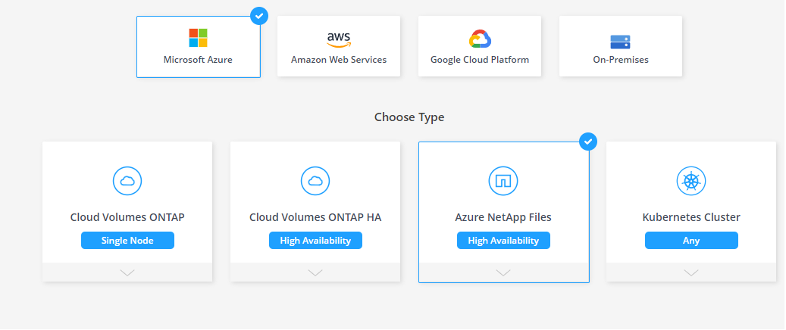

# Azure Netapp Files
AzureNetappFiles에 대해 간략히 소개합니다. 자세한 내용은 [여기](Readme.md)를 참조해주세요.
# Azure NetApp Files 작업 환경 만들기

1. 캔버스 페이지에서 작업 환경 추가 를 클릭 합니다.
2. Microsoft Azure 를 선택한 다음 Azure NetApp Files 를 선택 합니다.</br>

3. AzureNetappFiles를 배포하기 위해 선 적절한 Azure 권한이 필요합니다.
이전 단게에서 사용했던 Cloudmangaer 의 권한을 그대로 이용합니다.
4. CLI에서 Netapp Account를 생성합니다.</br>

```
az netappfiles account create --resource-group NetappHandson-RG --account-name NetappHandson-Acc --location KoreaCentral
``` 
6. 클라우드 매니저에서 생성된 작업환경으로 들어갑니다.
7. 새 볼륨 생성하기를 클릭합니다.
8. 앞에서 생성한 기존 어카운트를 선택합니다.</br>

9. 새로운 풀을 생성합니다.
```
Pool Name : Standard
Size : 4
Service Level : Standard
```


# 다음과정
AKS 와 ANF를 연결합니다. </br>
- 다음 주제 : [Install Trident useing tridentctl](../Trident/InstallTridentctl.md)
- 추가 주제 : [Install Trident on Cloudmanager](../Trident/InstallTrident.md)
> 설치는 가능하나 Cloudmanager에서 한국리전 ANF를 수정하지 못하는 이슈가 있어 SC 및 PV 백앤드 등록과정을 진행할 수 없습니다. 추후 업데이트 예정입니다. 
- 이전 주제 : [Deploy Cloudmanager](./Deploy_Cloudmanager.md)

# 참고
[Create a Connector in Azure from Cloud Manager](https://docs.netapp.com/us-en/cloud-manager-setup-admin/task-creating-connectors-azure.html#proxy-server)
