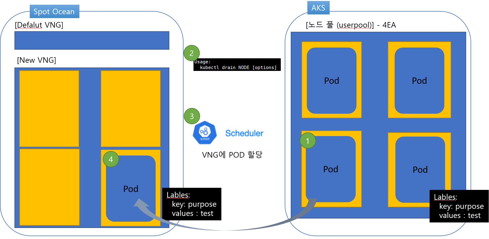
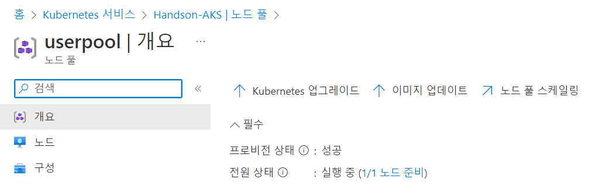
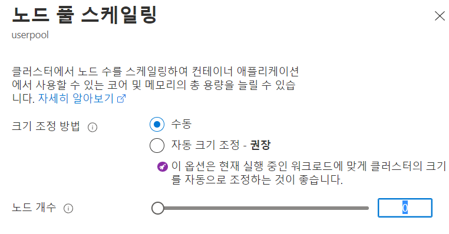

# AKS 에서 migration
aks 에서 Ocean으로 워크로드를 마이그레이션하는 방법을 알아봅니다.
안타깝지만 마이그레이션 절차를 수동으로 해주셔야 합니다.

0. VNG 그룹에 노드를 미리 배포합니다. (최단시간 컴퓨팅 이동을 위해) 
1. 이동할 컴퓨팅 노드를 식별합니다.
2. drain 명령을 통해  더 이상 이 노드에 컴퓨팅을 할당하지 않도록하고 노드가 가지고있는 워크로드들을 비우도록 명령합니다.
3. 스케줄러가 새로운 노드에 워크로드를 할당합니다.
## Ocean이 관리하는 노드로 워크로드 이동
1. VNG 그룹에 노드를 미리 배포합니다. 
   1. Ocean > VNG Tap > userpool VNG의 체크박스를 클릭합니다.
   2. "VNG Action" 버튼이 활성화 되면 드롭다운 하여 "Lanch VMs"를 클릭합니다.
   3. Node 수를 1개로 입력하고 적용을 클릭합니다.
2. 기존 AKS 노드를 드레인합니다.
   1. 드레인할 노드를 식별합니다.
    ```bash   
    Kubectl get nodes -o wide
    ```
    ```bash
    root@HandsonBastion-vm:~# k get nodes
    NAME                                STATUS   ROLES   AGE     VERSION
    aks-agentpool-15961100-vmss000000   Ready    agent   7d15h   v1.23.8
    aks-userpool-23402715-vmss000000   Ready    agent   5d1h    v1.23.8
    vm-028f7d463bfd                     Ready    agent   12d     v1.23.8
    ```
   2. 노드를 드레인 합니다. 
    ```bash
    root@HandsonBastion-vm:~# k drain aks-userpool2-23402715-vmss000001 --ignore-daemonsets --delete-emptydir-data
    node/aks-userpool2-23402715-vmss000001 already cordoned
    Warning: ignoring DaemonSet-managed Pods: kube-system/azure-ip-masq-agent-2bflf, kube-system/cloud-node-manager-f6x9z, kube-system/csi-azuredisk-node-k8j4l, kube-system/csi-azurefile-node-d4m6l, kube-system/kube-proxy-k8wzh, trident/trident-csi-fb7gx
    evicting pod trident/trident-csi-696bcb89dc-cfgsq
    pod/trident-csi-696bcb89dc-cfgsq evicted
    node/aks-userpool2-23402715-vmss000000 drained
    ```
   3. 노드의 상태를 확인합니다.
    ```bash
    root@HandsonBastion-vm:~# k get nodes
    NAME                                STATUS                     ROLES   AGE     VERSION
    aks-agentpool-15961100-vmss000000   Ready                      agent   7d15h   v1.23.8
    aks-userpool-23402715-vmss000000    Ready SchedulingDisabled   agent   5d1h    v1.23.8
    vm-028f7d463bfd                     Ready                      agent   12d     v1.23.8
    ```
3. 워크로드가 Ocean이 관리하는 노드로 옮겨진 것을 확인 후, AKS 노드를 삭제합니다.
   1. pod 를 할당 받은 노드를 확인합니다.
   ```bash
   kubectl get pod -o wide
   ```
   2. Azure AKS 콘솔 Handson-AKS > 노드 풀 > usepool로 이동합니다.
   
   3. 노드 풀 스케일링을 클릭하고 "노드 개수"를 0으로 변경합니다.
   

# 결과
AKS scaleset으로 관리되던 노드들이 Ocean에서 관리하는 노드로 이관됩니다.

# 다음과정
ocean의 Scaling 동작에 대해 알아봅니다.</br>
- 다음주제: [ Scaling Event ](../OceanforAKS/ScalingEvent.md)
- 이전주제: [Deploy testapp](../Trident/deploy_testapp.md)

# 참고
[k8S afely-drain-node](https://kubernetes.io/docs/tasks/administer-cluster/safely-drain-node/)