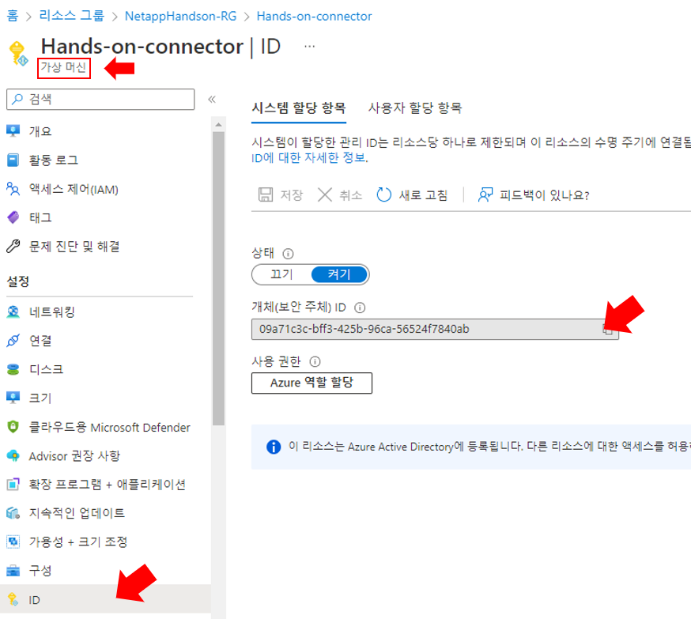
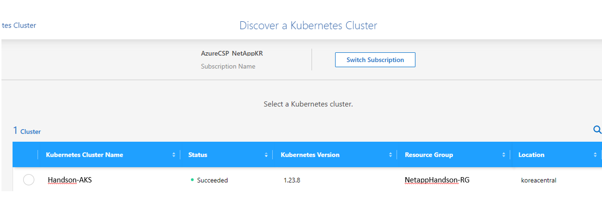
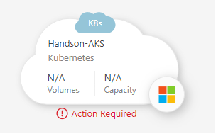
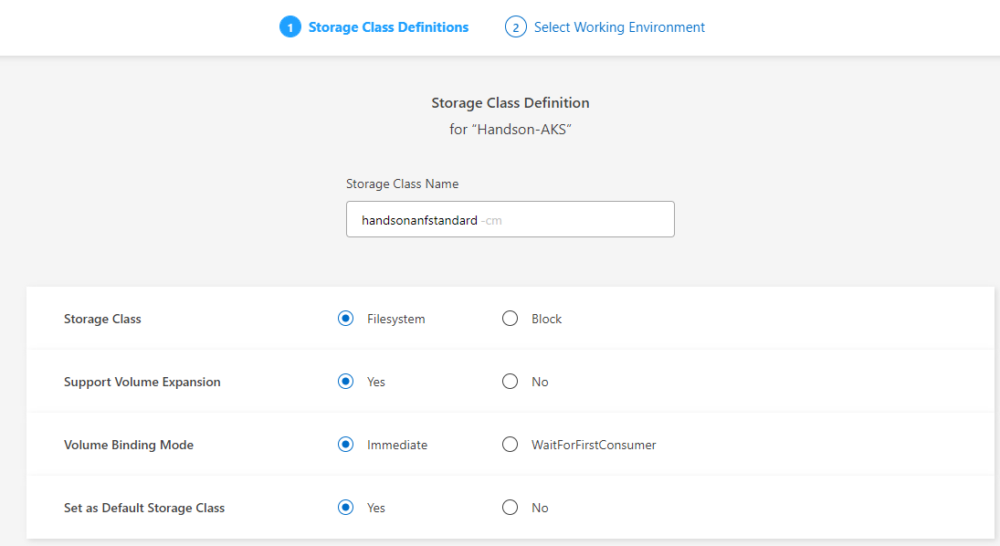

# trident 설치
- cloudmanager에서 AKS에 trident를 설치합니다.
Trident에 대한 추가 설명은 [여기](./README.md)를 참조합니다.
## Cloudmanager에 AKS 등록 
- Cloud manager 에 AKS를 등록 후 Cloudmanager에서 AKS로 trident를 구성하도록 명령할 수 있습니다.
### 요구 사항
- Astra Trident </br>
Astra Trident의 최신 버전 4개 중 하나가 필요합니다. Cloud Manager에서 Astra Trident를 직접 설치 또는 업그레이드할 수 있습니다. 당신은 해야 한다 "사전 요구 사항을 검토합니다" Astra Trident를 설치하기 전

- Cloud Manager 커넥터 </br>
Connector는 필요한 권한을 사용하여 Azure에서 실행 중이어야 합니다.
다음과 같은 권한이 Connecter에 부여되어 있어야 합니다. 
    ```
    "Microsoft.ContainerService/managedClusters/listClusterUserCredential/action"
    "Microsoft.ContainerService/managedClusters/read"
    ```

- 네트워크 연결 </br>
Kubernetes 클러스터와 Connector 간, Kubernetes 클러스터와 Cloud Volumes ONTAP 사이에 네트워크 연결이 필요합니다.</br>

- RBAC 인증 </br>
Cloud Manager는 Active Directory를 사용 또는 사용하지 않는 RBAC 지원 클러스터를 지원합니다. Cloud Manager Connector 역할은 각 Azure 클러스터에서 인증되어야 합니다. up RBAC authorization,아래에서 자세히 알아보십시오.

### 실습
1. connecter VM의 관리 ID를 확인합니다.

2. RBAC 승인을 설정합니다
    - Connector가 클러스터를 검색 및 관리할 수 있도록 각 Kubernetes 클러스터에서 커넥터 역할을 승인해야 합니다.
    > ### TIPS
    > RBAC 검증은 AD(Active Directory)가 활성화된 Kubernetes 클러스터에서만 실행됩니다. </br>
    > AD를 사용하지 않는 Kubernetes 클러스터는 검증을 자동으로 통과합니다.
    ```bash
    kubectl create clusterrolebinding netapp-connecter --clusterrole cluster-admin --user <Object (principal) ID>
    ```
2. 캔버스에서 "Add Working Environment"를 클릭 합니다 .
3. Microsoft Azure > Kubernetes Cluster 클릭하고 다음을 클릭합니다.</br>

4. Discover Cluster 를 선택합니다.
5. 조회된 클러스터중 "Handson-AKS"를 선택합니다.</br>

6. canvas 에서 AKS가 보이면 더블클릭합니다. </br>

7. "Install Astra Trident"를 클릭하고 트라이던트가 설치되기를 기다립니다.

--- 
### Cloudmanager 이슈로 SC 등록은 Tridentctl을 통해 진행합니다.

8. "Add Storage Class"를 클릭하고 아래항목을 선택합니다.

- StorageClass : Filesystem
- Support Volume Expansion: yes
- Volume Binding Mode : Immediate
- Set as Default Storage Class : yes
---

# 결과
1. trident 네임스페이스에 app들이 모두 Running 상태인것이 보입니다.
```bash
Kubectl get All -n trident
```
2. AKS에 커스텀 리소스가 등록된것이 확인됩니다.
```bash
root@HandsonBastion-vm:/opt/DeployTestapp/ImportVolume# k get customresourcedefinitions.apiextensions.k8s.io 
NAME                                             CREATED AT
tridentbackendconfigs.trident.netapp.io          2022-08-31T23:22:17Z
tridentbackends.trident.netapp.io                2022-08-31T23:22:14Z
tridentmirrorrelationships.trident.netapp.io     2022-08-31T23:22:17Z
tridentnodes.trident.netapp.io                   2022-08-31T23:22:16Z
tridentsnapshotinfos.trident.netapp.io           2022-08-31T23:22:17Z
tridentsnapshots.trident.netapp.io               2022-08-31T23:22:15Z
tridentstorageclasses.trident.netapp.io          2022-08-31T23:22:18Z
tridenttransactions.trident.netapp.io            2022-08-31T23:22:15Z
tridentversions.trident.netapp.io                2022-08-31T23:22:16Z
tridentvolumepublications.trident.netapp.io      2022-08-31T23:22:18Z
tridentvolumes.trident.netapp.io                 2022-08-31T23:22:15Z
volumesnapshotclasses.snapshot.storage.k8s.io    2022-08-30T22:49:08Z
volumesnapshotcontents.snapshot.storage.k8s.io   2022-08-30T22:49:08Z
volumesnapshots.snapshot.storage.k8s.io          2022-08-30T22:49:08Z

root@HandsonBastion-vm:/opt/DeployTestapp/ImportVolume# k get trident
tridentbackendconfigs.trident.netapp.io       tridentstorageclasses.trident.netapp.io
tridentbackends.trident.netapp.io             tridenttransactions.trident.netapp.io
tridentmirrorrelationships.trident.netapp.io  tridentversions.trident.netapp.io
tridentnodes.trident.netapp.io                tridentvolumepublications.trident.netapp.io
tridentsnapshotinfos.trident.netapp.io        tridentvolumes.trident.netapp.io
tridentsnapshots.trident.netapp.io 
```

# 다음과정
TEST에 사용할 어플리케이션을 배포합니다.</br>
- 다음주제: [AKS에 Test Application 배포](./deploy_testapp.md)
- 이전주제: [Azure Netapp Files 생성](../AzureNetappFiles/CreateAzureNetappFilesonAzure.md)


# 참고
- [trident-fsx guide](https://docs.netapp.com/us-en/trident/trident-use/trident-fsx.html#authentication)
- [aws cli - import ssh](https://aws.amazon.com/de/blogs/compute/new-using-amazon-ec2-instance-connect-for-ssh-access-to-your-ec2-instances/)
- [tridentctl refernce](https://netapp-trident.readthedocs.io/en/latest/reference/tridentctl.html)
