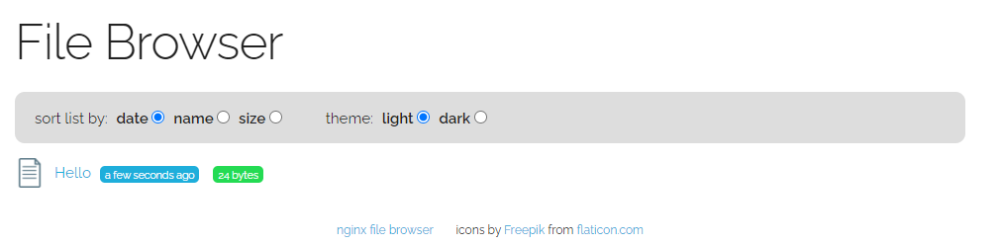

# Hands-on 에 사용할 app을 배포합니다.
1. 파일을 순서대로 작성 후 적용합니다. 
2. kubectl apply -f <작성한 파일이름>
3. 해당 파일은 bastionhost /opt/DeployTestapp/nginx-file-browser에 다운로드 되어 있습니다.
    ```bash
    [root@ip-172-30-0-23 nginx-file-browser]# pwd
    /opt/DeployTestapp/nginx-file-browser
    [root@ip-172-30-0-23 nginx-file-browser]# ls
    ANF-pvc.yaml  nginx-file-browser-deployment.yaml  nginx-file-browser-service.yaml
    ANF-sc.yaml   nginx-file-browser-ingress.yaml
    ```
ANF-sc.yaml
```yaml
apiVersion: storage.k8s.io/v1
kind: StorageClass
metadata:
  name: handson-anf-premium
provisioner: csi.trident.netapp.io
parameters:
  selector: "performance=premium"
allowVolumeExpansion: true
---
apiVersion: storage.k8s.io/v1
kind: StorageClass
metadata:
  name: handson-anf-standard
provisioner: csi.trident.netapp.io
parameters:
  selector: "performance=standard"
allowVolumeExpansion: true
```
```bash
root@HandsonBastion-vm:~# kubectl get sc handson-anf-premium handson-anf-standard
NAME                   PROVISIONER             RECLAIMPOLICY   VOLUMEBINDINGMODE   ALLOWVOLUMEEXPANSION   AGE
handson-anf-premium    csi.trident.netapp.io   Delete          Immediate           true                   3d21h
handson-anf-standard   csi.trident.netapp.io   Delete          Immediate           true                   3d21h
```

ANF-pvc.yaml 
```yaml
apiVersion: v1
kind: PersistentVolumeClaim
metadata:
  name: handson-anf-standard
  namespace: default
  annotations:
    trident.netapp.io/unixPermissions: "0775"  
spec:
  accessModes:
    - ReadWriteMany
  resources:
    requests:
      storage: 100Gi
  storageClassName: handson-anf-standard
---
apiVersion: v1
kind: PersistentVolumeClaim
metadata:
  name: handson-anf-premium
  namespace: default
  annotations:
    trident.netapp.io/unixPermissions: "0775"
spec:
  accessModes:
    - ReadWriteMany
  resources:
    requests:
      storage: 100Gi
  storageClassName: handson-anf-premium

```
```bash
root@HandsonBastion-vm:~# kubectl get pvc
NAME                   STATUS   VOLUME                                     CAPACITY   ACCESS MODES   STORAGECLASS           AGE
handson-anf-premium    Bound    pvc-9b42be6e-08b3-4b33-9500-c2f85b0f29cb   100Gi      RWX            handson-anf-premium    3d21h
handson-anf-standard   Bound    pvc-ef5a4c3a-c3cd-46e1-be37-d9494b6d11a0   100Gi      RWX            handson-anf-standard   3d21h
```
nginx-file-browser-deployment.yaml
```yaml
apiVersion: apps/v1
kind: Deployment
metadata:
  labels:
    app: nginx-file-bro
  name: nginx-file-bro
spec:
  replicas: 1
  selector:
    matchLabels:
      app: nginx-file-bro
  template:
    metadata:
      labels:
        app: nginx-file-bro
    spec:
      containers:
      - image: docker.io/mohamnag/nginx-file-browser:latest
        name: nginx-file-browser
        volumeMounts:
        - mountPath: /opt/www/files
          name: anf-volume

      volumes:
      - name: anf-volume
        persistentVolumeClaim:
          claimName: handson-anf-standard
      affinity:
        nodeAffinity:
          requiredDuringSchedulingIgnoredDuringExecution:
            nodeSelectorTerms:
            - matchExpressions:
              - operator: In
                key: purpose
                values:
                - test
```
```bash
root@HandsonBastion-vm:~# kubectl get pod -o wide
NAME                              READY   STATUS    RESTARTS   AGE     IP           NODE                                NOMINATED NODE   READINESS GATES
nginx-file-bro-7c9c4d88fc-r7ts6   1/1     Running   0          3d21h   10.244.3.2   aks-userpool2-23402715-vmss000000   <none>           <none>
```

nginx-file-browser-service.yaml
```yaml
apiVersion: v1
kind: Service
metadata:
  name: nginx-file-bro-svc
  namespace: default
spec:
  ports:
    - port: 80
      targetPort: 80
      protocol: TCP
  type: LoadBalancer
  selector:
    app: nginx-file-bro
```
```bash
root@HandsonBastion-vm:~# kubectl get svc 
NAME                 TYPE           CLUSTER-IP    EXTERNAL-IP     PORT(S)        AGE
kubernetes           ClusterIP      10.0.0.1      <none>          443/TCP        7d15h
nginx-file-bro-svc   LoadBalancer   10.0.247.22   20.214.76.244   80:30377/TCP   3d21h
```

3. Azure console 에서 볼륨이 생성되어 있는지 확인합니다. 
4. 생성된 볼륨을 클릭하고 mount 정보를 복사합니다.
5. mount 지점 값을 pvc-난수 에서 /mnt 로 변경하고 명령어를 실행합니다. 
  ```bash
  sudo mount -t nfs -o rw,hard,rsize=65536,wsize=65536,vers=3,tcp 172.18.4.4:/pvc-ef5a4c3a-c3cd-46e1-be37-d9494b6d11a0 /mnt
  ```
5. bastion 에서 /mnt 볼륨에 마운트합니다.
6. echo "Hello Netapp" > /mnt/Hello Netapp.txt
7. kubectl get svc 명령에서 출력된 외부 도메인을 브라우저에 입력합니다.
  ```bash
  wooyoung [ ~ ]$ kubectl get svc
  NAME                 TYPE           CLUSTER-IP    EXTERNAL-IP     PORT(S)        AGE
  kubernetes           ClusterIP      10.0.0.1      <none>          443/TCP        3d17h
  nginx-file-bro-svc   LoadBalancer   10.0.247.22   20.214.76.244   80:30377/TCP   15s
  ```
8. 브라우저 접속시 Filebrowser 앱이 보입니다.</br>


# 다음과정
ocean이 관리하는 노드로 전환하는 절차에 대해 알아봅니다.</br>
- 다음주제: [Workload Migration](../OceanforAKS/WorkloadMigration.md)
- 이전주제: [Trident 설치](../Trident/InstallTridentctl.md)


# 참고
- [K8S Doc](https://kubernetes.io/docs/home/)