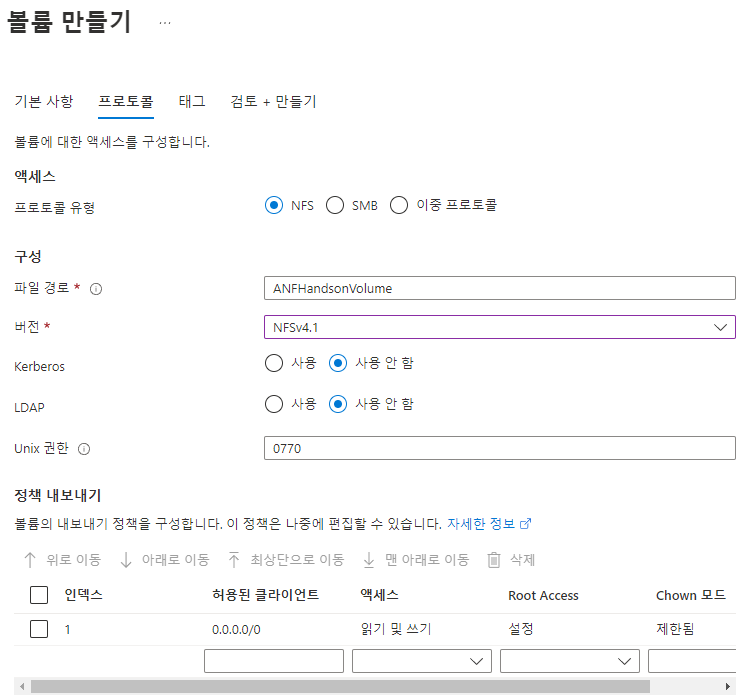

# Azure NetApp Files에 NFS 볼륨 만들기
Azure Console에서 논리적인 볼륨을 생성 할 수 있습니다. 
Azure NetApp Files에서 볼륨을 만들기 전에 프로비전된 용량에 대한 풀을 구매하고 설정해야 합니다.  
용량 풀을 설정하려면 NetApp 계정이 있어야 합니다.  
스토리지 계층 구조를 이해하는 것은 Azure NetApp Files 리소스를 설정하고 관리하는 데 도움이 됩니다. 
실습 전 ANF의 스토리지 계층 구조에 대해 설명합니다.

## ANF의 스토리지 계층구조 

### 용량 풀
논리적인 볼륨이 배정할 실제 스토리지의 저장공간을 정의합니다.  
어플리케이션 요구사항에 맞는 용량 풀을 정의하여 비용에 알맞게 이용할 수 있습니다.  
기본적으로 볼륨에 할당된 크기에 비례하여 Qos가 자동 할당됩니다. SAP HANA 시스템, Oracle 데이터베이스등 여러 볼륨이 필요한 워크로드에서 QoS 유형을 수동으로 지정하여 이용할 수 있습니다.  
- 용량정의는 4Tib ~500Tib 용량을 설정 할 수 있습니다.
- 용량 풀은 NetApp 계정 간에 이동할 수 없습니다.
- 용량 풀은 용량 풀 내 모든 볼륨이 삭제되기 전까지 삭제할 수 없습니다.

### 볼륨
논리적인 용량으로 클라이언트에서 바라보는 볼륨입니다.
- 볼륨의 용량 소비는 해당 풀의 프로비전된 용량에 대해 계산됩니다.
- 볼륨의 처리량 사용은 풀의 사용 가능한 처리량에 대해 계산됩니다. [수동 QoS 유형](https://learn.microsoft.com/ko-kr/azure/azure-netapp-files/azure-netapp-files-understand-storage-hierarchy?source=recommendations#manual-qos-type)을 참조하세요.
볼륨 만들기 창에서 다음과 같은 볼륨 정보를 입력합니다.
- 각 볼륨은 하나의 풀에만 속하지만 풀은 여러 볼륨을 포함할 수 있습니다.

## 볼륨 생성
1. NetApp 계정의 Azure NetApp Files 관리 블레이드에서 볼륨을 클릭합니다.
2. "+ 볼륨 추가"를 클릭합니다.
3. 볼륨 만들기 창에서 다음과 같은 볼륨 정보를 입력합니다.
    - 볼륨 이름 : ANFHandsonVolume
    - 용량 풀 : Premium
    - 할당량 : 100
    - 가상 네트워크 : NetappHandson-Vnet
    - 위임된 서브넷 : ANFsubnet
    
4. 프로토콜을 클릭한 후, 다음 작업을 완료합니다.
    - 프로토콜 유형 : NFS
    - 파일 경로 : ANFHandsonVolume
    - 버전 : NFSv4.1
    - 나머지 옵션은 전부 기본값으로 지정합니다.
    

5. 검토 + 만들기를 클릭하고 볼륨을 생성합니다.

# 결과
- NginxFileBrowser 볼륨이 생성됩니다.
- Cloudmanager 에서 생성된 볼륨이 확인됩니다.

# 다음과정
Azure Netapp files 볼륨 설정에 대해 알아봅니다.  
- 다음 주제 : [Volume Opration](./VolumeOperation.md)
- 이전 주제 : [Headroom](../OceanforAKS/Headroom.md)

# 참고
- [Azure NetApp Files 설정 및 NFS 볼륨 만들기](https://learn.microsoft.com/ko-kr/azure/azure-netapp-files/azure-netapp-files-quickstart-set-up-account-create-volumes?tabs=azure-portal)
- [Azure NetApp Files의 스토리지 계층 구조](https://learn.microsoft.com/ko-kr/azure/azure-netapp-files/azure-netapp-files-understand-storage-hierarchy)
