# Cloud Manager에서 Azure의 커넥터 
클라우드 관리자 계정 관리자는 대부분의 클라우드 관리자 기능을 사용하기 전에 커넥터 를 배포해야 합니다. 커넥터를 사용하면 Cloud Manager가 공용 클라우드 환경 내에서 리소스와 프로세스를 관리할 수 있습니다.

# 사전 조건
커넥터를 배포하려면 Azure에서 커넥터 VM을 만드는 데 필요한 권한이 있는 로그인을 클라우드 관리자에게 제공해야 합니다.

### 권한
- 제공한 Azure 사용자 또는 서비스 주체에 충분한 권한이 있는지 확인합니다.
### Authentication
- Azure user account 또는 Active Directory service principal 인증이 필요합니다.
### Networking
- connecter가 배포될 Vnet 과 subnet이 미리 제공되어야 합니다.

## 서비스 주체를 사용하여 커넥터 만들기
Azure 서비스 주체에 대한 자격 증명을 Cloud Manager에 제공합니다.

### 서비스 주체를 사용하여 Azure 권한 부여
Azure Active Directory에서 서비스 주체를 만들고 설정하고 Cloud Manager에 필요한 Azure 자격 증명을 가져와 Azure에서 커넥터를 배포하는 데 필요한 권한을 부여합니다.
> # Tips
> 일반적으로 이 방법을 권장드립니다만 
> Azure 계정을 사용하여 인증하는 방식의 경우 좀 더 절차가 간편합니다.
> 권한문제등으로 인해 수행이 어려우신 분들은 [Azure 계정을 사용하여 커넥터 배포](https://docs.netapp.com/us-en/cloud-manager-setup-admin/task-creating-connectors-azure.html#create-a-connector-using-your-azure-account)를 수행해주세요

1. ### Azure Active Directory 애플리케이션 만들기  
Cloud Manager가 커넥터를 배포하는 데 사용할 수 있는 Azure AD(Active Directory) 애플리케이션 및 서비스 주체를 만듭니다.

- Azure Portal에서 Azure Active Directory 서비스를 엽니다.
- Microsoft Azure의 Active Directory 서비스를 보여줍니다.
- 메뉴에서 앱 등록 을 클릭합니다 .
- 새 등록 을 클릭 합니다 .
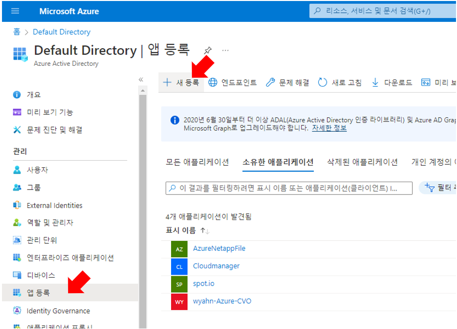

- 응용 프로그램에 대한 세부 정보를 지정합니다.
  - 이름 : Cloudmanager
  - 계정 유형 : 모든 조직 디렉터리의 계정(모든 Azure AD 디렉터리 - 다중 테넌트)
  - 리디렉션 URI : 이 필드를 비워 둘 수 있습니다.
- 등록 을 클릭 합니다.
  AD 응용 프로그램 및 서비스 주체를 만들었습니다.
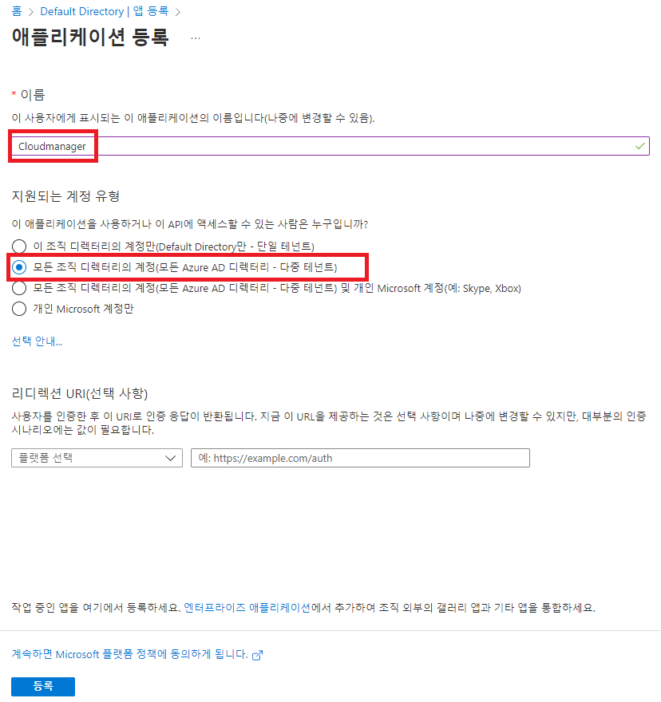

2. ### 역할에 애플리케이션 할당  
커넥터를 배포하려는 Azure 구독에 서비스 주체를 바인딩하고 사용자 지정 "Azure SetupAsService" 역할을 할당해야 합니다.
   1. 구독 > 엑세스제어(IAM) > 사용자 지정 역할 만들기를 선택합니다.  
   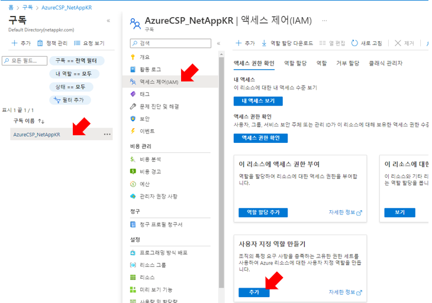
   2. JSON 탭에서 편집을 누릅니다
   3. assignableScopes 키의 값을 구독 ID로 변경하고 json을 붙여넣습니다.(편집 전 나타나는 기본탬플릿에 지정되어 있습니다.)  
   [CloudmanagerSetupRole.json](./CloudmanagerSetupRole.json)
   4. 위와 같은 방법으로 사용자 지정 역활을 하나더 생성합니다.
   [CloudmanagerOperator.json](./CloudmanagerOperator.json)
   5. 액세스 제어(IAM) > 추가 > 역할 할당 추가를 클릭 합니다 .
   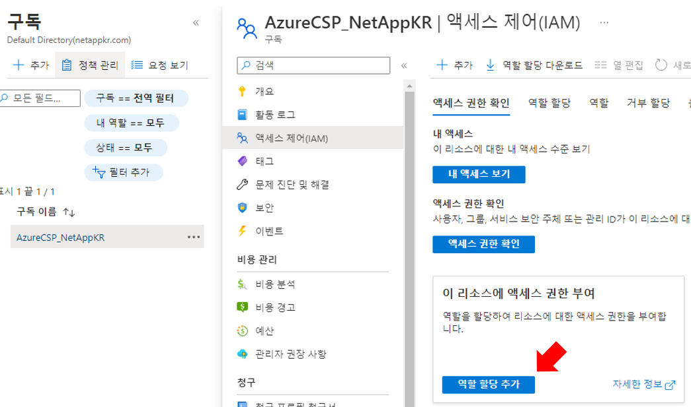
   6. 역할 탭에서 CloudmanagerSetupRole 역할을 선택하고 다음 을 클릭 합니다 .
   7. 구성원 탭에서 구원원 선택을 클릭하고 Cloudmanager를 검색하여 추가합니다.
   8. 검토 + 할당 을 클릭 합니다.

3. ### Windows Azure 서비스 관리 API 권한 추가  
서비스 주체에는 "Windows Azure Service Management API" 권한이 있어야 합니다.

   1. Azure Active Directory 서비스에서 앱 등록을 클릭 하고 애플리케이션을 선택합니다.
   2. API 권한 > 권한 추가를 클릭 합니다 .
   3. Microsoft API 에서 Azure Service Management 를 선택 합니다.
   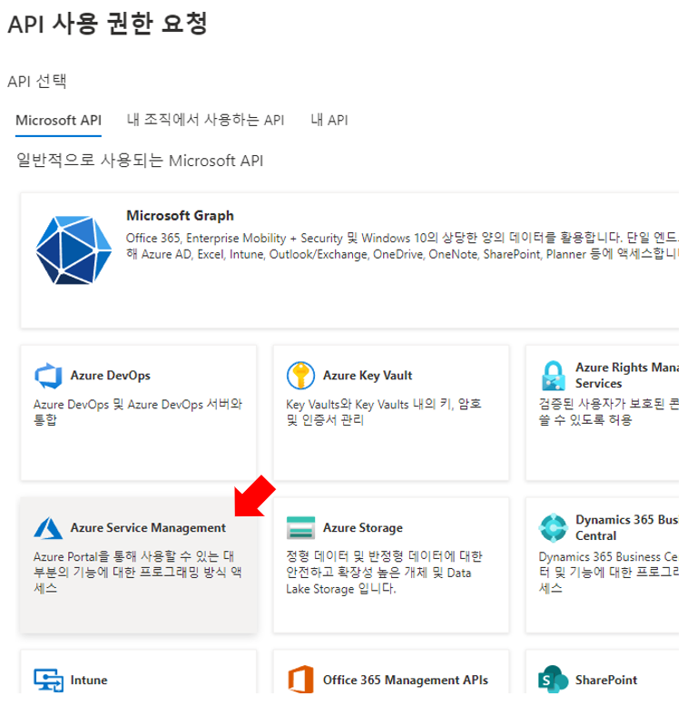

- 조직 사용자로 Azure Service Management에 액세스 를 체크 한 다음 권한 추가 를 클릭 합니다.

4. ### 애플리케이션 ID 및 디렉토리 ID 가져오기  
- Cloud Manager에서 커넥터를 생성할 때 애플리케이션(클라이언트) ID와 애플리케이션에 대한 디렉터리(테넌트) ID를 제공해야 합니다. Cloud Manager는 ID를 사용하여 프로그래밍 방식으로 로그인합니다.

   1. Azure Active Directory 서비스에서 앱 등록을 클릭 하고 애플리케이션 을 선택합니다.
   2. 애플리케이션(클라이언트) ID 와 디렉토리(테넌트) ID 를 복사합니다.

5. ### 클라이언트 암호 만들기  
클라이언트 암호를 만든 다음 Cloud Manager가 암호 값을 사용하여 Azure AD에 인증할 수 있도록 Cloud Manager에 암호 값을 제공해야 합니다.
   1. Azure Active Directory 서비스를 엽니다 .
   2. 앱 등록 을 클릭 하고 애플리케이션 을 선택합니다.
   3. 인증서 및 비밀 > 새 클라이언트 비밀을 클릭 합니다.
   4. 비밀과 기간에 대한 설명을 제공합니다.
   5. 추가 를 클릭 합니다.
   6. 클라이언트 암호 값을 복사합니다.
   

    이제 서비스 주체가 설정되었으며 애플리케이션(클라이언트) ID, 디렉터리(테넌트) ID 및 클라이언트 암호 값을 복사해야 합니다. 커넥터를 생성할 때 클라우드 관리자에 이 정보를 입력해야 합니다.

6. ### 서비스 주체로 로그인하여 커넥터 만들기  
- Cloud Manager를 사용하면 사용자 인터페이스에서 직접 Azure의 커넥터를 만들 수 있습니다.

    1. 첫 번째 작업 환경을 만드는 경우 작업 환경 추가 를 클릭 하고 프롬프트를 따릅니다.  
    그렇지 않으면 커넥터 드롭다운을 클릭하고 커넥터 추가 를 선택 합니다.
    
    2. 클라우드 공급자로 Microsoft Azure 를 선택합니다 .
    3. 커넥터 배포 페이지 에서 인증 아래에서 Active Directory 서비스 주체 를 클릭 하고 필요한 권한을 부여하는 Azure Active Directory 서비스 주체에 대한 정보를 입력합니다.
    - 애플리케이션(클라이언트) ID: 애플리케이션 ID 및 디렉토리 ID 가져오기를 참조하십시오.
    - 디렉토리(테넌트) ID: 애플리케이션 ID 및 디렉토리 ID 가져오기를 참조하십시오.
    - 클라이언트 암호: 클라이언트 암호 생성을 참조하십시오.
    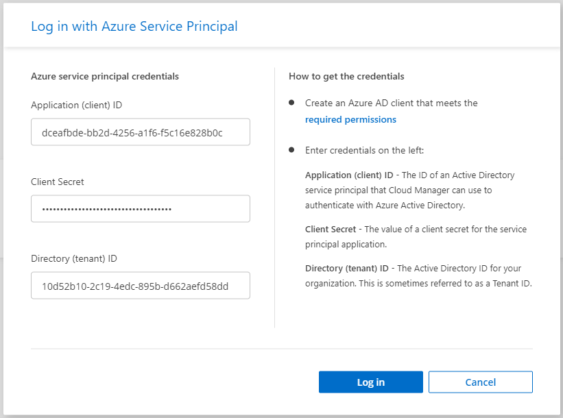
    4. 로그인 을 클릭 합니다.

7. 이 페이지의 단계에 따라 이미 준비되어 있습니다.배포로 건너뛰기를 클릭 합니다.

8. 마법사의 단계에 따라 커넥터를 생성합니다.

    1. VM Authentication 
    - Azure 구독 : 준비해온 구독 선택
    - 위치: Korea Central
    - 기존 리소스 그룹을 선택 : NetappHandson-RG
    - 인증 방법 password 선택
        - username : azureuser
        - password : Netapp1!
    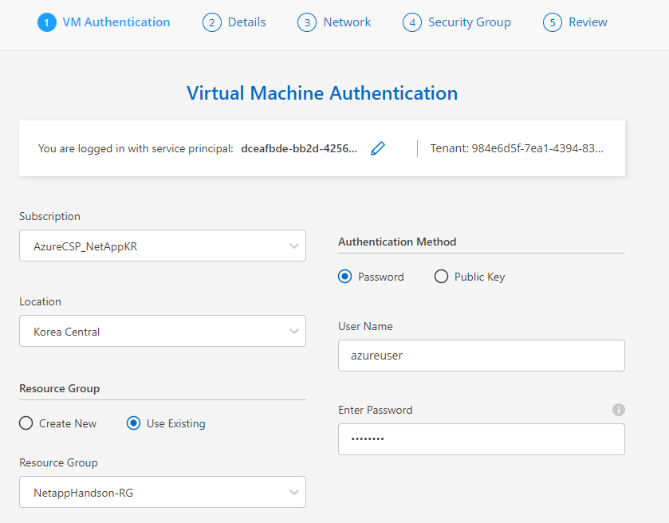
    2. Details
    - Connector instance Name : Hands-on-connecter
    - Connector Role : Attach existing
    - Role Name : Cloud Manager Operator
    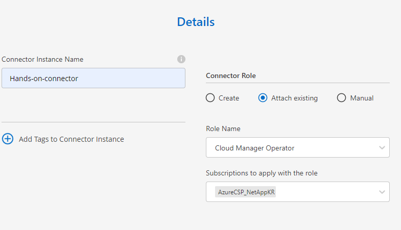
    3. Network
    - Vnet : NetappHanson-Vent
    - subnet : PublicSubnet-2
    - Public IP : Enable
    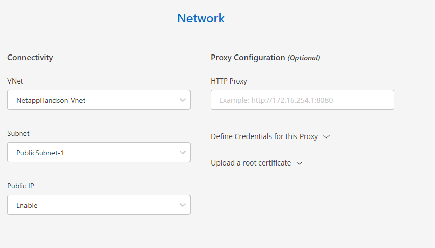
    4. Security Group
    - HTTP : Anywhere
    - HTTPS : Anywhere
    - SSH : Anywhere
    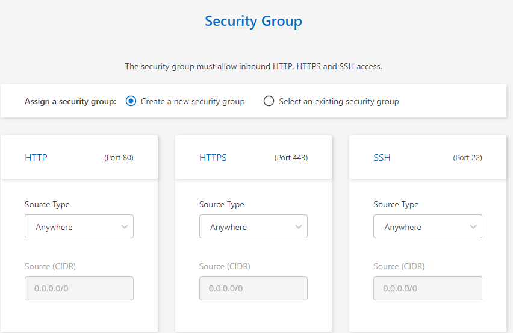
    5. Review
    - 입력 내용 확인 후 Add를 클릭합니다.
# 결과
수분 후 Connecter가 배포됩니다.  
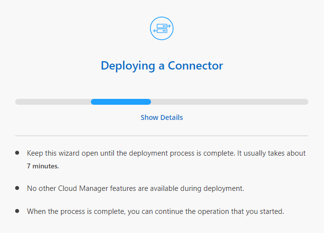

> ### 완료한 후
> 작업 공간 관리자가 해당 커넥터를 사용하여 Cloud Volumes ONTAP 시스템을 생성할 수 있도록 커넥터를 작업 공간과 연결해야 합니다.
> 계정 관리자만 있는 경우 커넥터를 작업 영역과 연결할 필요가 없습니다.
> 계정 관리자는 기본적으로 Cloud Manager의 모든 작업 영역에 액세스할 수 있습니다. 자세히 알아 보기

커넥터를 만든 동일한 Azure 계정에 Azure Blob 저장소가 있는 경우 Azure Blob 작업 환경이 캔버스에 자동으로 표시됩니다. 이 작업 환경으로 무엇을 할 수 있는지 자세히 알아보십시오 .

# 다음과정
AzureNetapFiles를 생성합니다.
- 다음 주제 : [Azure 콘솔에서 Azure Netapp Files 생성](./CreateAzureNetappFilesonAzure.md)
- 이전 주제 : [Hands on Lab 배포](../Quickstart/Quickstart.md)

# 참고
- [Create a Connector in Azure from Cloud Manager](https://docs.netapp.com/us-en/cloud-manager-setup-admin/task-creating-connectors-azure.html#proxy-server)