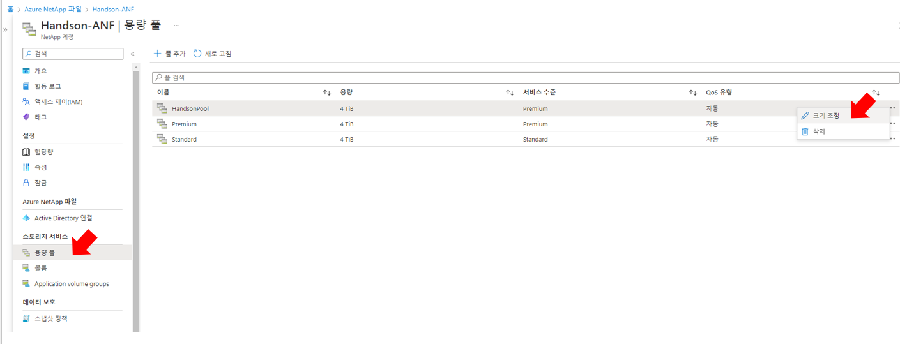
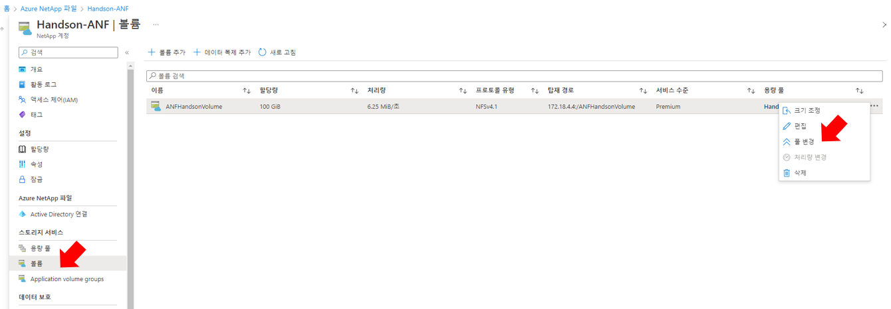

# Azure Netapp Files 볼륨 설정
AzureNetappFiles로 볼륨 오퍼레이션을 편리하게 해볼 수 있습니다. </br> 
특히 논리적인 볼륨들은 온라인중에도 설정변경이 가능하여 운영중 볼륨수정으로 인한 서비스 메인터넌스를 가져갈 필요가 없습니다.

# 전제조건
- Cloudmanager에 ANF가 등록되어 있어야 합니다.
- 이전 세션의 볼륨이 생성되어 있어야 합니다.

## Volume 마운트
Bastion 서버에 볼륨을 마운트 합니다.
1. Cloudmanager console로 이동합니다.
2. Handon-ANF의 작업 환경을 엽니다.</br>

2. View Volumes 을 선택하고 볼륨 보기 화면으로 이동합니다.
3. NginxBrowser볼륨 카드를 찾고 ```º º º``` 선택합니다.
4. "Mount the volume"을 선택합니다.
5. Mount 가이드에서 마운트 명령을 복사합니다.
6. 베스천호스트에 접속하여 마운트 명령을 실행합니다.
    ```bash
    root@HandsonBastion-vm:~# mkdir -p /ANF/ANFHandsonVolume
    ```
    ```bash
    mount -t nfs -o rw,hard,rsize=65536,wsize=65536,vers=4.1,tcp 172.18.4.4:/ANFHandsonVolume /ANF/ANFHandsonVolume
    ```
    > ### Tips
    > nfs-common 모듈이 설치되어 있음에도 지원하지 않는 프로토콜 문제가 발생한다면 vers=4.1로 변경하거나 버전항목을 삭제 후 마운트를 시도합니다.
    > mount.nfs: Protocol not supported

## 용량 풀, 볼륨 크기 변경
### 용량 풀 변경
1. Capacity pool 메뉴에서 변경할 용량풀을 선택 후 ```º º º``` 버튼을 클릭합니다.
    - 변경할 용량 풀 : Handsonpool
2. 크기변경을 누르고 크기를 변경합니다.
    - 크기 : 5

3. 확인을 누르고 Azure 콘솔에서 size 변경이 이루어지는지 확인합니다.
### 볼륨 크기 변경
4. Volumes 메뉴에서 변경할 볼륨을 선택 후 ```º º º``` 버튼을 클릭합니다.
    - 변경할 볼륨 : ANFHandsonVolume
5. "크기 조정" 버튼을 클릭하여 볼륨 사이즈를 변경합니다.
- 할당량 : 150

6. OS에서 볼륨 크기가 변경된것을 확인합니다.
```bash
root@HandsonBastion-vm:~# df -h
Filesystem                                            Size  Used Avail Use% Mounted on
/dev/root                                              29G  2.8G   27G  10% /
devtmpfs                                              3.9G     0  3.9G   0% /dev
tmpfs                                                 3.9G     0  3.9G   0% /dev/shm
tmpfs                                                 796M  984K  795M   1% /run
tmpfs                                                 5.0M     0  5.0M   0% /run/lock
tmpfs                                                 3.9G     0  3.9G   0% /sys/fs/cgroup
/dev/loop0                                             68M   68M     0 100% /snap/lxd/22753
/dev/loop1                                             64M   64M     0 100% /snap/core20/1623
/dev/sda15                                            105M  5.2M  100M   5% /boot/efi
/dev/loop2                                             48M   48M     0 100% /snap/snapd/16778
172.18.4.4:/pvc-ef5a4c3a-c3cd-46e1-be37-d9494b6d11a0  100G  320K  100G   1% /mnt
/dev/loop3                                             48M   48M     0 100% /snap/snapd/17029
tmpfs                                                 796M     0  796M   0% /run/user/1000
172.18.4.4:/ANFHandsonVolume                          150G  1.2G  149G   1% /ANF/ANFHandsonVolume
root@HandsonBastion-vm:~# 
```

## Azure NetApp Files 볼륨의 용량 풀 변경
볼륨의 성능을 결정하는 기준은 용량풀과 볼륨크기 입니다.(QoS 자동 기준)
각 용량 풀간 볼륨의 이동이 가능합니다.

> ### Tips
> FIO를 활용하여 성능 측정합니다. 알 수 없는 명령이라는 에러가 발생한다면 하기 명령을 통해 FIO를 설치합니다.</br>
> apt install -f fio
> 명령에 대한 자세한 설명은 [man fio](https://linux.die.net/man/1/fio)를 참조하세요.
> 일반적인 성능측정 시 --bs 값은 8k 또는 어플리케이션에서 요구하는 값으로 지정합니다. 

1. premium 볼륨의 성능을 측정합니다. (bs=4K)
```bash
fio --directory=/ANF/ANFHandsonVolume --name fio_test_file --direct=1 --rw=randwrite --bs=4K --size=1G --numjobs=16 --time_based --runtime=180 --group_reporting --norandommap
```
```bash
root@HandsonBastion-vm:~# fio \
> --directory=/ANF/ANFHandsonVolume \
> --name fio_test_file \
> --direct=1 \
> --rw=randwrite \
> --bs=4K \
> --size=1G \
> --numjobs=16 \
> --time_based \
> --runtime=180 \
> --group_reporting \
> --norandommap
```
```bash
fio_test_file: (g=0): rw=randwrite, bs=(R) 4096B-4096B, (W) 4096B-4096B, (T) 4096B-4096B, ioengine=psync, iodepth=1
...
fio-3.16
Starting 16 processes
fio_test_file: Laying out IO file (1 file / 1024MiB)
fio_test_file: Laying out IO file (1 file / 1024MiB)
fio_test_file: Laying out IO file (1 file / 1024MiB)
fio_test_file: Laying out IO file (1 file / 1024MiB)
fio_test_file: Laying out IO file (1 file / 1024MiB)
fio_test_file: Laying out IO file (1 file / 1024MiB)
fio_test_file: Laying out IO file (1 file / 1024MiB)
fio_test_file: Laying out IO file (1 file / 1024MiB)
fio_test_file: Laying out IO file (1 file / 1024MiB)
fio_test_file: Laying out IO file (1 file / 1024MiB)
fio_test_file: Laying out IO file (1 file / 1024MiB)
fio_test_file: Laying out IO file (1 file / 1024MiB)
fio_test_file: Laying out IO file (1 file / 1024MiB)
fio_test_file: Laying out IO file (1 file / 1024MiB)
fio_test_file: Laying out IO file (1 file / 1024MiB)
fio_test_file: Laying out IO file (1 file / 1024MiB)
Jobs: 16 (f=16): [w(16)][100.0%][w=6368KiB/s][w=1592 IOPS][eta 00m:00s]
fio_test_file: (groupid=0, jobs=16): err= 0: pid=61971: Mon Oct  3 10:41:36 2022
  write: IOPS=1604, BW=6418KiB/s (6572kB/s)(1128MiB/180003msec); 0 zone resets
    clat (usec): min=287, max=130070, avg=9968.67, stdev=5530.78
     lat (usec): min=287, max=130071, avg=9969.05, stdev=5530.80
    clat percentiles (usec):
     |  1.00th=[  351],  5.00th=[  412], 10.00th=[  498], 20.00th=[ 9765],
     | 30.00th=[ 9896], 40.00th=[10028], 50.00th=[10159], 60.00th=[10290],
     | 70.00th=[10421], 80.00th=[10552], 90.00th=[20055], 95.00th=[20579],
     | 99.00th=[30016], 99.50th=[30540], 99.90th=[40633], 99.95th=[50594],
     | 99.99th=[69731]
   bw (  KiB/s): min= 4616, max=12792, per=99.98%, avg=6416.94, stdev=45.18, samples=5760
   iops        : min= 1154, max= 3198, avg=1603.45, stdev=11.30, samples=5760
  lat (usec)   : 500=10.03%, 750=4.41%, 1000=0.30%
  lat (msec)   : 2=0.03%, 10=23.10%, 20=52.29%, 50=9.76%, 100=0.07%
  lat (msec)   : 250=0.01%
  cpu          : usr=0.03%, sys=0.12%, ctx=356716, majf=0, minf=137
  IO depths    : 1=100.0%, 2=0.0%, 4=0.0%, 8=0.0%, 16=0.0%, 32=0.0%, >=64=0.0%
     submit    : 0=0.0%, 4=100.0%, 8=0.0%, 16=0.0%, 32=0.0%, 64=0.0%, >=64=0.0%
     complete  : 0=0.0%, 4=100.0%, 8=0.0%, 16=0.0%, 32=0.0%, 64=0.0%, >=64=0.0%
     issued rwts: total=0,288826,0,0 short=0,0,0,0 dropped=0,0,0,0
     latency   : target=0, window=0, percentile=100.00%, depth=1

Run status group 0 (all jobs):
  WRITE: bw=6418KiB/s (6572kB/s), 6418KiB/s-6418KiB/s (6572kB/s-6572kB/s), io=1128MiB (1183MB), run=180003-180003msec
```

2. Volumes 메뉴에서 변경할 볼륨을 선택 후 ```º º º``` 버튼을 클릭합니다.
    - 변경할 볼륨 : ANFHandsonVolume
5. "풀 변경" 버튼을 클릭하여 볼륨 사이즈를 변경합니다.
    - 풀 : HandsonPool
    

6. 다시한번 성능을 측정합니다.
```bash
rm -rf /ANF/ANFHandsonVolume/fio_test*
```
```bash
fio --directory=/ANF/ANFHandsonVolume --name fio_test_file --direct=1 --rw=randwrite --bs=4K --size=1G --numjobs=16 --time_based --runtime=180 --group_reporting --norandommap
```
```bash
fio_test_file: (g=0): rw=randwrite, bs=(R) 4096B-4096B, (W) 4096B-4096B, (T) 4096B-4096B, ioengine=psync, iodepth=1
...bash
fio-3.16
Starting 16 processes
fio_test_file: Laying out IO file (1 file / 1024MiB)
fio_test_file: Laying out IO file (1 file / 1024MiB)
fio_test_file: Laying out IO file (1 file / 1024MiB)
fio_test_file: Laying out IO file (1 file / 1024MiB)
fio_test_file: Laying out IO file (1 file / 1024MiB)
fio_test_file: Laying out IO file (1 file / 1024MiB)
fio_test_file: Laying out IO file (1 file / 1024MiB)
fio_test_file: Laying out IO file (1 file / 1024MiB)
fio_test_file: Laying out IO file (1 file / 1024MiB)
fio_test_file: Laying out IO file (1 file / 1024MiB)
fio_test_file: Laying out IO file (1 file / 1024MiB)
fio_test_file: Laying out IO file (1 file / 1024MiB)
fio_test_file: Laying out IO file (1 file / 1024MiB)
fio_test_file: Laying out IO file (1 file / 1024MiB)
fio_test_file: Laying out IO file (1 file / 1024MiB)
fio_test_file: Laying out IO file (1 file / 1024MiB)
Jobs: 16 (f=16): [w(16)][100.0%][w=2402KiB/s][w=600 IOPS][eta 00m:00s]
fio_test_file: (groupid=0, jobs=16): err= 0: pid=62079: Mon Oct  3 11:19:54 2022
  write: IOPS=601, BW=2407KiB/s (2465kB/s)(423MiB/180032msec); 0 zone resets
    clat (usec): min=279, max=4480.2k, avg=26579.77, stdev=42341.77
     lat (usec): min=280, max=4480.2k, avg=26580.16, stdev=42341.77
    clat percentiles (usec):
     |  1.00th=[    490],  5.00th=[   9896], 10.00th=[  10028],
     | 20.00th=[  10028], 30.00th=[  20055], 40.00th=[  20055],
     | 50.00th=[  20055], 60.00th=[  20055], 70.00th=[  30016],
     | 80.00th=[  30016], 90.00th=[  50070], 95.00th=[  60031],
     | 99.00th=[  89654], 99.50th=[ 100140], 99.90th=[ 371196],
     | 99.95th=[1098908], 99.99th=[1149240]
   bw (  KiB/s): min=  158, max= 8711, per=100.00%, avg=2463.42, stdev=78.82, samples=5623
   iops        : min=   38, max= 2177, avg=615.13, stdev=19.71, samples=5623
  lat (usec)   : 500=1.01%, 750=0.08%, 1000=0.01%
  lat (msec)   : 10=10.44%, 20=31.57%, 50=48.81%, 100=7.55%, 250=0.43%
  lat (msec)   : 500=0.02%, 750=0.01%, 1000=0.01%, 2000=0.07%, >=2000=0.01%
  cpu          : usr=0.02%, sys=0.06%, ctx=121954, majf=0, minf=139
  IO depths    : 1=100.0%, 2=0.0%, 4=0.0%, 8=0.0%, 16=0.0%, 32=0.0%, >=64=0.0%
     submit    : 0=0.0%, 4=100.0%, 8=0.0%, 16=0.0%, 32=0.0%, 64=0.0%, >=64=0.0%
     complete  : 0=0.0%, 4=100.0%, 8=0.0%, 16=0.0%, 32=0.0%, 64=0.0%, >=64=0.0%
     issued rwts: total=0,108350,0,0 short=0,0,0,0 dropped=0,0,0,0
     latency   : target=0, window=0, percentile=100.00%, depth=1

Run status group 0 (all jobs):
  WRITE: bw=2407KiB/s (2465kB/s), 2407KiB/s-2407KiB/s (2465kB/s-2465kB/s), io=423MiB (444MB), run=180032-180032msec
```

# Azure NetApp Files 볼륨 throuput 변경하기
1. 용량풀 메뉴에서 QoS를 변경할 풀을 선택합니다.
- 선택 풀 : HandsonPool
2. " QoS 유형 변경 "을 클릭합니다.
3. QoS를 "수동"으로 변경합니다.

4. 볼륨 메뉴에서 "처리량 변경"을 클릭하여 변경할 처리량(Mib/초)을 입력합니다.
- 처리량(Mib/초) : 3

5. 베스천에서 성능을 측정합니다.
```bash
rm -rf /ANF/ANFHandsonVolume/fio_test*
```
```bash
fio --directory=/ANF/ANFHandsonVolume --name fio_test_file --direct=1 --rw=randwrite --bs=4K --size=1G --numjobs=16 --time_based --runtime=180 --group_reporting --norandommap
```

# 결과 
- Azure console에서 명시된 볼륨 별 처리량 값과 FIO 측정 시 출력된 BandWidths 결과가 일치하는지 확인합니다.


# 다음과정
데이터를 백업하고 복구하는 방법을 알아봅니다.</br>
- 다음주제: [Volume Backup and Restore](./VolumeBackupAndRestore.md)
- 이전주제: [Create Volume](./CreateVolmeinAzure.md)

# 참조
- [Netapp Doc manage-backups-ontap](https://docs.netapp.com/us-en/cloud-manager-backup-restore/task-manage-backups-ontap.html#adding-a-new-backup-policy)
- [man fio](https://linux.die.net/man/1/fio)
- [FIO command example](https://zetawiki.com/wiki/%EB%A6%AC%EB%88%85%EC%8A%A4_fio)
