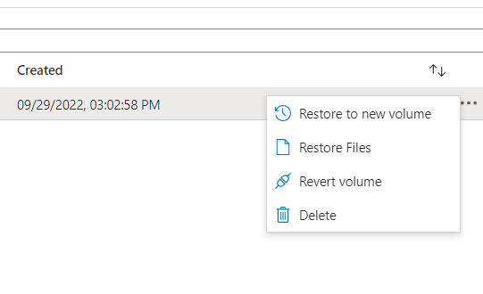

# Azure Netapp Files 주요기능 사용하기
AzureNetappFiles로 볼륨 오퍼레이션을 편리하게 해볼 수 있습니다. 
# Azure NetApp Files Pool, 볼륨 사이즈 변경하기
1. Capacity pool 메뉴에서 ... 버튼을 클릭하여 사이즈를 변경합니다.(최소 4TB)

2. Volumes 메뉴에서 볼륨을 선택하여 Resize 버튼을 클릭하여 볼륨 사이즈를 변경합니다. (최소 100GB)

# Azure NetApp Files 볼륨 Pool 이동 시키기
1. 볼륨을 클릭하고 Change pool 버튼을 클릭합니다.

2. 볼륨을 이동시킬 풀을 선택합니다.

# Azure NetApp Files 볼륨 throuput 변경하기
1. pool의 qos policy를 manual로 변경합니다.

2. change throuput을 클릭하여 변경할 throuput을 입력합니다.

# Azure NetApp Files 볼륨 스냅샷 생성하기
1. add snapshot메뉴를 클릭하여 스냅샷을 생성합니다.

2. ...버튼을 클릭하여 Restore to new volume을 클릭합니다.

3. 복원될 볼륨의 정보를 입력하고 볼륨을 생성합니다.

# 참고

