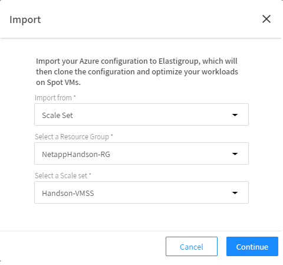
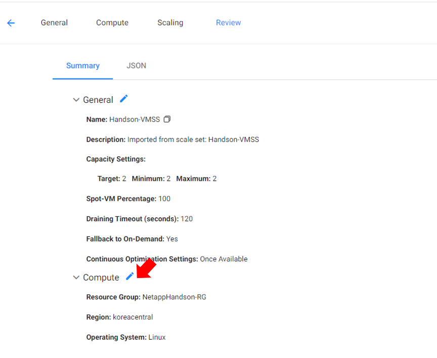
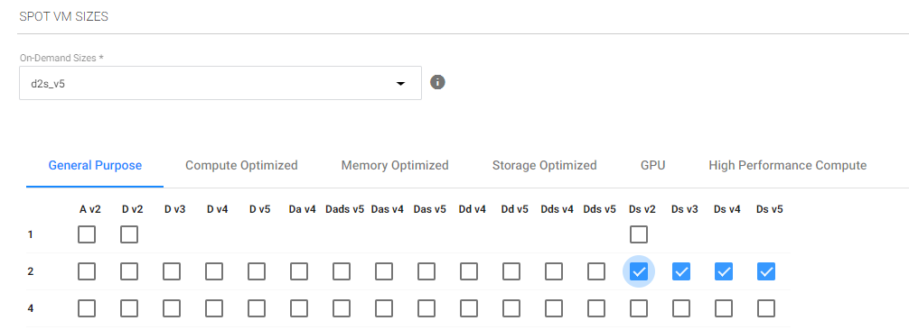
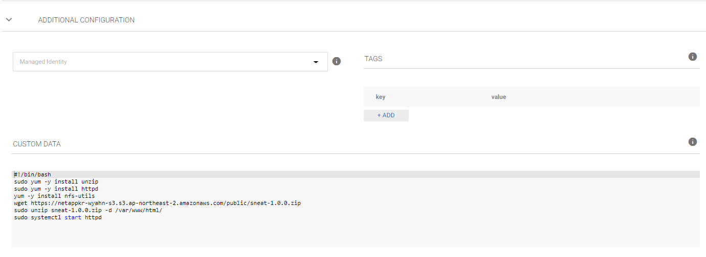

# 기존 Azure 리소스 가져오기
온디멘드 VM으로 동작하는 리소스들을 Elasticgroup에 가져올 수 있습니다.

# 전제조건
Spot 계정과 Azure 구독이 연결되어 있어야 합니다.
Azure 리소스(예: Scale Set, Application Gateway, Load Balancer, VM)가 적어도 하나이상 실행되고 있어야 합니다.

## Azure 환경을 이용하여 ElasticGroupo 생성
1. Elasticgrouop 콘솔에서 import를 선택합니다. </br>

2. 가져올 에저 리소스를 선택합니다.
- import from: scale set </br>
- select a Resource Group : NetappHandson-RG
- Select a Load Balancer : Handson-LB
- Select a Scale Set : Handson-bg </br>

3. Review 컴퓨팅 부분을 누르고 설정을 편집합니다.

4. 스팟 VM 사이즈를 추가선택합니다.</br>


> ### 주의
> 리소스 그룹 내 네트워크 보안 그룹 목록을 가져오지 못하는 경우 잠시 다른 리소스그룹을 선택하였다가 다시 기존 리소스 그룹을 > 선택하면 보안그룹목록이 보입니다.

5. 고급 설정에서 CUSTOM DATA를 입력합니다.
```bash
#!/bin/bash
sudo yum -y install unzip 
sudo yum -y install httpd 
yum -y install nfs-utils 
sudo mount -t nfs -o rw,hard,rsize=262144,wsize=262144,sec=sys,vers=4.1,tcp <AzuerNetappFiles 탑재대상IP주소>:/ANFHandsonVolume /var/www/html/
wget https://netappkr-wyahn-s3.s3.ap-northeast-2.amazonaws.com/public/sneat-1.0.0.zip
sudo unzip sneat-1.0.0.zip -d /var/www/html/
sudo systemctl start httpd
```

6. 리뷰페이지로 돌아와 그룹을 생성합니다.

7. Azure VMSS 에서 인스턴스 수를 0으로 조절합니다. 


8. 브라우저에 아래주소를 입력합니다.
```url
http://<로드벨런서IP주소>/sneat-1.0.0/html/index.html
```

# 결과
- 브라우저에 서비스페이지가 잘 보입니다.
- 2대의 VM이 Spot 타입으로 실행됩니다.


# 다음과정
Azure Netapp files 볼륨 설정에 대해 알아봅니다. </br>
- [Volume Operation](../AzureNetappFiles/VolumeOperation.md)
- [Azure NetApp Files에 NFS 볼륨 생성](../AzureNetappFiles/CreateVolmeinAzure.md)