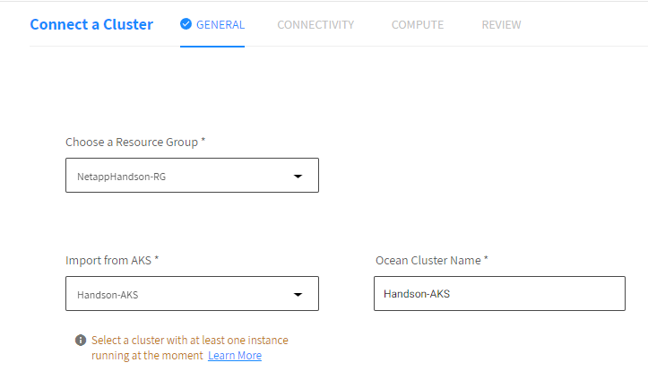
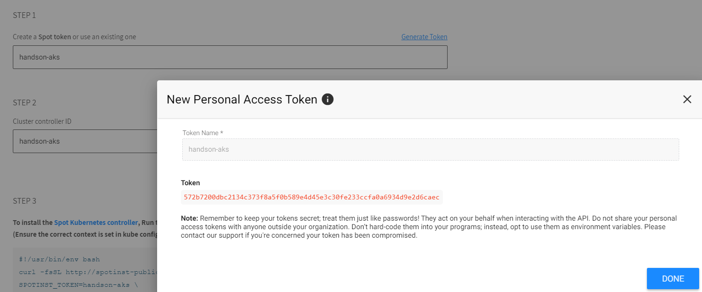
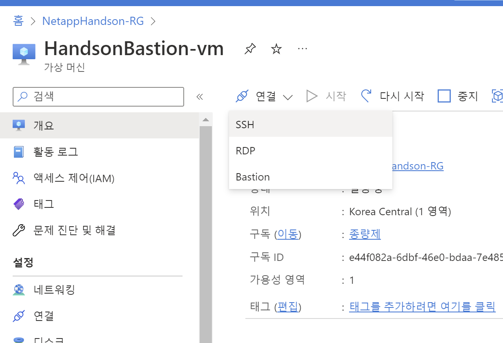
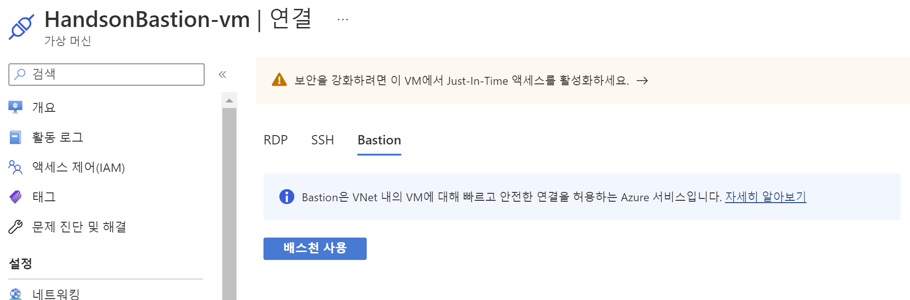
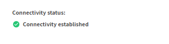
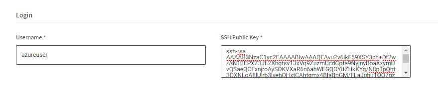
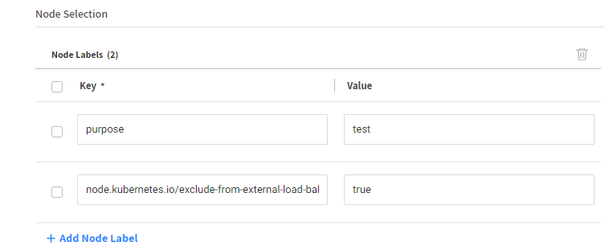

# Ocean 간략 소개
Ocean은 포드, 컨테이너 및 애플리케이션의 요구 사항을 충족하도록 인프라 용량과 크기를 자동으로 조정하는 Kubernetes용 관리형 인프라 서비스입니다.

이 절차에서는 스팟 콘솔을 사용하여 기존 AKS 클러스터를 Ocean에 연결합니다.

# 전제 조건
- Spot에 연결된 Azure 구독
- 하나 이상의 노드를 실행하는 AKS의 Kubernetes 클러스터
- Kubernetes 명령줄 도구 kubectl은 워크스테이션에 설치되고 관련 AKS 클러스터와 함께 작동하도록 구성됩니다.

# 기존 AKS 클러스터 연결
1. Spot Console의 왼쪽 메뉴에서 Ocean/Cloud Clusters를 클릭하고 Create Cluster를 클릭합니다.


2. Cluster 생성 페이지가 나타나면 아래 항목을 선택합니다. 
   - 리소스 그룹: AKS 클러스터를 포함하는 Azure 리소스 그룹
   - AKS에서 가져오기: 가져올 AKS 클러스터
 
<!---->
3. 다음을 클릭합니다.
4. AKS와 Ocean을 연결합니다.
- "Generate Token" 을 클릭하고 Spot Token을 생성합니다.
   - Token Name : Handson-AKS
    > ### Tips
    > 미리 생성된 토큰의 값을 알고 있다면 중복 사용가능합니다. </br>
     </br>
    클러스터 컨트롤러 ID를 입력하거나 자동으로 생성합니다.
5. HandsonBastion-VM에 접속합니다. </br>
    

   ### 다음중 하나의 방법을 선택하여 접속 합니다.
   1. 클라이언트와 SSh를 통해서 연결 </br>
      [handsonkey.pem](../keypair/handsonkey.pem) 키를 다운로드합니다.
      ```bash
      ssh -i handsonkey.pem azureuser@<"HandsonBastion-VM IP">
      ```
   2. Bastion 사용
      [handsonkey.pem](../keypair/handsonkey.pem) 키를 다운로드합니다.
      

6. azure cli를 통해 Azure에 로그인 합니다.
    ```bash
    az login
    ```
    ```
    To sign in, use a web browser to open the page https://microsoft.com/devicelogin and enter the code S5ASZ297Y to authenticate.
    ```
    1. 브라우저에 주소를 입력하고 코드입력란에 CLI에 표시된 코드를 입력합니다.
    2. 로그인에 성공하면 브라우저 종료 안내 메세지와 함께 az cli 로그인이 성공합니다.
7. Cli의 기본값이 Handson 구독을 바라보고 있는지 확인합니다.
    ```bash
    az account list --output table
    ```
    ```bash
    Name               CloudName    SubscriptionId                        TenantId                              State    IsDefault
    -----------------  -----------  ------------------------------------  ------------------------------------  -------  -----------
    종량제             AzureCloud   e44f082a-6dbf-46e0-bdaa-7e485a9807ae  4949618e-15bd-4e73-8600-555f657fd9b1  Enabled  True
    AzureCSP_NetAppKR  AzureCloud   3a49f80b-be29-4847-9d66-724a67d9f3d4  984e6d5f-7ea1-4394-8330-52e1f31b4097  Enabled  False
    ```
8. 맞지 않다면 기본값을 변경합니다.
    ```bash
    az account set --subscription "<your subscribtion>"
    ```
9. az aks install-cli 명령을 사용하여 kubectl을 설치합니다.
    ```bash
    az aks install-cli
    ```
10. aks 접속정보를 가져옵니다.
    ```bash
    az aks get-credentials --resource-group NetappHandson-RG --name Handson-AKS
    ```
    설치가 성공적이라면 AKS서비스 조회 시 아래와 같은 결과가 출력됩니다.
    ```bash
    wooyoung [ ~ ]$ kubectl get svc
    NAME         TYPE        CLUSTER-IP   EXTERNAL-IP   PORT(S)   AGE
    kubernetes   ClusterIP   10.0.0.1     <none>        443/TCP   24h
    wooyoung [ ~ ]$ 
    ```
11. Azure Cloudshell에서 AKS 클러스터 컨텍스트로 설정된 워크스테이션에서 표시된 스크립트를 실행합니다.
    ```bash
    #!/usr/bin/env bash
    curl -fsSL http://spotinst-public.s3.amazonaws.com/integrations/kubernetes/cluster-controller/scripts/init.sh | \
    SPOTINST_TOKEN=< Token > \
    SPOTINST_ACCOUNT=<your spot account > \
    SPOTINST_CLUSTER_IDENTIFIER=handson-aks \
    bash
    ```
    ```bash
    2022-09-20T13:34:43.727Z downloading
    2022-09-20T13:34:44.954Z rendering
    2022-09-20T13:34:45.014Z applying
    secret/spotinst-kubernetes-cluster-controller created
    configmap/spotinst-kubernetes-cluster-controller-config created
    serviceaccount/spotinst-kubernetes-cluster-controller created
    clusterrole.rbac.authorization.k8s.io/spotinst-kubernetes-cluster-controller created
    clusterrolebinding.rbac.authorization.k8s.io/spotinst-kubernetes-cluster-controller created
    deployment.apps/spotinst-kubernetes-cluster-controller created
    ```

    Ocean Controller가 클러스터에서 작동하는지 확인하려면 연결 확인을 클릭하십시오. 테스트가 완료될 때까지 약 2분 정도 기다립니다.
    

> ### Tips
> Ocean Controller가 배포되고 Ocean 서버와 통신이 시작되기까지 시간이 걸릴 수있습니다.
> 아래와 같은 명령을 통해 로그를 확인하고 진행과정을 확인 할 수 있습니다.
> ```
> wooyoung [ ~ ]$ kubectl get pods -n kube-system 
> NAME                                                     READY   STATUS    RESTARTS   AGE
> spotinst-kubernetes-cluster-controller-f58d9d4f8-z2qsz   1/1     Running   0          73s
> kubectl get pods -n kube-system spotinst-kubernetes-cluster-controller-f58d9d4f8-z2qsz 
> ```

12. AKS에서 리소스 가져오기 프로세스를 실행합니다.
kubectl 명령줄 도구가 설치 및 구성된 시스템에서 다음 스크립트를 실행합니다. 
(kube 구성에서 올바른 컨텍스트가 설정되었는지 확인하십시오.)
    ```basj
    curl -fsSL https://spotinst-public.s3.amazonaws.com/integrations/kubernetes/aks/spot-aks-connector/init.sh | \
    bash -s acd-4ed2c385
    2022-09-20T13:42:07.200Z downloading
    2022-09-20T13:42:08.305Z rendering
    2022-09-20T13:42:08.312Z applying
    job.batch/get-waagent-data created

    wooyoung [ ~ ]$ kubectl get job -n kube-system
    NAME               COMPLETIONS   DURATION   AGE
    get-waagent-data   1/1           18s        18s
    ```
13. (Kubenet 기반 AKS 클러스터만 해당) Azure 환경에 대한 소유자 권한 토큰이 있는 워크스테이션에서 표시된 스크립트를 실행합니다. 이렇게 하면 새 노드를 프로비저닝할 때 Ocean이 사용할 Azure MSI(관리 서비스 ID)에 필요한 권한이 조정됩니다.

    ```bash
    wooyoung [ ~ ]$ curl -fsSL https://spotinst-public.s3.amazonaws.com/integrations/kubernetes/aks/spot-aks-cluster-setup/aks-kubenet-routetable-access.sh | bash -s 3a49f80b-be29-4847-9d66-724a67d9f3d4 NetappHandson-RG Handson-AKS
    Success! Role assigned to MSI
    ```
14. 다음을 선택합니다.
15. 로그인 항목에서 퍼블릭키를 입력합니다. 나머지 값은 자동으로 입력됩니다. 기본값으로 수행합니다.
    ```bash
    ssh-rsa AAAAB3NzaC1yc2EAAAABIwAAAQEAvu2v6lkF59XSY3ch+Df2w/AN10EPXZ3JL2Xbqtsv13xVq9ZuzmUcdCpfa9NyjnyBoaXxymUvQSaeQCFxnjroAySOKVXaR6n6ahWFGQOYlfZHkKYg/N8pTpQht3QXNLoA8lUlrb3lyehQHxtCAhtgmx4BIaBpGM/FLaJqhu1OQ7gz0GBbG1qZOmEyrzcklkvriyPYzEESg3N9w+eM09rWvu3dK+EezAsgeFBlcsfHY5eNRmgp2iPfvz8tNZ3wgsrU/UiZHueqsMmGYS+Njjr461cx2q3EhjjPbYz8+tj3t/taZ/Jf419r9ZhT1JHm8/vUh22B5Xm31LdbMBPGvuUKPQ==
    ```
    </br>
16. Disk 항복에서 Type을 Premium_LRS 로 변경합니다.</br>
    - OS Disk Type : Premium_LRS</br>
17. VNG 항목에서 라벨을 추가합니다.</br>
    - key: node.kubernetes.io/exclude-from-external-load-balancers
    - value: true</br>
    

18. 다음을 선택합니다.
19. 최종확인 후 생성합니다.

## 결과
AKS가 Ocean과 연결됩니다.</br>


# 다음과정
Cloudmanager를 배포합니다. </br>
- 다음주제: [Deploy Cloudmanager](../AzureNetappFiles/Deploy_Cloudmanager.md)
- 이전주제: [Create Lab Quickstart Guide](../Quickstart/Quickstart.md)


## 참조
- [Connect an Existing AKS Cluster](https://docs.spot.io/ocean/getting-started/aks)
- [cloud-provider-azure/AKS/issues](https://github.com/kubernetes-sigs/cloud-provider-azure/issues/401)
