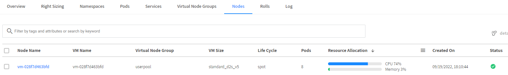
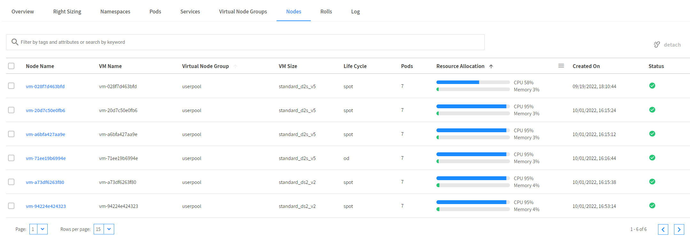
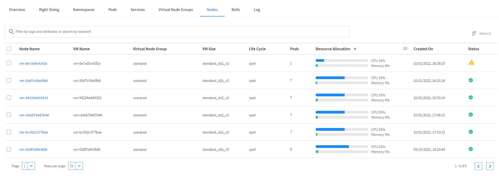
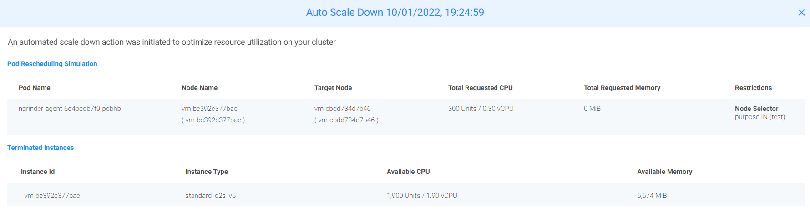

# 확장과 축소(Kubernetes)
Kubernetes 클러스터에 대한 Ocean의 포드 기반 확장은 세 가지 주요 목표를 제공합니다.

- 리소스 부족으로 인해 현재 노드에서 실행에 실패한 포드를 예약합니다.
- 빈번한 확장 포드가 인스턴스가 시작될 때까지 기다릴 필요가 없도록 합니다(자세한 내용은 헤드룸 섹션 참조).
- 클러스터 리소스가 최적으로 활용되는지 확인합니다.
## 확장
Ocean이 클러스터의 Pending job을 감지하여 일어납니다.

## 축소
Ocean은 활용도가 낮은 노드를 사전에 식별 하고 노드의 포드를 보다 효율적으로 빈 포장 하여 노드를 축소하고 클러스터 비용을 줄일 수 있습니다.


자세한 설명은 [Scaling](https://docs.spot.io/ocean/features/scaling-kubernetes?id=scaling-kubernetes) 문서를 참조합니다.

# 스케일링
Pendding event 감지 시 요구사항 많큼 노드가 증가하는지 확인합니다.

1. Spot Ocean 콘솔에서 VNG 설정을 수정합니다.
   1. Ocean > VNG 탭 > VNG 이름을 클릭합니다.
   2. VNG 설정 화면에서 View 방식을 json 으로 변경합니다.
   3. Edit mode를 활성화 하고 VMsize : null 값을 아래와 같이 변경합니다.
   > ### Tips
   > VNG 그룹에 하기 라벨이 설정되어 있는지 반드시 확인합니다. </br>
   > node.kubernetes.io/exclude-from-external-load-balancers=true
   ### 변경할 설정 값
   ```json
   {
    "vmSizes": [  
      "standard_ds2_v2",
      "standard_d2s_v5"
   ],
    {
      "key": "node.kubernetes.io/exclude-from-external-load-balancers",
      "value": "true"
    }
    }
   ```
   ### 변경 예시
   ```json
   {
     "labels": [
       {
         "key": "purpose",
         "value": "test"
       },
       {
         "key": "node.kubernetes.io/exclude-from-external-load-balancers",
         "value": "true"
       }
     ],
     "taints": [],
     "autoScale": {
       "headrooms": []
     },
     "launchSpecification": {
       "tags": [],
       "osDisk": {
         "type": "Standard_LRS",
         "sizeGB": 30
       }
     },
     "resourceLimits": {
       "maxInstanceCount": 20
     },
     "name": "userpool",
     "vmSizes": [  
       "standard_ds2_v2",
       "standard_d2s_v5"
     ],
     "zones": [
       "1",
       "2",
       "3"
     ]
   }
   ```
   4. 변경된 설정을 적용합니다.
2. ngrinder 앱을 배포합니다.
    ```bash
    kubectl create ns ngrinder
    ```
    ```bash
    kubectl apply -f /opt/DeployTestapp/ngrinder/ngrinder-controller.yaml
    ```
    ```bash
    kubectl apply -f /opt/DeployTestapp/ngrinder/ngrinder-AzureLB-svc.yaml
    ```
    ```bash
    kubectl apply -f /opt/DeployTestapp/ngrinder/ngrinder-agent.yaml
    ```
    > ### Tips
    > Ocean은 노드풀(vmss)에 포함된 노드를 배포하지 않고 Spot by Netapp에서 관리하는 VNG라는 가상그룹에 노드를 배포합니다.
    > 따라서 AKS 에서 외부 노드에 대한 서비스 인식에서 제외하는 TAG가 필요합니다.
    > 자세한 내용은 [여기](https://github.com/Azure/AKS/issues/2026)를 참조 하세요
    4. app 배포 상태를 확인합니다.
    ```bash
    kubectl get pod -n ngrinder -o wide
    ```
    ```
    NAME                                   READY   STATUS    RESTARTS   AGE     IP             NODE              NOMINATED NODE   READINESS GATES
    ngrinder-agent-6d4bcdb7f9-wrdft        1/1     Running   0          3m35s   10.92.16.110   vm-028f7d463bfd   <none>           <none>
    ngrinder-controller-784bb4688f-bjtvq   1/1     Running   0          4m34s   10.92.16.41    vm-028f7d463bfd   <none>           <none>
    ```
    5. 수 분 뒤 Spot console 확인 시 Spot Node가 생성되고 앱이 배포됩니다.
    
        ```
        kubctl get svc -n ngrinder 
        ```
        ```bash
        NAME       TYPE           CLUSTER-IP   EXTERNAL-IP   PORT(S)                                                                                                                                                                                                                         AGE
        ngrinder   LoadBalancer   10.0.206.206   20.214.216.130   80:32193/TCP,16001:32440/TCP,12000:30045/TCP,12001:32230/TCP,12002:30569/TCP,12003:30104/TCP,12004:32568/TCP,12005:31197/TCP,12006:31637/TCP,12007:32603/TCP,12008:32122/TCP,12009:31611/TCP   29m
    6. EXTERNAL-IP 출력된 IP로 웹브라우저 접속 시 ngrinder 서비스가 보입니다. 로그인합니다..</br>
        > admin/admin</br>
    7. 오른쪽 상단 admin 을 드롭다운 하여 "에이전트 관리" 를 선택합니다.
      - 수분 후 agent 한개가 구동되는것이 확인됩니다.
      

3. 어플리케이션 확장
    1. agent app을 스케일링 합니다.
        ```bash
        vim /opt/DeployTestapp/ngrinder/ngrinder-agent.yaml 

    2. Agent Pod가 5개로 스케일 UP되는 것을 확인합니다.
      ```bash
      kubectl get pods -n ngrinder 
      ```
      ```
      NAME                                   READY   STATUS    RESTARTS   AGE
      ngrinder-agent-6d4bcdb7f9-4mrxj        0/1     Pending   0          3m11s
      ngrinder-agent-6d4bcdb7f9-67x9p        0/1     Pending   0          3m11s
      ngrinder-agent-6d4bcdb7f9-tlv6z        1/1     Running   0          3m11s
      ngrinder-agent-6d4bcdb7f9-wrdft        1/1     Running   0          22h
      ngrinder-agent-84df766f4f-b5wfx        0/1     Pending   0          3m11s
      ngrinder-agent-84df766f4f-h8mfd        0/1     Pending   0          3m11s
      ngrinder-agent-84df766f4f-qv9wd        0/1     Pending   0          3m11s
      ngrinder-controller-784bb4688f-bjtvq   1/1     Running   0          22h
      ```
    > ### Tips
    > 노드를 생성 후 부팅되고 AKS 클러스터에 등록되기까지 수분의 시간이 필요합니다.
    > 컴퓨팅 리소스가 확장되기 전까지 클러스터에서 POD 배포를 보류합니다.
    > 더 빠른 확장을 위해 Ocean은 Headroom이라는 기능을 제공합니다.
    - Ocean web console에서 Node가 증가 하였는지 확인합니다.
    
    - ngrinder "에이전트 관리" 화면에서 agent가 증가하였는지 확인합니다.
    - kubectl 명령을 통해 node 수를 확인합니다.
    ```bash
    kubectl get node -o custom-columns=NodeName:metadata.name,labels:metadata.labels.purpose,STATUS:status.conditions[3].type,AGE:status.conditions[3].lastTransitionTime
    ```
    ```
    NodeName                            labels   STATUS               AGE
    aks-agentpool-69515322-vmss000001   <none>   TerminateScheduled   2022-09-13T17:20:15Z
    vm-028f7d463bfd                     test     Ready                2022-09-23T01:36:51Z
    vm-20d7c50e0fb6                     test     Ready                2022-10-01T07:18:44Z
    vm-71ee19b6994e                     test     Ready                2022-10-01T07:19:55Z
    vm-94224e424323                     test     Ready                2022-10-01T07:56:22Z
    vm-a6bfa427aa9e                     test     Ready                2022-10-01T07:18:16Z
    vm-a73df6263f80                     test     Ready                2022-10-01T07:19:40Z
    ```
4. 어플리케이션 축소
    1. BastionHost 에서 ngrinder agent 앱의 스팩을 변경합니다.
    ```
    vim /opt/DeployTestapp/ngrinder/ngrinder-agent.yaml
    ```
    ```yaml
    apiVersion: apps/v1
    kind: Deployment
    metadata:
      name: ngrinder-agent
      namespace: ngrinder
    spec:
      replicas: 5
      selector:
        matchLabels:
          app: ngrinder
          tier: middle
      template:
        metadata:
          labels:
            app: ngrinder
            tier: middle
        spec:
          containers:
          - name: ngrinder-agent
            image: ngrinder/agent:latest
            #imagePullPolicy: Always
            resources:
              requests:
                cpu: 700m # 1500m에서 700m으로 변경
            args:
            - "ngrinder.ngrinder.svc.cluster.local:80"
          affinity:
            nodeAffinity:
              requiredDuringSchedulingIgnoredDuringExecution:
                nodeSelectorTerms:
                - matchExpressions:
                  - operator: In
                    key: purpose
                    values:
                    - test
    ```
    2. 배포를 삭제합니다.
    ```bash
    kubectl delete -f /opt/DeployTestapp/ngrinder/ngrinder-agent.yaml
    ```
    ```bash
    root@HandsonBastion-vm:/opt/DeployTestapp/ngrinder# k get pod -o wide -n ngrinder
    NAME                                   READY   STATUS        RESTARTS   AGE     IP             NODE              NOMINATED NODE   READINESS GATES
    ngrinder-controller-784bb4688f-bjtvq   1/1     Running       0          24h     10.92.16.41    vm-028f7d463bfd   <none>           <none>
    ```
    3. 변경된 설정으로 다시 배포합니다.
    ```bash
    kubectl apply -f /opt/DeployTestapp/ngrinder/ngrinder-agent.yaml
    ```
    ```bash
    root@HandsonBastion-vm:/opt/DeployTestapp/ngrinder# k get pod -o wide -n ngrinder
    NAME                                   READY   STATUS    RESTARTS   AGE   IP             NODE              NOMINATED NODE   READINESS GATES
    ngrinder-agent-665f66859c-75rht        1/1     Running   0          57s   10.92.19.18    vm-bc392c377bae   <none>           <none>
    ngrinder-agent-665f66859c-8t644        1/1     Running   0          57s   10.92.17.103   vm-20d7c50e0fb6   <none>           <none>
    ngrinder-agent-665f66859c-qb2vm        1/1     Running   0          57s   10.92.18.205   vm-cbdd734d7b46   <none>           <none>
    ngrinder-agent-665f66859c-qmh56        1/1     Running   0          57s   10.92.19.192   vm-d00c70f7b9cd   <none>           <none>
    ngrinder-agent-665f66859c-s9kgj        1/1     Running   0          57s   10.92.18.88    vm-94224e424323   <none>           <none>
    ngrinder-controller-784bb4688f-bjtvq   1/1     Running   0          24h   10.92.16.41    vm-028f7d463bfd   <none>           <none>
    ```
    
    > ### 경고!
    > AKS 에서 kube-scheduler의 기본값과 roleup 정책 기본값이 적용되어 있는 상태임으로 기본배포를 삭제 후 재생성해야 합니다.
    > node 당 하나의 POD가 할당되지 않은 경우 [Pod Topology Spread Constraints](https://docs.spot.io/ocean/features/scaling-kubernetes?id=pod-topology-spread-constraints) 항목을 참조하여 각 노드에 균일하게 배포될 수 있도록 설정합니다.
    
5. Ocean 클러스터가 자동으로 노드를 축소하는지 확인합니다.
    - Ocean web console에서 수분 후 Node가 감소 하였는지 확인합니다.
    - ngrinder "에이전트 관리" 화면에서 agent가 감소하였는지 확인합니다.
    - kubectl 명령을 통해 node 수를 확인합니다.
    - 빈패킹 전
    
        > 빈패킹 프로세스 과정은 조건에 따라 수분이상 걸립니다.
        > 기다리지 마시고 다음과정을 진행하면서 확인하시기 바랍니다.
        > 
    - 빈패킹 후
    
    # 결과
    - Ocean은 Cluster의 Request를 감지하고 자동으로 Scaling 동작을 수행합니다.
    - binpacking 프로세스를 활용하여 비용 효율적인 컴퓨팅 활용이 가능합니다.

# 다음과정
헤드룸에 대해 알아봅니다.</br>
- 다음주제: [Headroom](./Headroom.md)
- 이전주제: [Workload Migration](./WorkloadMigration.md)

# 참조
- [Scaling (Kubernetes)](https://docs.spot.io/ocean/features/scaling-kubernetes)
- [AKS ISSUE](https://github.com/Azure/AKS/issues/2026)