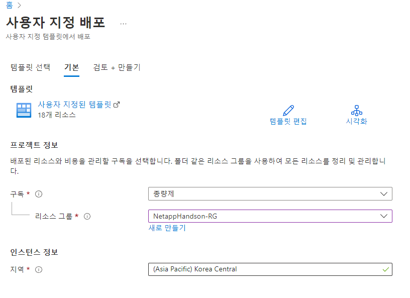
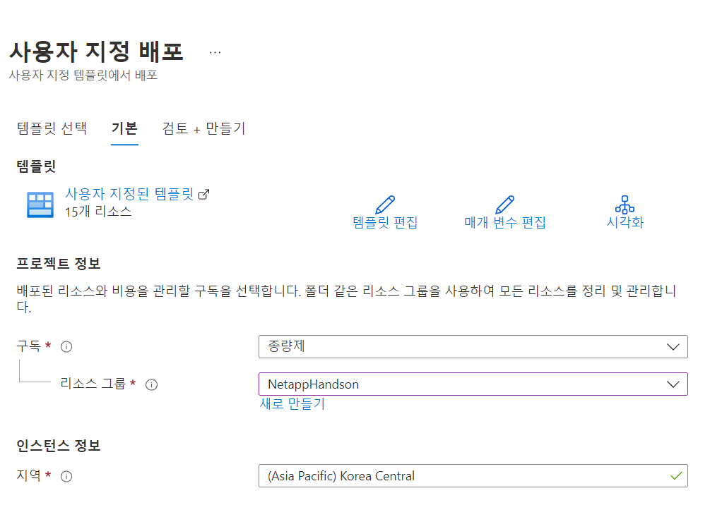
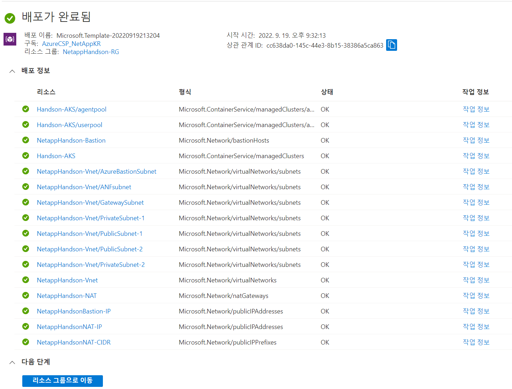

# Handson 환경 생성
Hands on 환경을 빠르게 생성합니다.

# 선행조건
다음 사용조건을 만족해야 합니다.
## Cloudshell 사용
cloudshell 또는 AzureCLI가 미리 구성되지 않으셧다면 수행합니다.

## Provider 등록
```bash
wyahn1219 [ ~ ]$ az provider register --namespace Microsoft.OperationsManagement
Registering is still on-going. You can monitor using 'az provider show -n Microsoft.OperationsManagement'
wyahn1219 [ ~ ]$ az provider register --namespace Microsoft.OperationalInsights
Registering is still on-going. You can monitor using 'az provider show -n Microsoft.OperationalInsights'
```

## 사용자 지정 템플릿에서 배포
1. 리소스 그룹을 생성합니다.
- 이름: NetappHandson-RG
- 위치: Korea Central</br>

2. 사용자 지정 템플릿 배포를 검색하여 클릭합니다.
3. 탬플릿 선택, "편집기에서 사용자 고유 탬플릿을 빌드합니다."를 선택합니다.
- [ParterAcademyv4_template](./ARM/ParterAcademyv4.json)
4. 파라미터를 확인합니다. 명시되지 않은값은 모두 기본값으로 지정합니다.
- 구독: '<your subsciption>', 
- 리소스그룹: "NetappHanson-RG"


> ### Tips
> Azure Resourc Manager는 매우 드문 확률로 "재시도 가능한 오류" 문구가 표시되며 리소스 배포에 실패하는 경우가 있습니다.
> ( 병렬배포를 실행하는 구조적 문제일껍니다.. 아마도?)
> 이 경우 리소스 그룹의 모든 리소스를 삭제 후 재시도 하시기 바랍니다.

# 결과
Hands on Lab 이 생성됩니다.


# 다음과정
Ocean 연동을 진행합니다.</br>
- 다음주제: [클라우드매니저 배포](./AzureNetappFiles/Deploy_Cloudmanager.md) 


## 참조
- [Azure Doc AKS api](https://learn.microsoft.com/en-us/rest/api/aks/managed-clusters/create-or-update?tabs=HTTP)
- [Azure Doc 리소스 배포](https://learn.microsoft.com/ko-kr/azure/azure-resource-manager/templates/deploy-portal)
