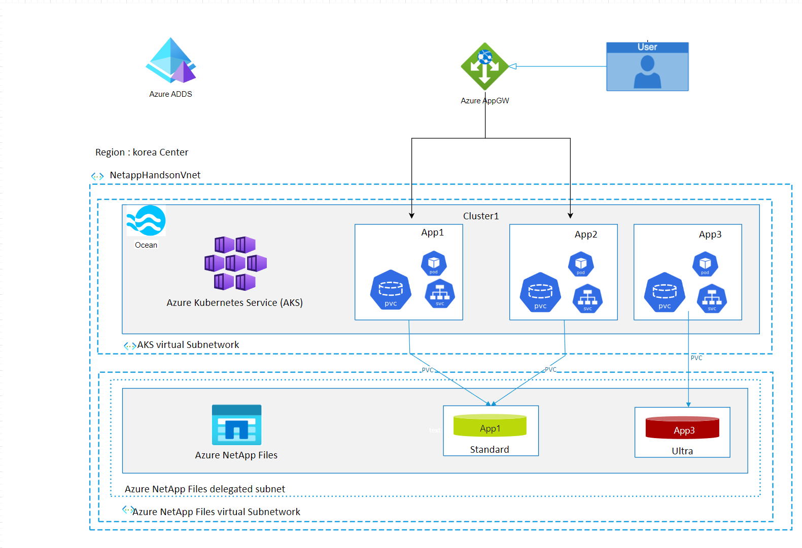

# 2022 Partner Academy Cloud Hands-on
본 과정에서는 Spot Ocean과 Azure Netapp Files를 이용하여 다양한 서비스들을 배포하고 설정합니다.
이 과정에서 이용할 수 있는 솔루션의 기능에 대해 소개합니다.

## 구성도

# 절차
1. [Create Lab Quickstart Guide](./Quickstart/Quickstart.md)
2. [Connecting Ocean to AKS](./OceanforAKS/ConnectAnAKSCluster.md)
3. [Deploy Cloudmanager](./AzureNetappFiles/Deploy_Cloudmanager.md) 
4. [Azure Netapp Files](./AzureNetappFiles/Readme.md)  
  4-1. [Create ANF on Azure](./AzureNetappFiles/CreateAzureNetappFilesonAzure.md)  
  **번외**
  4-2. [Create ANF on Cloudmanager](./AzureNetappFiles/CreateAzureNetappFiles.md)  
5. [Trident](./Trident/README.md) 
  5-1. [Install Trident on cloudmanager](./Trident/InstallTrident.md) 
  5-2. [Install Trident used tridentctl](./Trident/InstallTridentctl.md) 
6. [Deploy testapp](./Trident/deploy_testapp.md)
7. [Workload Migration](./OceanforAKS/WorkloadMigration.md)
8. [Ocean Features & Concept](https://docs.spot.io/ocean/features/) 
  8-1. [Scaling event](./OceanforAKS/ScalingEvent.md) 
  8-2. [Headroom](./OceanforAKS/Headroom.md) 
  **번외** 
  8-3. [Right Sizing](./OceanforAKS/RightSizing.md) 
  8-4. [Cost Analysis](./OceanforAKS/CostAnalysis.md) 
9. [AZure Netapp Files](./AzureNetappFiles/Readme.md) 
  9-1. [Create Volume](./AzureNetappFiles/CreateVolmeinAzure.md) 
  9-2. [Volume Operation](./AzureNetappFiles/VolumeOperation.md) 
  9-3. [Volume Backup & restore](./AzureNetappFiles/VolumeBackupAndRestore.md) 
  9-4. [Import volume to AKS](./Trident/ImportVolumeToAKS.md)  
  **번외** 
  9-5. [stateful pod](./FSXforOntap/K8SWithFSxOntap_Stateful.md)

