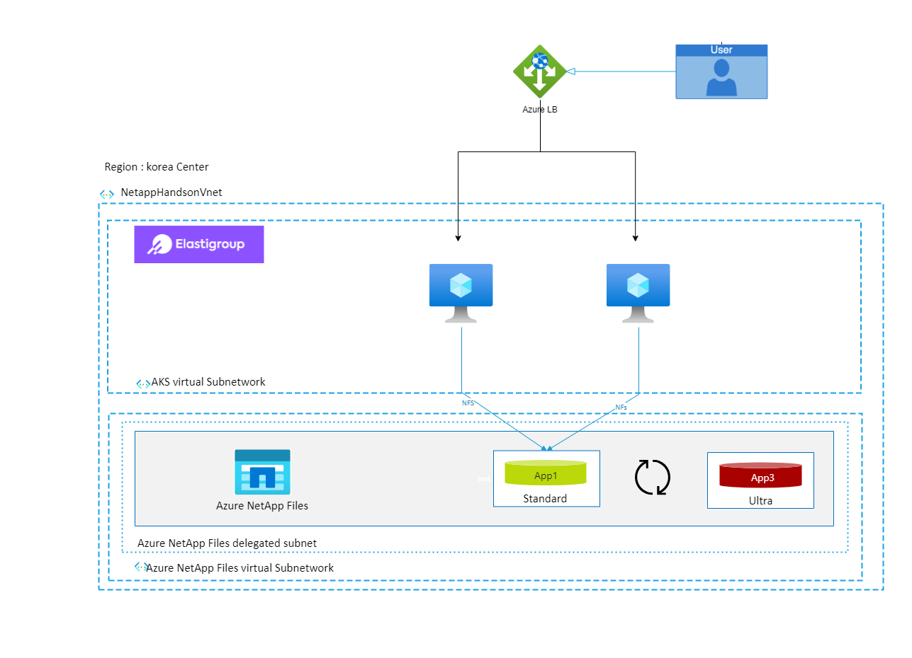

# 2022 Partner Academy Cloud Hands-on
본 과정에서는 Spot Ocean과 Azure Netapp Files를 이용하여 다양한 서비스들을 배포하고 설정합니다.
이 과정에서 이용할 수 있는 솔루션의 기능에 대해 소개합니다.

## 구성도

# 절차
1. [Hands on Lab 배포](./Quickstart/Quickstart.md)
2. [클라우드매니저 배포](./AzureNetappFiles/Deploy_Cloudmanager.md) 
3. [Azure Netapp Files](./AzureNetappFiles/Readme.md)  
  3-1. [Azure 콘솔에서 Azure Netapp Files 생성](./AzureNetappFiles/CreateAzureNetappFilesonAzure.md)  
4. [Azure NetApp Files에 NFS 볼륨 생성](./AzureNetappFiles/CreateVolmeinAzure.md)
5. [엘라스틱그룹으로 가져오기](./Elasticgroup/CreateElasticgroup.md)
6. [AZure Netapp Files](./AzureNetappFiles/Readme.md) 
  6-1. [Volume Operation](./AzureNetappFiles/VolumeOperation.md) 
  6-2. [Volume Backup & restore](./AzureNetappFiles/VolumeBackupAndRestore.md) 

