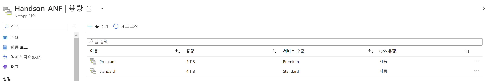

# Trident 설치
Tridentctl을 활용하여 설치합니다. ( 구 버전)
Trident에 대한 추가 설명은 [여기](./README.md)를 참조합니다.

# 전제조건
- AKS에 접속가능한 상태여야만합니다. 베스천 호스트에서 접속정보를 받아오는 방법은 [여기](../OceanforAKS/ConnectAnAKSCluster.md)를 참조하세요.
## Tridentctl 설치
1. HandsonBastion-VM 서버에 접속합니다.
2. tridentctl install -n trident
3. 설치 확인
- tridentctl version -n trident or kubectl get tridentversions.trident.netapp.io -n trident
```bash
wooyoung [ ~/trident-installer ]$ kubectl get tridentversions.trident.netapp.io -n trident
NAME      VERSION
trident   22.07.0
```
## ANF를 backend로 등록합니다.
1. Azure console 에서 용량풀 정보가 올바르게 입력되었는지 확인합니다.</br>


2. backend 정보를 작성합니다.

    [Deploy_cloudmanager](../AzureNetappFiles/Deploy_Cloudmanager.md)과정에서 Azure AD에 등록한 Cloudmanager App의 정보를 입력합니다.

    ```bash
    vim backend-Handson-ANF.json
    ```
    ```json
    {
            "version": 1,
            "storageDriverName": "azure-netapp-files",
            "backendName" : "Handson-ANF",
            "subscriptionID": "<your subcription ID>",
            "tenantID": "<your tenant ID>",
            "clientID": "<your Cloudmanager App ID>",
            "clientSecret": "<your screat key >",
            "location": "koreacentral",
            "virtualNetwork": "NetappHandson-Vnet",
            "nfsMountOptions": "vers=4.1,proto=tcp,timeo=600",
            "storage": [
            {
                "labels": {
                    "performance": "premium"
                },
                "serviceLevel": "Premium"
            },
            {
                "labels": {
                    "performance": "standard"
                },
                "serviceLevel": "Standard"
            }
        ]
    }
    ```
2. tridentctl create backend -f backend-Handson-ANF.json -n trident
    ```bash
    wooyoung [ ~/trident-installer ]$ ./tridentctl create backend -f backend-Handson-ANF.json -n trident
    +-------------+--------------------+--------------------------------------+--------+---------+
    |    NAME     |   STORAGE DRIVER   |                 UUID                 | STATE  | VOLUMES |
    +-------------+--------------------+--------------------------------------+--------+---------+
    | Handson-ANF | azure-netapp-files | 87aab7ee-0d0b-42fd-a370-dd216ef0e7d1 | online |       0 |
    +-------------+--------------------+--------------------------------------+--------+---------+
    ```
# 결과
1. trident 네임스페이스에 app들이 모두 Running 상태인것이 보입니다.
    ```bash
    Kubectl get All -n trident
    ```
2. AKS에 커스텀 리소스가 등록된것이 확인됩니다.
    ```bash
    root@HandsonBastion-vm:/opt/DeployTestapp/ImportVolume# k get customresourcedefinitions.apiextensions.k8s.io 
    NAME                                             CREATED AT
    tridentbackendconfigs.trident.netapp.io          2022-08-31T23:22:17Z
    tridentbackends.trident.netapp.io                2022-08-31T23:22:14Z
    tridentmirrorrelationships.trident.netapp.io     2022-08-31T23:22:17Z
    tridentnodes.trident.netapp.io                   2022-08-31T23:22:16Z
    tridentsnapshotinfos.trident.netapp.io           2022-08-31T23:22:17Z
    tridentsnapshots.trident.netapp.io               2022-08-31T23:22:15Z
    tridentstorageclasses.trident.netapp.io          2022-08-31T23:22:18Z
    tridenttransactions.trident.netapp.io            2022-08-31T23:22:15Z
    tridentversions.trident.netapp.io                2022-08-31T23:22:16Z
    tridentvolumepublications.trident.netapp.io      2022-08-31T23:22:18Z
    tridentvolumes.trident.netapp.io                 2022-08-31T23:22:15Z
    volumesnapshotclasses.snapshot.storage.k8s.io    2022-08-30T22:49:08Z
    volumesnapshotcontents.snapshot.storage.k8s.io   2022-08-30T22:49:08Z
    volumesnapshots.snapshot.storage.k8s.io          2022-08-30T22:49:08Z

    root@HandsonBastion-vm:/opt/DeployTestapp/ImportVolume# k get trident
    tridentbackendconfigs.trident.netapp.io       tridentstorageclasses.trident.netapp.io
    tridentbackends.trident.netapp.io             tridenttransactions.trident.netapp.io
    tridentmirrorrelationships.trident.netapp.io  tridentversions.trident.netapp.io
    tridentnodes.trident.netapp.io                tridentvolumepublications.trident.netapp.io
    tridentsnapshotinfos.trident.netapp.io        tridentvolumes.trident.netapp.io
    tridentsnapshots.trident.netapp.io 
    ```

# 다음과정
Test App을 배포합니다. </br>
- 다음주제: [ Deploy TEST App ](./deploy_testapp.md)
- 이전주제: [ Azure Netapp File 생성 ](../AzureNetappFiles/CreateAzureNetappFilesonAzure.md)

# 참조
- [ANF Backend configuration](https://netapp-trident.readthedocs.io/en/stable-v20.07/kubernetes/operations/tasks/backends/anf.html)
- [Troubleshooting](https://docs.netapp.com/us-en/trident/troubleshooting.html#general-troubleshooting)