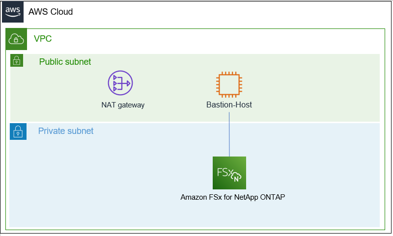

# [Amazon FSx for NetApp ONTAP] AD 도메인에 가입하지 않고 SMB에서 파일 공유에 연결.

Amazon FSx for NetApp ONTAP(이후 FSx for ONTAP)에 SMB로 접속하는 검증을 위해 AD DS를 준비하는 것이 귀찮습니다. </br>
그 귀찮음을 해결하기 위해 ec2 AD 를 직접 구성하고 이미지화 시켜 테라폼으로 자동화하는 과정을 거쳤습니다 </br>
하지만 몇번 검증을 하다보면 사용되는 ec2 마저도 돈이 너무 아깝습니다. </br>

하지만 SMB 구성을 위해서는 FSx for ONTAP의 SVM을 도메인에 참가 시키는 작업이 필요합니다. </br>
AWS에서는 MSAD 구성을 통해 사용하는것을 가이드하고 있습니다.

> ## [ONTAP용 FSx의 마이크로소프트 액티브 디렉터리 사용](https://docs.aws.amazon.com/ko_kr/fsx/latest/ONTAPGuide/ad-integration-ontap.html)
>
> Amazon FSx는 마이크로소프트 액티브 디렉터리 (AD) 와 연동하여 기존 환경과 통합합니다. Active Directory는 네트워크에 있는 개체에 대한 정보를 저장하고 관리자와 사용자가 이 정보를 쉽게 찾고 사용할 수 있도록 하는 데 사용되는 Microsoft 디렉터리 서비스입니다. 이러한 객체에는 일반적으로 파일 서버, 네트워크 사용자 및 컴퓨터 계정과 같은 공유 리소스가 포함됩니다.
>
> Amazon FSx로 스토리지 가상 머신 (SVM) 을 생성할 때 선택적으로 AD 도메인에 연결하여 사용자 인증과 파일 및 폴더 수준의 액세스 제어를 제공할 수 있습니다. 그러면 SMB (서버 메시지 블록) 클라이언트가 AD의 기존 사용자 ID를 사용하여 자신을 인증하고 SVM의 볼륨에 액세스할 수 있습니다. 또한 사용자는 기존 ID를 사용하여 개별 파일 및 폴더에 대한 액세스를 제어할 수 있습니다. 또한 기존 파일 및 폴더와 이러한 항목의 보안 액세스 제어 목록 (ACL) 구성을 수정 없이 Amazon FSx로 마이그레이션할 수 있습니다.
>
> NetApp ONTAP용 Amazon FSx를 AD에 연결하면 각 SVM을 AD에 독립적으로 가입합니다. 즉, 일부 SVM은 AD에 연결되고 다른 SVM은 연결되지 않는 파일 시스템을 가질 수 있습니다.
>
>SVM을 AD에 연결한 후 다음 속성을 업데이트할 수 있습니다.
>
>- 서비스 사용자 자격 증명
>
>- DNS 서버 IP 주소


그러나 SMB를 사용하여 연결을 조금 검증하기 위해 AD DS를 구성하는 것은 매우 번거롭습니다. 
CVO나 기존 Ontap의 경우 AD 없이 workgroup 구성을 통해 SMB를 잘 활용했었습니다.

NetApp의 Knowledge Base에도 다음과 같이 설명되어 있습니다.

> ## Is Workgroup Mode Supported for CIFS/SMB in ONTAP?
> Workgroup mode is a standard feature in Windows that allows a workstation to operate without an Active Directory Domain, it allows the ability to authenticate and serve data without DC interaction </br>
> Support for Workgroup mode was missing for older versions of Data ONTAP, but it has been added as of ONTAP 9.0 and later </br>
>
> This feature is crucial in situations like:
> - When customers do not want a Microsoft domain infrastructure
> - When customers are prevented from using a Microsoft domain by regulation policies
>   - How to create a new CIFS server configured for Workgroup mode?
>     - ```Cluster::>vserver cifs create -vserver [vserver_name] -cifs-server [cifs_server_name] -workgroup [workgroup_name]```
>   - How to move a CIFS server from a domain to a workgroup?
>     - ```Cluster::>vserver cifs modify -vserver [vserver_name] -cifs-server [cifs_server_name] -status-admin down -workgroup [workgroup_name]```
>   - How to move a CIFS server from a workgroup to a domain?
>     - ```Cluster::>vserver cifs modify -vserver [vserver_name] -cifs-server [cifs_server_name] -status-admin down -domain [domain_name]```

## 구성 환경


## FSxN CIFS 서버 설정

1. 먼저 FSxN을 SMB 구성을 하지 않고 생성합니다. 

> ### 경고!
> 여기서 생성 방법은 따로 가이드하지 않습니다. </br>
> 수동 생성이 귀찮으신 분들은 [cdk 템플릿](https://github.com/non-97/fsx-for-ontap-windows-client)이나 Netapp korea github의 테라폼 예제, [FSxN workshop](https://github.com/aws-samples/amazon-fsx-workshop/tree/master/netapp-ontap) 클라우드 포메이션 자동 배포를 활용하세요.

2. Bastion host에 접속합니다.
> ### 경고!
> Test에 사용할 Bastion 서버 구성방법에 대해서 가이드하지 않습니다. </br>
> FSxN과 동일한 VPC에 EC2 window 서버를 배포하는것을 추천합니다. </br>
> 이 가이드에서는 리눅스로 하겠습니다.

3. aws console 또는 cli를 통해 접속정보를 받아옵니다.</br>
(콘솔접속은 귀찮으니 cli로 확인합니다.)
```
aws fsx describe-file-systems
```
```json
{
    "FileSystems": [
        {
            "OwnerId": "169544784679",
            "CreationTime": "2023-01-31T05:05:16.013000+00:00",
            "FileSystemId": "fs-07cc7eec44bbd83f8",
            "FileSystemType": "ONTAP",
            "Lifecycle": "AVAILABLE",
            "StorageCapacity": 1024,
            "StorageType": "SSD",
            "VpcId": "vpc-0ae249757f34ca385",
            "SubnetIds": [
                "subnet-0f5c93becdd0e2a14"
            ],
            "NetworkInterfaceIds": [
                "eni-01e3801f257321aa3",
                "eni-08574dc1f7f817d6d"
            ],
            "KmsKeyId": "arn:aws:kms:ap-northeast-2:169544784679:key/a3693e93-fb5d-42ee-8169-2557f2c90e56",
            "ResourceARN": "arn:aws:fsx:ap-northeast-2:169544784679:file-system/fs-07cc7eec44bbd83f8",
            "Tags": [
                {
                    "Key": "creator",
                    "Value": "SeanP"
                },
                {
                    "Key": "managed",
                    "Value": "terraform"
                },
                {
                    "Key": "Name",
                    "Value": "SeanPFsxN"
                }
            ],
            "OntapConfiguration": {
                "DeploymentType": "SINGLE_AZ_1",
                "Endpoints": {
                    "Intercluster": {
                        "DNSName": "intercluster.fs-07cc7eec44bbd83f8.fsx.ap-northeast-2.amazonaws.com",
                        "IpAddresses": [
                            "172.30.4.238",
                            "172.30.4.114"
                        ]
                    },
                    "Management": {
                        "DNSName": "management.fs-07cc7eec44bbd83f8.fsx.ap-northeast-2.amazonaws.com",
                        "IpAddresses": [
                            "172.30.4.105"
                        ]
                    }
                },
                "DiskIopsConfiguration": {
                    "Mode": "AUTOMATIC",
                    "Iops": 3072
                },
                "PreferredSubnetId": "subnet-0f5c93becdd0e2a14",
                "ThroughputCapacity": 128,
                "WeeklyMaintenanceStartTime": "2:15:30"
            }
        }
    ]
}
```
4. ssh를 통해 FSxN Ontap shell에 접속합니다.
```
ssh fsxadmin@management.fs-07cc7eec44bbd83f8.fsx.ap-northeast-2.amazonaws.com
```

5. 먼저 cifs 구성이 되어 있는지 확인합니다.
```
FsxId07cc7eec44bbd83f8::> vserver cifs show
This table is currently empty.
```
```
vserver cifs create -vserver fsx-for-ontap-svm -cifs-server cifs-server -workgroup fsxn-workgroup
```
> ### 경고
> SMB1 프로토콜 버전은 더 이상 사용되지 않으며 안전하지 않은 것으로 간주됩니다. 
> 따라서 이 CIFS 서버에서는 더 이상 사용되지 않으며 비활성화됩니다.
> SMB1에 대한 지원은 향후 릴리스에서 제거될 수 있습니다. 
> 필요한 경우 아래 명령을 통해 활성화 합니다.
> (privilege: advanced) "vserver cifs options modify -vserver SeanPFsxN -smb1-enabled true"
```
FsxId07cc7eec44bbd83f8::> vserver cifs show
            Server          Status    Domain/Workgroup Authentication
Vserver     Name            Admin     Name             Style
----------- --------------- --------- ---------------- --------------
SeanPFsxN   CIFS            up        FSXN-WORKGROUP   workgroup

FsxId07cc7eec44bbd83f8::> vserver cifs show -instance

                                          Vserver: SeanPFsxN
                         CIFS Server NetBIOS Name: CIFS
                    NetBIOS Domain/Workgroup Name: FSXN-WORKGROUP
                      Fully Qualified Domain Name: -
                              Organizational Unit: -
Default Site Used by LIFs Without Site Membership: -
                                   Workgroup Name: FSXN-WORKGROUP
                             Authentication Style: workgroup
                CIFS Server Administrative Status: up
                          CIFS Server Description: 
                          List of NetBIOS Aliases: -

FsxId07cc7eec44bbd83f8::> 
```
## CIFS 사용자 만들기
SMB로 연결할 때 인증에 사용할 CIFS 사용자를 만듭니다.

```
vserver cifs users-and-groups local-user create -user-name cifs-user -is-account-disabled false

Enter the password: Netapp1!
Confirm the password: Netapp1!

FsxId07cc7eec44bbd83f8::> vserver cifs users-and-groups local-user show -instance

                                   Vserver: SeanPFsxN
                                 User Name: CIFS\Administrator
                                 Full Name: 
                               Description: Built-in administrator account
                       Is Account Disabled: true

                                   Vserver: SeanPFsxN
                                 User Name: CIFS\cifs-user
                                 Full Name: -
                               Description: -
                       Is Account Disabled: false
2 entries were displayed.
```


## CIFS share point 만들기

### 네이밍 제약 조건
- ONTAP 공유 명명 규칙은 Windows 명명 규칙과 동일하며 다음 요구 사항을 포함합니다.
- 공유 이름은 SMB 서버에서 각각 고유해야 합니다.
- 공유 이름은 대소문자를 구분하지 않습니다.
- 공유 이름의 최대 길이는 80자입니다.
- 공유 이름은 유니코드를 지원합니다.
- $ 기호로 끝나는 공유 이름은 숨겨진 공유입니다.
- 관리 공유 ADMIN$, IPC$ 및 c$는 모든 CIFS 서버에서 자동으로 생성됩니다. 이러한 공유 이름은 예약되어 있습니다.
- 공유를 만들 때 ONTAP_ADMIN$이라는 공유 이름을 사용할 수 없습니다.
- 공유 이름은 공백 사용을 지원합니다.
- 공유 이름의 시작 또는 끝 문자는 공백이 될 수 없습니다.
- 공백을 포함하는 공유 이름은 따옴표로 묶어야 합니다.
- 작은 따옴표는 공유 이름의 일부로 간주되며 따옴표 대신 사용할 수 없습니다.
- SMB 공유 이름은 다음 특수 문자 사용을 지원합니다.</br>
```！@ #$%&'__ .~ （） ｛ ｝```
- SMB 공유 이름은 다음 특수 문자 사용을 지원하지 않습니다.</br>
```"//\:;| 、？* =```

1. 연결할 볼륨 **junction-path**를 확인합니다.
```
FsxId07cc7eec44bbd83f8::> volume show
Vserver   Volume       Aggregate    State      Type       Size  Available Used%
--------- ------------ ------------ ---------- ---- ---------- ---------- -----
SeanPFsxN SeanPFsxN_root 
                       aggr1        online     RW          1GB    972.5MB    0%
SeanPFsxN nfs_Vol      aggr1        online     RW          5GB     4.75GB    0%
2 entries were displayed.

FsxId07cc7eec44bbd83f8::> volume show -fields junction-path
vserver   volume         junction-path 
--------- -------------- ------------- 
SeanPFsxN SeanPFsxN_root /             
SeanPFsxN nfs_Vol        /nfs_Vol      
2 entries were displayed.
```
2. 공유 지점을 생성합니다.
```
vserver cifs share create -share-name cifs-share -path /nfs_Vol
```
3. 잘 만들어 졌는지 확인합니다.
```
vserver cifs share show
FsxId07cc7eec44bbd83f8::> vserver cifs share show
Vserver        Share         Path              Properties Comment  ACL
-------------- ------------- ----------------- ---------- -------- -----------
SeanPFsxN      c$            /                 oplocks    -        BUILTIN\Administrators / Full Control
                                               browsable
                                               changenotify
                                               show-previous-versions
SeanPFsxN      cifs-share    /nfs_Vol          oplocks    -        Everyone / Full Control
                                               browsable
                                               changenotify
                                               show-previous-versions
SeanPFsxN      ipc$          /                 browsable  -        -
3 entries were displayed.

FsxId07cc7eec44bbd83f8::> vserver cifs share show -share-name cifs-share -instance                           

                                      Vserver: SeanPFsxN
                                        Share: cifs-share
                     CIFS Server NetBIOS Name: CIFS
                                         Path: /nfs_Vol
                             Share Properties: oplocks
                                               browsable
                                               changenotify
                                               show-previous-versions
                           Symlink Properties: symlinks
                      File Mode Creation Mask: -
                 Directory Mode Creation Mask: -
                                Share Comment: -
                                    Share ACL: Everyone / Full Control
                File Attribute Cache Lifetime: -
                                  Volume Name: nfs_Vol
                                Offline Files: manual
                Vscan File-Operations Profile: standard
            Maximum Tree Connections on Share: 4294967295
                   UNIX Group for File Create: -
```
4. LIF IP를 확인합니다.
```
FsxId07cc7eec44bbd83f8::> net in show
  (network interface show)
            Logical    Status     Network            Current       Current Is
Vserver     Interface  Admin/Oper Address/Mask       Node          Port    Home
----------- ---------- ---------- ------------------ ------------- ------- ----
FsxId07cc7eec44bbd83f8
            fsxadmin     up/up    172.30.4.105/24    FsxId07cc7eec44bbd83f8-01 
                                                                   e0e     true
            inter_1      up/up    172.30.4.238/24    FsxId07cc7eec44bbd83f8-01 
                                                                   e0e     true
            inter_2      up/up    172.30.4.114/24    FsxId07cc7eec44bbd83f8-02 
                                                                   e0e     true
SeanPFsxN
            iscsi_1      up/up    172.30.4.70/24     FsxId07cc7eec44bbd83f8-01 
                                                                   e0e     true
            iscsi_2      up/up    172.30.4.214/24    FsxId07cc7eec44bbd83f8-02 
                                                                   e0e     true
            nfs_smb_management_1 
                         up/up    172.30.4.217/24    FsxId07cc7eec44bbd83f8-01 
                                                                   e0e     true
6 entries were displayed.
```

5. Bastion host로 돌아와 마운트를 해봅니다.
```
mkdir /FSxN
mount -t cifs -o user='cifs-user',password='NetApp1!' //172.30.4.217/cifs-share /FSxN
```
## 결론
생각해보니 이게 더 귀찮습니다.


# 참조
[[Amazon FSx for NetApp ONTAP] AD 도메인에 가입하지 않고 SMB에서 파일 공유에 연결해 봅니다.](https://dev.classmethod.jp/articles/amazon-fsx-for-netapp-ontap-workgroup-cifs-server/)