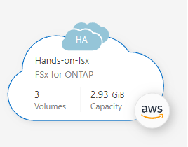
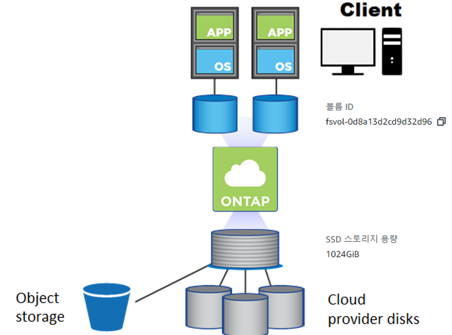
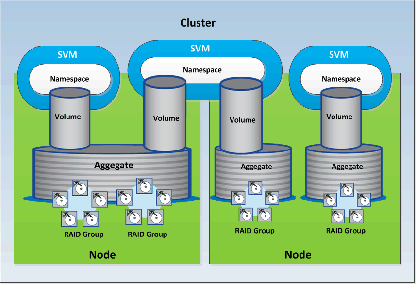
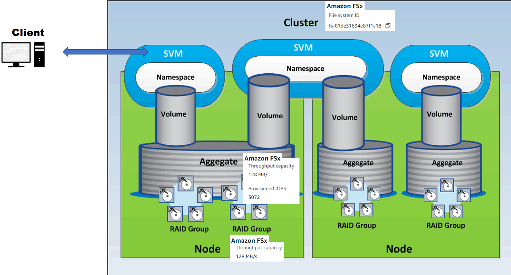
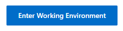
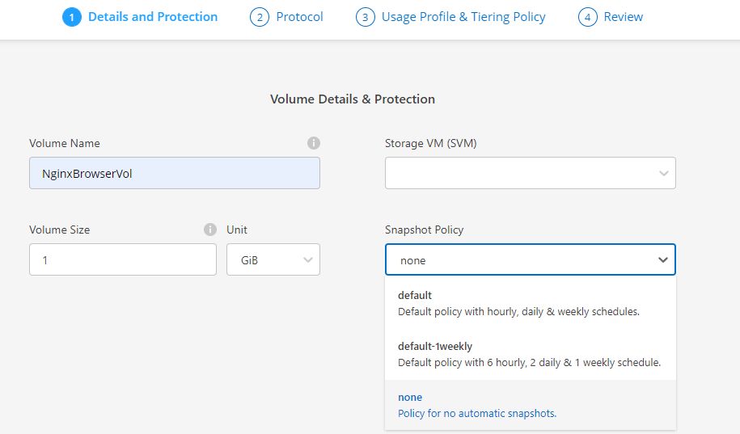
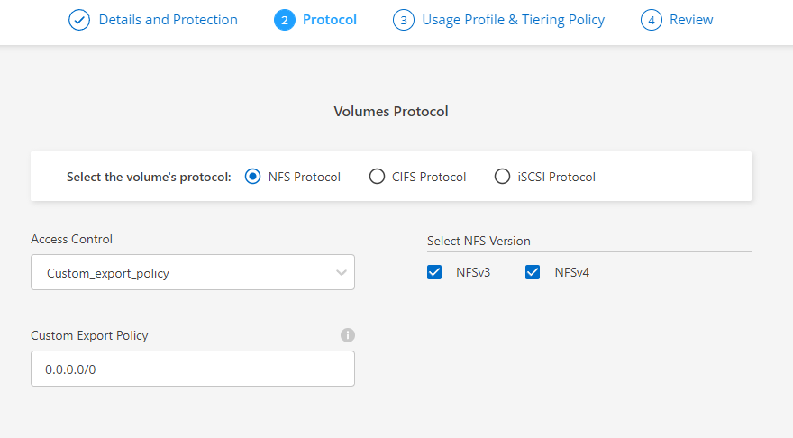
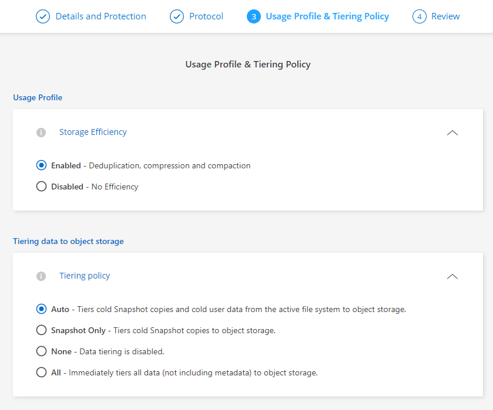
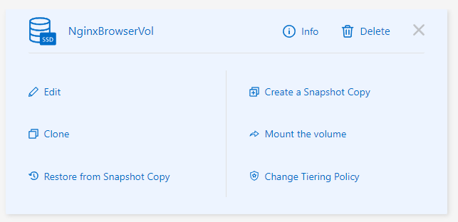

# Manage volumes for Amazon FSx for ONTAP
클라우드매니저를 통해 손쉽게 볼륨을 관리하는 방법에 대해 알아봅니다.

# 전제조건
 Cloudmanager가 배포되어 있어야 합니다. 이전세션 중 Cloudmanager 배포를 수행해주세요.</br>
 

# ONTAP 
Netapp 스토리지 디스크 어레이 에 사용되는 NetApp 의 독점 운영 체제 입니다.</br>
실습 전 Ontap의 스토리지 구조를 간략히 설명합니다.

## 스토리지 가상 머신(SVM)
SVM(스토리지 가상 머신)은 데이터를 관리하고 액세스하기 위한 자체 관리 자격 증명과 끝점이 있는 격리된 파일 서버입니다. 
FSx for ONTAP의 데이터에 액세스하면 클라이언트와 워크스테이션은 데이터가 저장된 SVM의 Endpoint에 액세스합니다.

## 볼륨
볼륨은 파일, 디렉토리 또는 iSCSI LUN(Logical Units of Storage)이 저장되는 격리된 데이터 컨테이너입니다. 볼륨은 씬 프로비저닝됩니다. 즉, 볼륨에 저장된 데이터에 대해서만 스토리지 용량을 소비합니다. 각 볼륨은 파일 시스템의 SVM 중 하나에 생성됩니다. 볼륨은 모든 요구 사항을 충족하도록 데이터를 관리할 수 있는 유연성을 제공합니다. 볼륨별로 데이터를 그룹화하고 권한, 데이터 계층화 정책 등을 설정할 수 있기 때문입니다.

AWS Management 콘솔, AWS CLI, Amazon FSx API 또는 NetApp Cloud Manager를 사용하여 볼륨을 생성할 수 있습니다. 파일 시스템 또는 SVM의 관리 끝점을 사용하여 NetApp ONTAP CLI 또는 REST API를 사용하여 볼륨을 생성, 업데이트 및 삭제할 수도 있습니다.

### 스토리지 구조도
<!---->

<!---->


## 볼륨 생성
1. 작업 환경을 엽니다.</br>

2. 볼륨 메뉴를 열고 "Add Volume" 을 선택합니다.
3. 볼륨생성을 진행합니다.
- Details and protiection
    - Volume Name: NginxBrowserVol
    - Volume Size: 1
    - Unit : Gib
    - SVM: "yourSVM"
    - Snapshot Policy : none
    
- Protocol
    - Access Control : Custom_export_policy
    - Custom Export Policy: 0.0.0.0/0
    - Select NFS Version: 전부 선택
    
- Usage Profile & Tiering Policy
    - Storage Efficiency : enable
    - Tiering Policy : Auto
    
- Review
    > Add를 선택하고 볼륨을 생성합니다.</br>
    > 볼륨 view 화면으로 이동되고 생성된 볼륨이 보입니다.</br>
    ( 보이지 않을 경우 우측 상단 새로고침을 클릭합니다.)

## 볼륨 연결
HandsonBastion 서버에 NFS 볼륨을 연결합니다.
1. 볼륨 마운트 정보 확인
    1. 볼륨 카드에서 ```º º º``` 선택합니다.
    2. Mount the volume 을 선택합니다. </br>
    
    3. 마운트 커맨드를 복사합니다.

2. HandsonBastion 서버에 볼륨을 연결합니다.
    1. HandsonBastion에 접속하여 볼륨을 연결합니다.
        ```bash
        sudo su -
        ```
        ```bash
        mkdir -p /fsxontap/NginxBrowserVol
        ```
        ```bash
        mount <"your svm datalif ip">:/NginxBrowserVol /fsxontap/NginxBrowserVol
        ```
    2. 연결이 잘되었는지 확인합니다.
        ```bash
        df -f
        ```
        ```bash
        Filesystem                   Size  Used Avail Use% Mounted on
        devtmpfs                     3.9G     0  3.9G   0% /dev
        tmpfs                        3.9G     0  3.9G   0% /dev/shm
        tmpfs                        3.9G  468K  3.9G   1% /run
        tmpfs                        3.9G     0  3.9G   0% /sys/fs/cgroup
        /dev/nvme1n1p1                50G   13G   38G  25% /
        /dev/nvme2n1p1               300G  102G  199G  34% /data
        tmpfs                        785M     0  785M   0% /run/user/0
        <"your svm datalif ip">:/NginxBrowserVol  973M  320K  973M   1% /fsxontap/NginxBrowserVol
        ```

# 다음과정
스토리지 효율성 옵션에 대해 알아봅니다.</br>
- 다음주제: [volume Efficiency (중복제거)](./StorageEfficiency.md)
- 이전주제: [AWS FSX for ontap 생성](./CreateFSXontap.md)

# 참조
- [AWS FSXontap Doc]()
- [Cloudmanager Doc]()
- [Ontap Doc](https://docs.netapp.com/us-en/ontap/concepts/namespaces-junction-points-concept.html)
