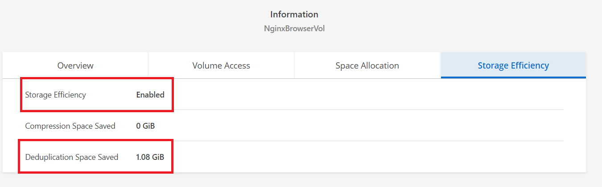

# Storage Efficiency
Storage Efficiency 중 중복제거에 대해 알아봅니다.

# 중복 제거 동작 방식
중복 제거는 전체 FlexVol 볼륨 내의 블록 수준에서 작동하여 중복 데이터 블록을 제거하고 고유한 데이터 블록만 저장합니다.

각 데이터 블록에는 데이터 볼륨의 다른 모든 서명과 비교되는 디지털 서명이 있습니다. 
정확한 블록 서명 일치가 존재하는 경우 블록의 모든 바이트에 대해 바이트 단위 비교가 수행됩니다. 모든 바이트가 일치하는 경우에만 중복 블록이 삭제되고 디스크 공간이 회수되어 데이터 손실이 발생하지 않습니다.

중복 제거는 다음 그림과 같이 데이터 중복을 제거합니다.


# 중복 제거 실습
- Volume 세부 정보에서 NginxBrowserVol 볼륨의 Storage Efficiency가 활성화 되어 있는지 확인합니다.
- test 파일을 다운로드 합니다.
    ```bash
    [root@ ~]# cd /fsxontap/NginxBrowserVol
    [root@ ~]# wget https://netappkr-wyahn-s3.s3.ap-northeast-2.amazonaws.com/public/TestData/testdata-2g.csv

    [root@ ~]# wget https://netappkr-wyahn-s3.s3.ap-northeast-2.amazonaws.com/public/TestData/AllSameByteFile1G
    ```
    > 1G 볼륨을 생성 후 3G 파일을 다운로드하고 있습니다.</br>
    > FSXontap의 Volume 자동 확장이 이루어지고 있음으로 다운로드가 완료되는데 평소보다 더 시간이 필요할 수 있습니다.

### Cloudmanager 에서 확인
- Volume 세부 정보에서 Deduplication Space Saved 항목을 확인합니다.

### OS에서 확인
아래와 같이 파일크기는 3G 이지만 사용율은 2G인것이 확인됩니다.
- 디스크 사용율 확인
    ```bash
    [root@ ~]# df -h
    Filesystem                   Size  Used Avail Use% Mounted on
    devtmpfs                     3.9G     0  3.9G   0% /dev
    tmpfs                        3.9G     0  3.9G   0% /dev/shm
    tmpfs                        3.9G  500K  3.9G   1% /run
    tmpfs                        3.9G     0  3.9G   0% /sys/fs/cgroup
    /dev/nvme1n1p1                50G   13G   38G  25% /
    /dev/nvme2n1p1               300G  102G  199G  34% /data
    tmpfs                        785M     0  785M   0% /run/user/0
    10.0.7.125:/NginxBrowserVol  2.7G  2.0G  683M  75% /fsxontap/NginxBrowserVol
    ```
- 파일 크기 확인
    ```bash
    [root@ ~]# du -sh /fsxontap/NginxBrowserVol/
    3.1G	/fsxontap/NginxBrowserVol/
    ```
> ### 참고
> df -h로 보면 실제 사이징된 볼륨 크기와 차이가 있습니다. </br>
> 관리자가 아닌 사용자에게 실제 데이터크기에 착각을 일으킬 수 있습니다. </br>
> is-space-reporting-logical 옵션을 통해 실제 사용율이 아닌 논리적으로 계산된 사용율을 스토리지에서 OS에 보고 할 수 있습니다. 
> ```
> FsxId01de31634e87f1c18::> vol show NginxBrowserVol -fields is-space-reporting-logical, is-space-enforcement-logical
> vserver    volume          is-space-reporting-logical is-space-enforcement-logical 
> ---------- --------------- -------------------------- ---------------------------- 
> heewon-svm NginxBrowserVol false                      false 
> 
> FsxId01de31634e87f1c18::> vol modify NginxBrowserVol -is-space-reporting-logical true
> Volume modify successful on volume NginxBrowserVol of Vserver > heewon-svm.                                                                                                                                         
> FsxId01de31634e87f1c18::> vol show NginxBrowserVol -fields is-space-reporting-logical, is-space-enforcement-logical
> vserver    volume          is-space-reporting-logical is-space-enforcement-logical 
> ---------- --------------- -------------------------- ---------------------------- 
> heewon-svm NginxBrowserVol true                       false 
> ```

# 다음과정
볼륨 복제에 대해 알아봅니다.</br>
- 다음주제: [Volume Backup & restore](../FSXforOntap/VolumeBackupAndRestore.md)
- 이전주제: [Create Volume](../FSXforOntap/CreateVolume.md)

# 참조
- [Netapp Doc deduplication-concept](https://docs.netapp.com/ko-kr/ontap/concepts/deduplication-concept.html)
- [Netapp Doc enable-logical-space-reporting](https://docs.netapp.com/us-en/ontap/volumes/enable-logical-space-reporting-enforcement-task.html)