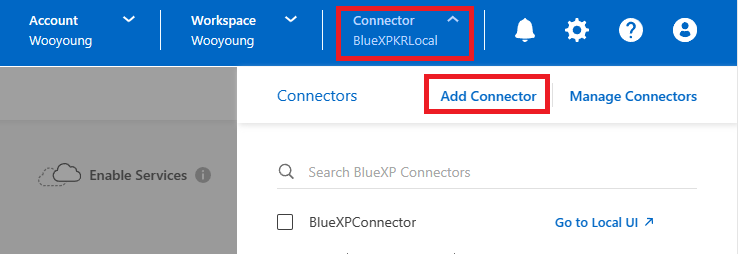
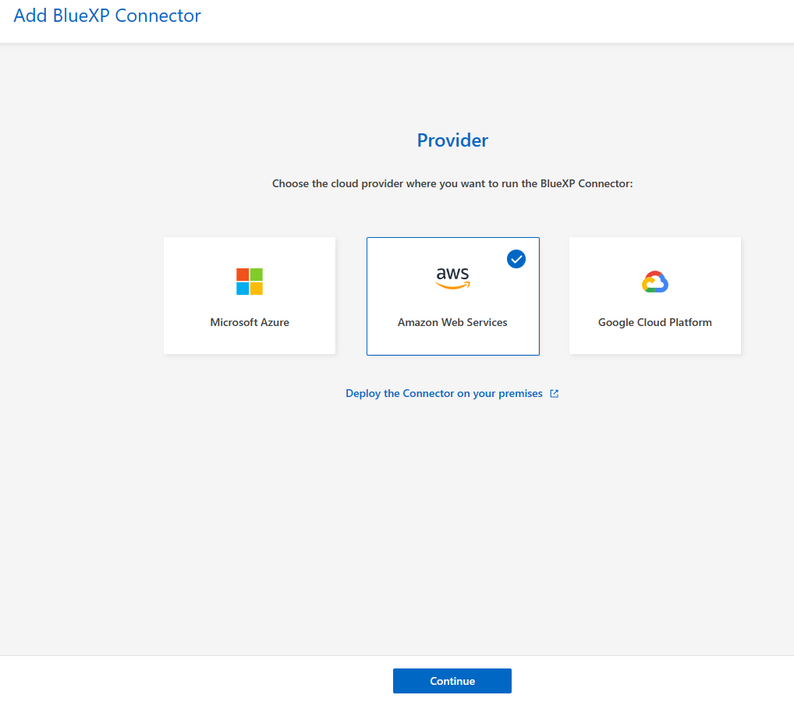
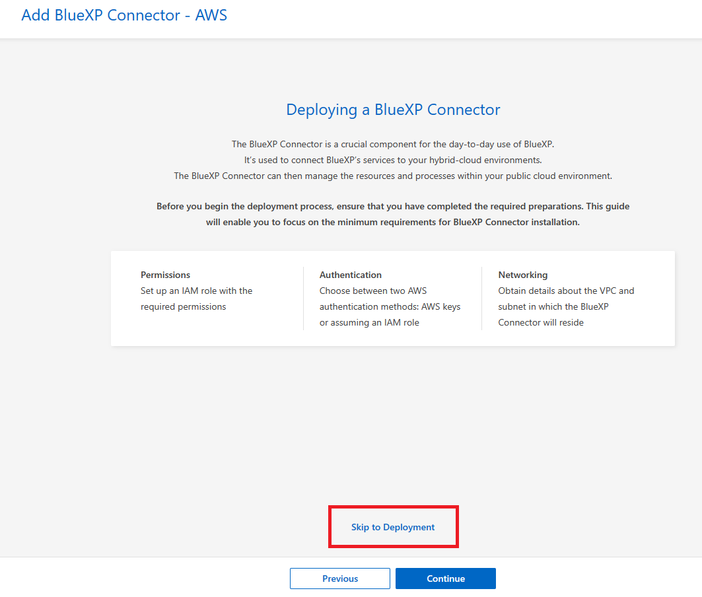
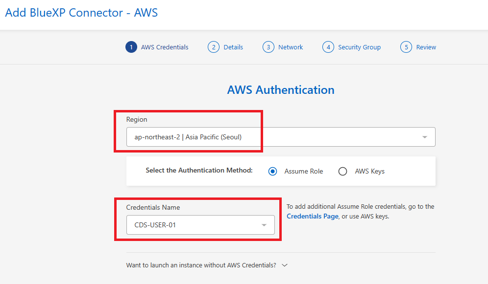
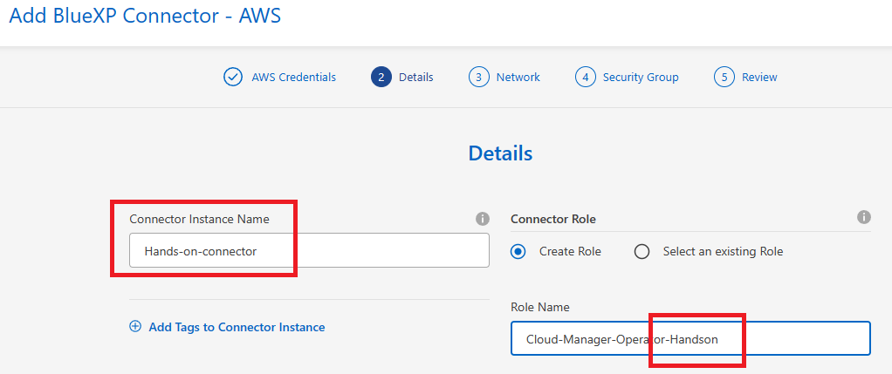
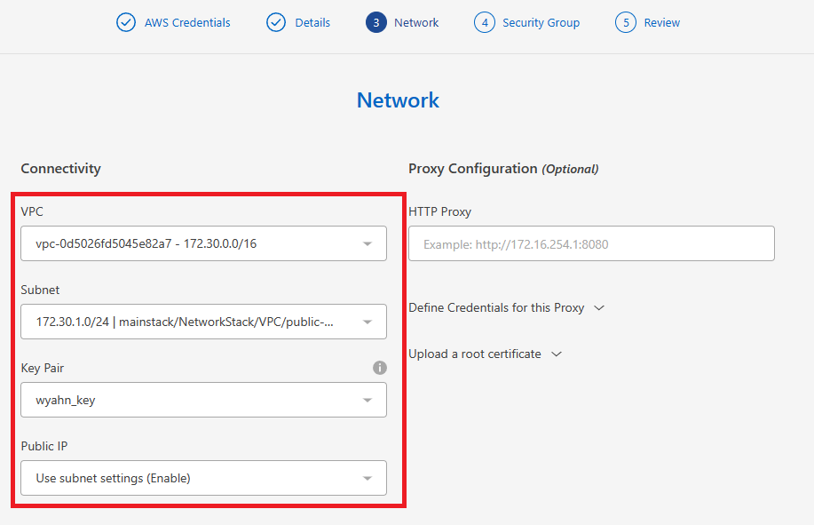
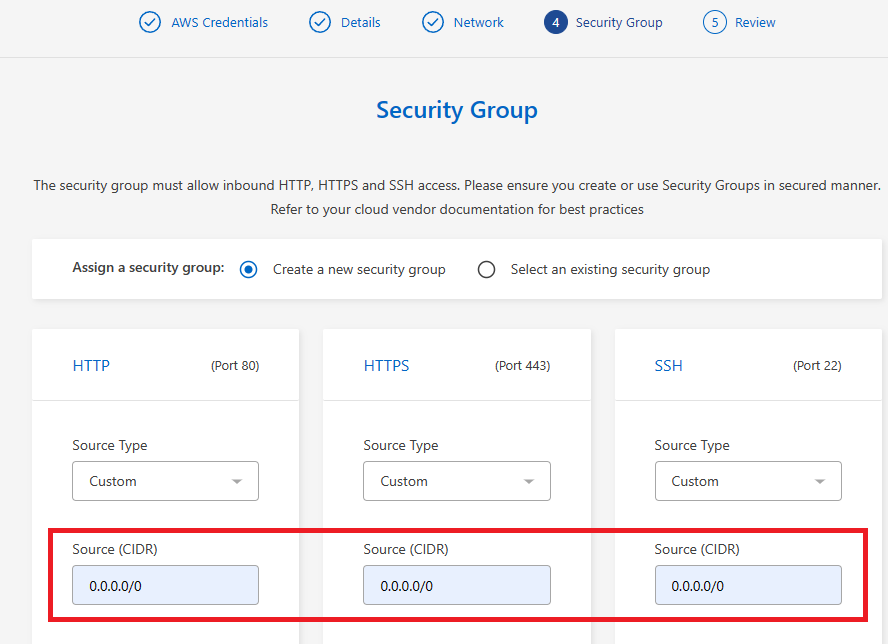
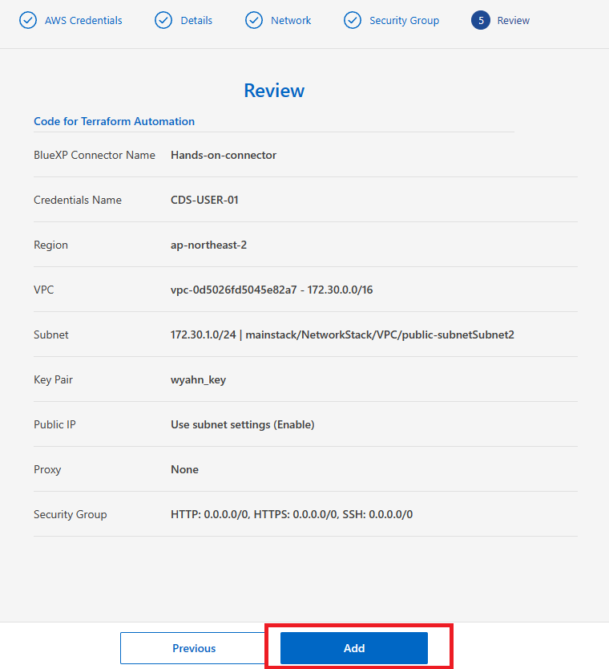

# BlueXP connector 배포
connector를 배포해야만 BlueXP의 다양한 기능들을 활용 할 수 있습니다.

## Pre requirement
- [Add_AWS_Credentinal](./Add_AWS_Credentinal.md)

## BlueXP에서 Connector 배포
1. 웹 브라우저를 열고 [BlueXP](https://consolebluexp.netapp.com)로 이동합니다 .

    a. 로그인되어 있지 않다면 NetApp Cloud Central 자격 증명을 입력하거나 NetApp으로 로그인 을 클릭 하고 NetApp 지원 사이트 자격 증명을 입력하여 로그인합니다.

2. NetApp 지원 사이트 자격 증명으로 로그인하여 등록한 경우 매번 해당 로그인 옵션을 사용해야 합니다.


## AWS connector 생성
1. **Connector** 클릭하고 **Add Connetor** 를 선택합니다.


2. **Amazon Web Services** 를 클라우드 공급자로 선택 하고 **Continue**를 클릭 합니다.

3. ```Skip to Deployment```를 클릭합니다.

4. AWS Authentication<br>
- Select the Authentication Method : Assume Role
- Region : seoul
- Credentials Name: </br>

5. Detail<br>
- Connector Instance Name : Hands-on-connector
- Role Name : Cloud-Manager-Operator-Handson


4. Network<br>
- vpc : 172.30.0.0/16
- subnet : 172.30.0.0/24 
- Key pair : 
- Public IP : Use Subnet Setting


5. Security Group<br>
새로운 보안 그룹을 생성할 것인지, 인바운드 HTTP, HTTPS, SSH 접근을 허용하는 기존 보안 그룹을 선택할 것인지 선택합니다.
- Assign a security group: Create a new security group
- Http : 0.0.0.0/0
- Https : 0.0.0.0/0
- ssh : 0.0.0.0/0
> ### Tips
> 커넥터 VM을 시작하지 않는 한 커넥터로 들어오는 트래픽이 없습니다.  </br>
> HTTP 및 HTTPS는 드문 상황에서 사용할 로컬 UI 에 대한 액세스를 제공합니다.  </br>
> SSH는 문제 해결을 위해 호스트에 연결해야 하는 경우에만 필요합니다. </br>


9. Reviw <br>
선택을 검토하여 설정이 올바른지 확인합니다.

10. Add 를 클릭 합니다.

# 결과
인스턴스는 약 7분~15분 안에 준비됩니다. </br>
프로세스가 완료될 때까지 페이지에 머물러 있어야 합니다.</br>
커넥터를 생성한 동일한 AWS 계정에 Amazon S3 버킷이 있는 경우 캔버스에 Amazon S3 작업 환경이 자동으로 표시됩니다.

## 실습 : BlueXP Connector 배포
- Info : [Read me](./Readme.md)
- Step 1 : [Add_AWS_Credentinal](./Add_AWS_Credentinal.md)
- Step 2 : [Deploy_BlueXP_connector](./Deploy_BlueXP_connector.md)

# Next
[](../CVO/Readme.md)


# 참조
- [ Netapp DOC Connector NW ](https://docs.netapp.com/us-en/cloud-manager-setup-admin/reference-networking-cloud-manager.html#endpoints-to-manage-resources-in-your-public-cloud-environment)
- [ Netapp DOC AWS permissions for the Connector ](https://docs.netapp.com/us-en/cloud-manager-setup-admin/reference-permissions-aws.html)