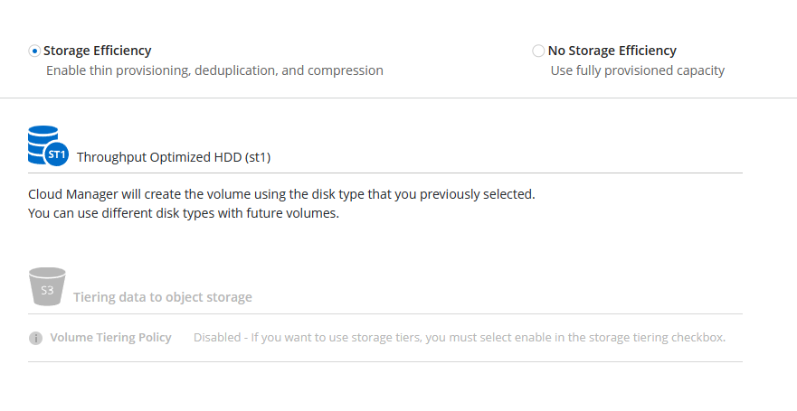

# BlueXP를 통해 Cloud Volume Ontap 생성
BlueXP를 통해 Demo에 사용할 CVO를 손쉽게 배포할 수 있습니다.

## Quick Start
1. __Add Working Enviroment__ </br>

2. Choose a Location </br>

3. Details and Credentials </br>

4. Services </br>

5. Location & Connectivity </br>

6. Data Encryption </br>

7. Cloud Volumes ONTAP Charging Methods & NSS Account </br>

8. Preconfigured Packages </br>


> __Tips__
<details>
    <summary>옵션 (생략가능): HDD로 배포하여 비용을 절약</summary>

<!-- summary 아래 한칸 공백 두고 내용 삽입 -->
## HDD 볼륨을 배포하여 유지비 절약
aws ```gp2```나 ```gp3``` type의 볼륨이 아닌 ```st1``` type을 사용하도록 설정합니다. </br>
이 경우 Tiring 기능을 선택할 수 없습니다. </br>


8. Preconfigured Packages </br>

9. IAM Role </br>

10. Licensing </br>

11. Underlying Storage Resources </br>

12. Underlying Storage Configuration </br>

13. WORM (write once, read many) </br>

</details>

9. volume </br>


10. CIFS Setup </br>
  a. 새 브라우저를 열고 AWS Console에 접속 합니다. </br>
  b. Cloudformation service에서 ```ADStack```으로 시작되는 Stack을 찾습니다. </br>
  c. Output Tab에 출력된 값을 복사합니다. </br>
  </br>

  d. 복사한 값을 알맞게 입력합니다.</br>


기본 루트로 진행하신 경우 __POC용 표준 배포__ 를 클릭하세요  </br>
HDD로 배포하여 비용을 절약 루트를 선택한 경우 __HDD로 배포하여 비용을 절약__ 을 클릭하세요  </br>

<details>
    <summary>POC용 표준 배포</summary>

11. Create Volume - Usage Profile Disk Type & Tiering Policy </br>

</details>
<details>
    <summary>옵션 (생략가능): HDD로 배포하여 비용을 절약</summary>

16. Create Volume - Usage Profile Disk Type & Tiering Policy </br>

</details>


17. Review & Apporve </br>
