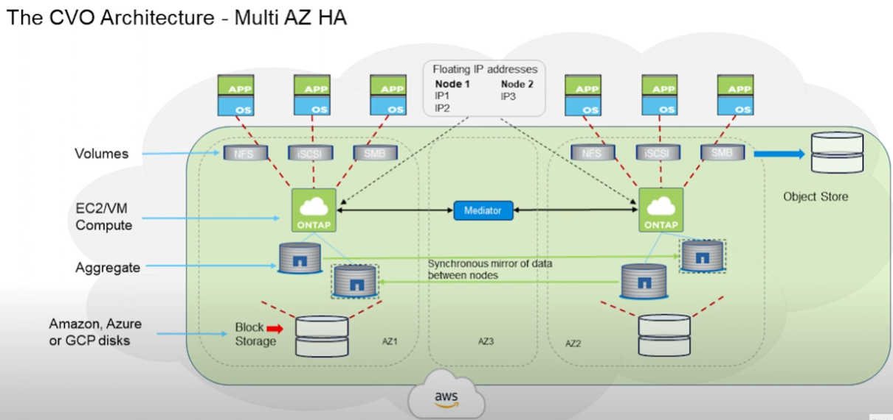

# Netapp Cloud Volume Ontap ( CVO )
Data Efficencies, SnapMirror 등 Netapp Ontap의 강력한 기능을 Cloud 환경에서도 이용할 수 있는 제품입니다. 

## What is Netapp Cloud Volume Ontap ( CVO )

# The CVO Architechure - Multi AZ HA

## 실습 : BlueXP에서 Cloud Volume Ontap을 AWS에 배포
- Info : [Read me](./Readme.md)
- [Create CVO in BlueXP](./Create_CVO_in_BlueXP.md)

# Next

# 참조
- [Cloud Volumes ONTAP에 대해 알아보기](https://docs.netapp.com/us-en/bluexp-cloud-volumes-ontap/concept-overview-cvo.html)