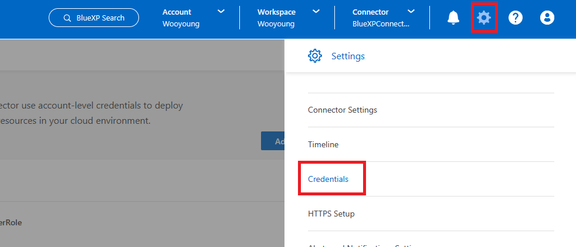
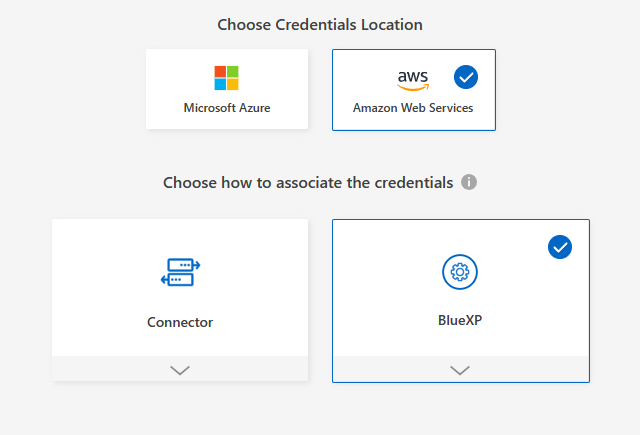
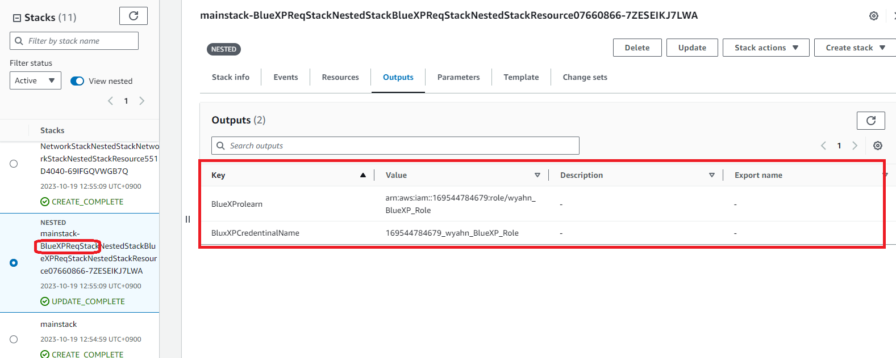
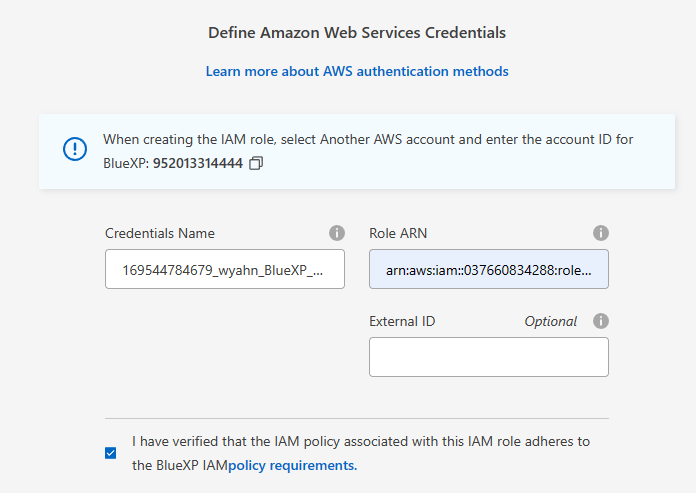

# BlueXP에 AWS Credentinal 추가
BlueXP에서 Plublic Cloud에 자원들을 제어하기위한 권한이 필요합니다.

## BlueXP에 AWS Credentinal 추가
1. 톱니바귀 모양의 아이콘을 클릭합니다.


2. __Add Credential__ 을 클릭합니다.
3. AWS, BlueXP를 선택합니다. 

4. 새로운 브라우저창에서 AWS web console에 접속합니다.
5. Cloudformation 서비스를 검색하고 ```BlueXPReqStack```으로 시작하는 Stack이름을 찾습니다.
6. Output Tab에 있는 값을 복사합니다.

7. BlueXP 콘솔에서 필요한 값을 입력합니다.
- Credentials name : Cloudformaion output 참조
- Role ARN : Cloudformaion output 참조

8. Next > Add 를 눌러 Role을 추가합니다.


# Next
- 이전: [Hands on 환경 배포](../QuickStart/Readme.md)
- 다음: [BlueXP Connector 배포](./Deploy_BlueXP_connector.md)
