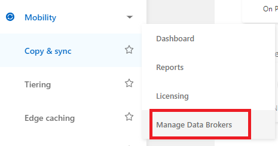
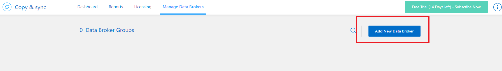
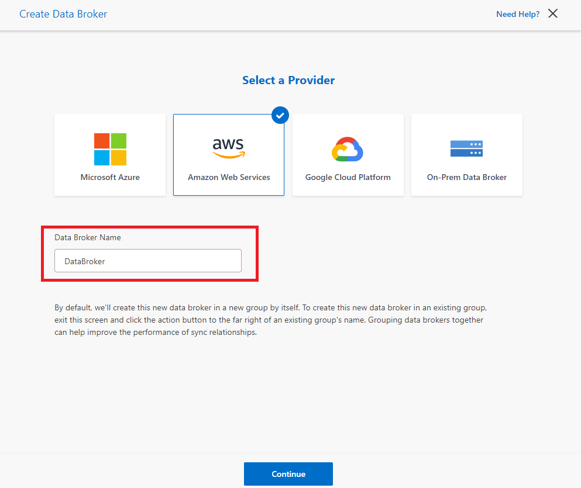
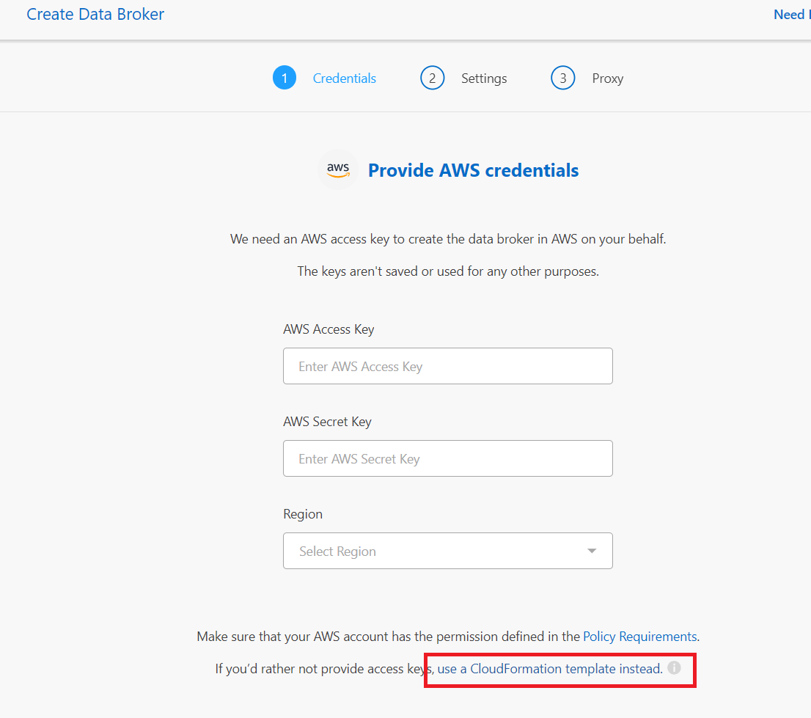
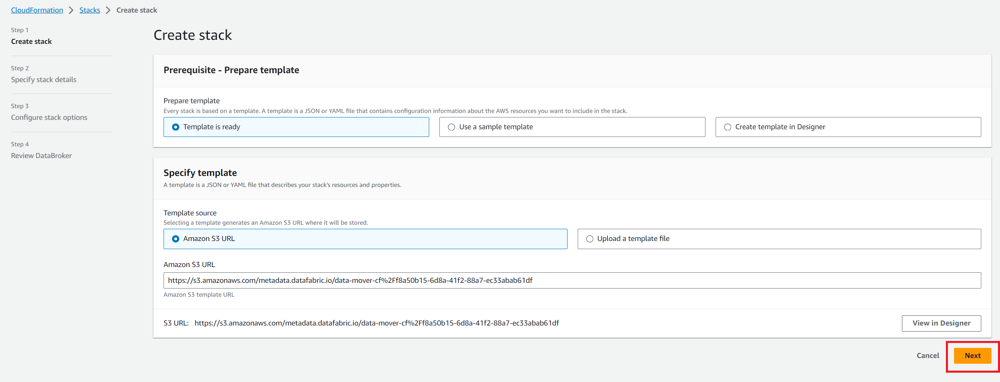
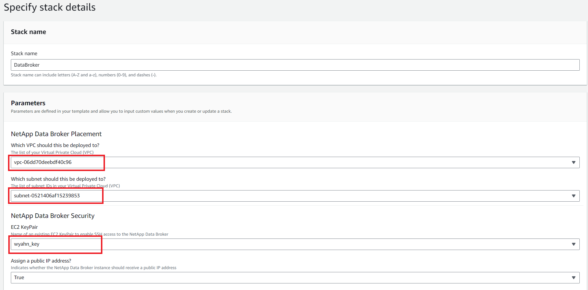
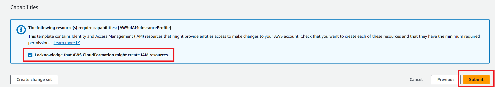
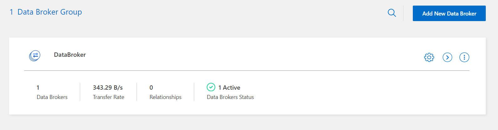

# BlueXP Data Copy
BlueXP 에서 Cloud sync 서비스를 이용하여 Data를 migration 합니다.

## Data Blocker
## Data Broker 배포
1. BlueXP console을 엽니다.
2. managed Data Broker  

3. Add New Data Broker  

3. Create Data Broker  

4. use a CloudFormation  

5. CloudFormation  
 
6. Specify stack details
- VPC : 생성한 VPC
- subnet : public-subnet1

7. Review DataBroker

8. 결과

# 
