# Cloud Sync 

## 
1. Define Sync Relationship </br>
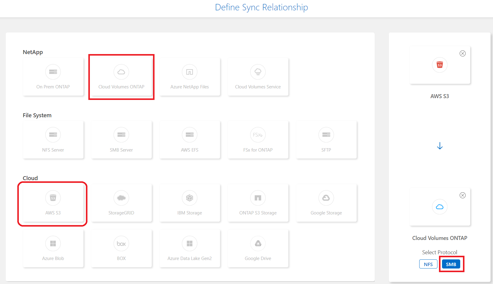
2. Select a Data Broker Group </br>
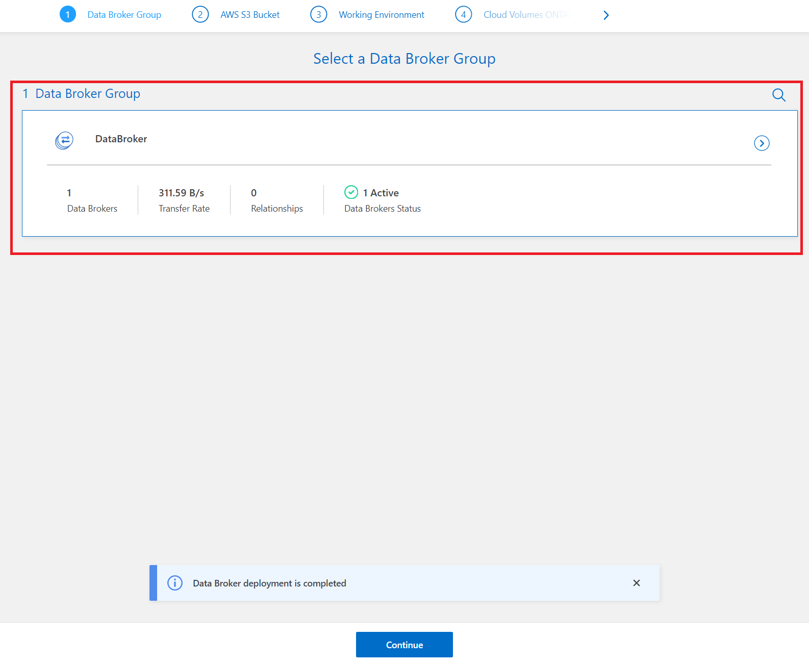
3. Select a Source Bucket </br>
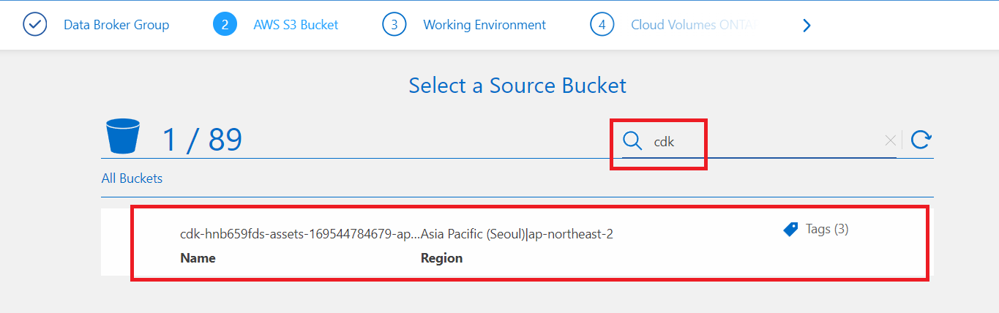
4. Bucket Setup </br>
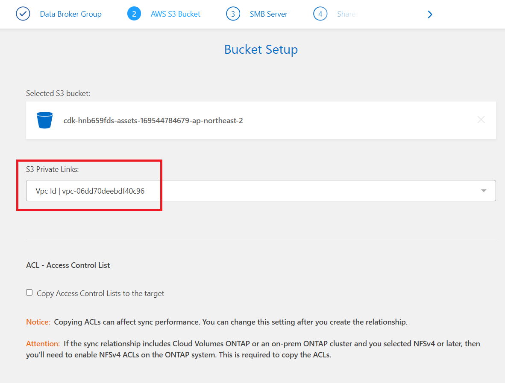
5. Select an SMB Target </br>
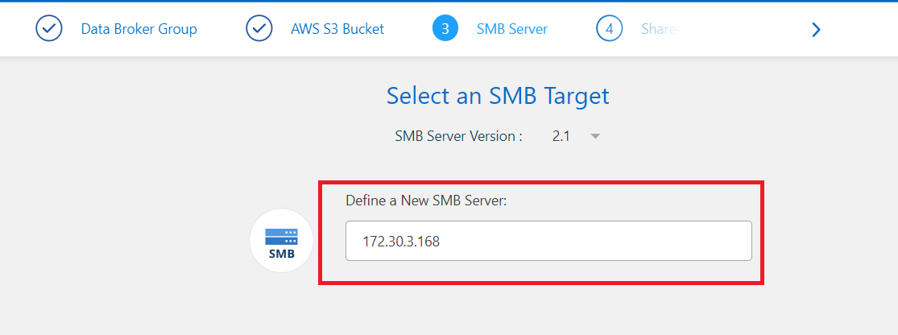 </br>
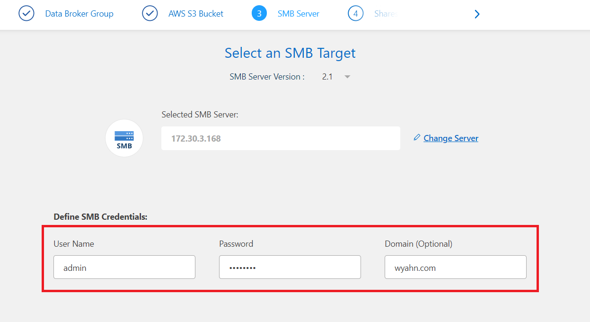
6. Sync Relationship Settings </br>
- 주의 사항: 관계 설정에서 대상 파일 삭제 옵션을 활성화하면 대상 디렉터리가 비어 있어야 합니다. 그렇지 않으면 디렉터리 내의 기존 파일이 삭제될 수 있습니다. </br>
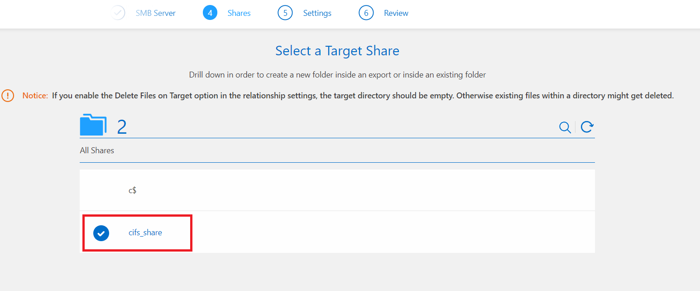 </br>
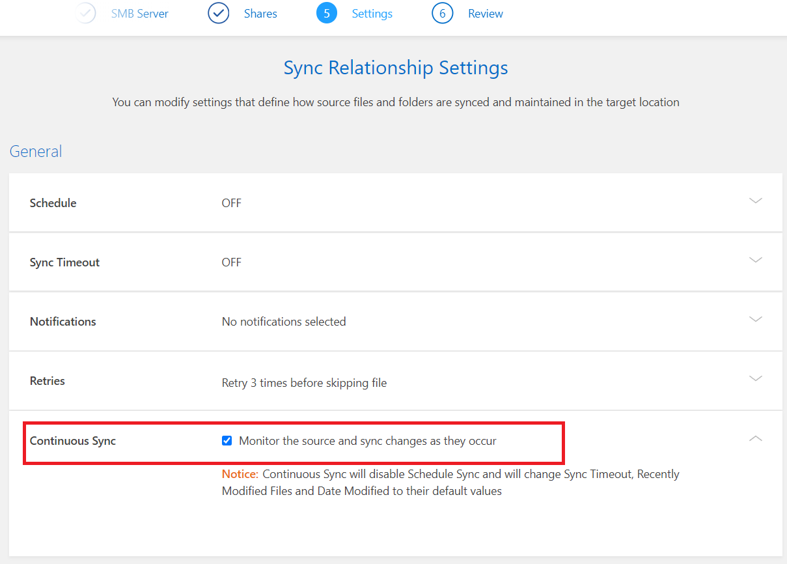
7. Review Sync Relationship </br>
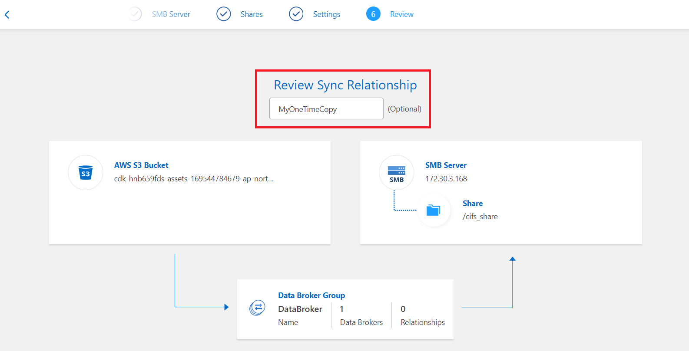
8. Creating Relationship </br>
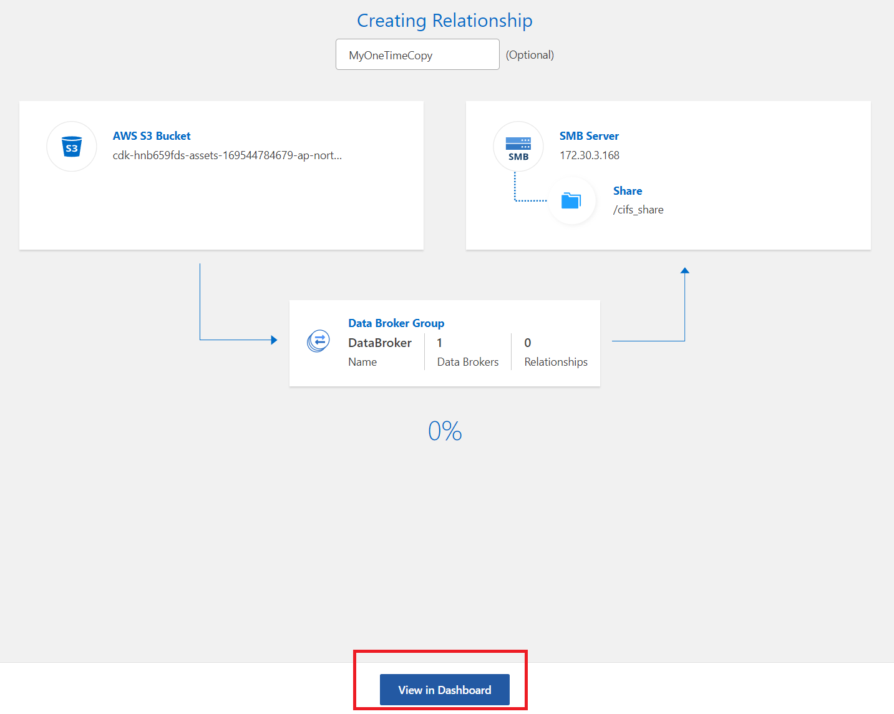
9. Dash Board </br>
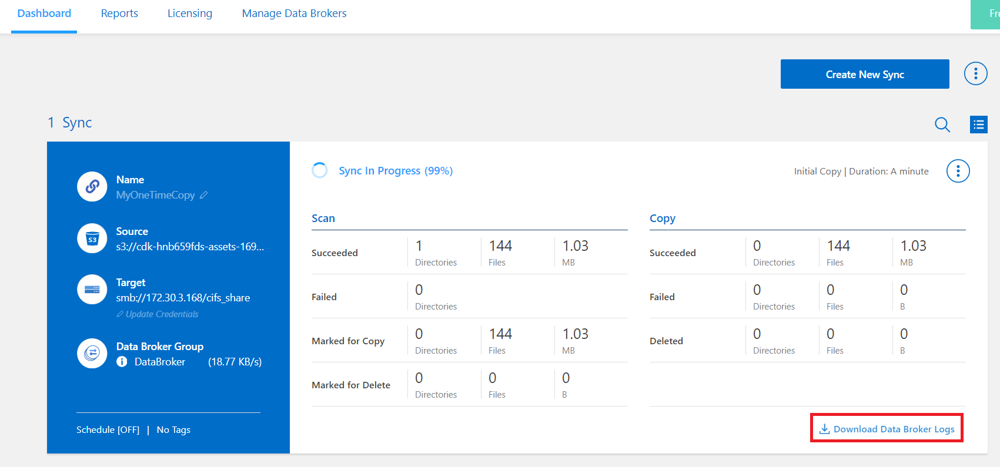
10. Download Data Broker Logs </br>
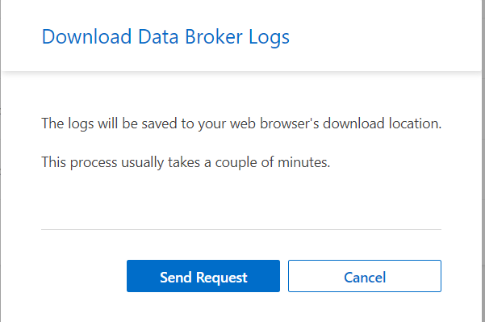
11. 잠시 후 다운로드가 완료됩니다. </br>
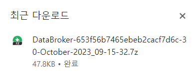

11. 압축 해제 후 ```./log/relationships.log```를 확인합니다.
```log
[2023-10-30T08:30:56.382] [INFO] [TRANSFERRER] [2] [42969] [653f69a9e7e0bc8451729e38] STARTING copy from: {"s3":{"bucket":"cdk-hnb659fds-assets-169544784679-ap-northeast-2","tags":[],"provider":"s3","path":"","region":"ap-northeast-2","encryption":{"protocol":"AES256"},"privateLink":"https://bucket.vpce-0dc93ae53ce8eb832-pb4fyfqf.s3.ap-northeast-2.vpce.amazonaws.com"}} to: {"local":{"path":"mnt/653f69a9e7e0bc8451729e38/dc358571-7260-477a-b1a3-ffc38a980efd_trg"}} entry: {"path":"7db451b6aecf53c4bb36320beb3f8cec7e6d529a6b31744611035f3376a17012.json","type":"FILE","size":1731,"mtimeSec":1697431442,"atimeSec":1697431442,"mode":33206,"uid":0,"gid":0,"tempEntryName":".7db451b6aecf53c4bb36320beb3f8cec7e6d529a6b31744611035f3376a17012.json_ygIcezP_netapp"}
[2023-10-30T08:30:56.392] [INFO] [TRANSFERRER] [2] [42969] [653f69a9e7e0bc8451729e38] STARTING copy from: {"s3":{"bucket":"cdk-hnb659fds-assets-169544784679-ap-northeast-2","tags":[],"provider":"s3","path":"","region":"ap-northeast-2","encryption":{"protocol":"AES256"},"privateLink":"https://bucket.vpce-0dc93ae53ce8eb832-pb4fyfqf.s3.ap-northeast-2.vpce.amazonaws.com"}} to: {"local":{"path":"mnt/653f69a9e7e0bc8451729e38/dc358571-7260-477a-b1a3-ffc38a980efd_trg"}} entry: {"path":"d489f612088502b02b7e9ef3f33fe2a01c83ccf7f4c367e415b7e75dff34bb36.json","type":"FILE","size":1853,"mtimeSec":1697441963,"atimeSec":1697441963,"mode":33206,"uid":0,"gid":0,"tempEntryName":".d489f612088502b02b7e9ef3f33fe2a01c83ccf7f4c367e415b7e75dff34bb36.json_KHJGNuJ_netapp"}
[2023-10-30T08:30:56.393] [INFO] [TRANSFERRER] [2] [42969] [653f69a9e7e0bc8451729e38] STARTING copy from: {"s3":{"bucket":"cdk-hnb659fds-assets-169544784679-ap-northeast-2","tags":[],"provider":"s3","path":"","region":"ap-northeast-2","encryption":{"protocol":"AES256"},"privateLink":"https://bucket.vpce-0dc93ae53ce8eb832-pb4fyfqf.s3.ap-northeast-2.vpce.amazonaws.com"}} to: {"local":{"path":"mnt/653f69a9e7e0bc8451729e38/dc358571-7260-477a-b1a3-ffc38a980efd_trg"}} entry: {"path":"e70e9fba1d540b8d1d0f6b101d949b311b2f1589b2b5ec88588b78227875eae6.json","type":"FILE","size":1949,"mtimeSec":1697450343,"atimeSec":1697450343,"mode":33206,"uid":0,"gid":0,"tempEntryName":".e70e9fba1d540b8d1d0f6b101d949b311b2f1589b2b5ec88588b78227875eae6.json_0o49daR_netapp"}
***
***
```

10. Bastion Host에 접속하여 볼륨 데이터를 확인합니다.
```bash
[root@ip-172-30-0-159 ~]# mount -t cifs -o user='admin',password='Netapp1!' //172.30.3.168/cifs_share /storage/cvo/cifs
[root@ip-172-30-0-159 ~]# df -h
Filesystem                 Size  Used Avail Use% Mounted on
devtmpfs                   1.9G     0  1.9G   0% /dev
tmpfs                      1.9G     0  1.9G   0% /dev/shm
tmpfs                      1.9G  408K  1.9G   1% /run
tmpfs                      1.9G     0  1.9G   0% /sys/fs/cgroup
/dev/nvme0n1p1             8.0G  2.4G  5.7G  29% /
tmpfs                      388M     0  388M   0% /run/user/1000
//172.30.3.168/cifs_share  9.5G  1.9M  9.5G   1% /storage/cvo/cifs
[root@ip-172-30-0-159 ~]# ls -al /storage/cvo/cifs/
total 1428
drwxr-xr-x 2 root root     0 Oct 30 08:30 .
drwxr-xr-x 3 root root    18 Oct 30 08:39 ..
-rwxr-xr-x 1 root root  2799 Oct 16 08:16 00a02fd05dc1ce24cf8447dbabf8132d03fc8ef592be9073803fca693e66b3b3.json
-rwxr-xr-x 1 root root  3953 Oct 16 11:35 04a18ba1065b803b1971c4133e6367331fd84a23a77678d2cc38e9c8309d1dcb.json
-rwxr-xr-x 1 root root  9003 Oct 19 03:54 07c6c4809d0ca16aa1451a1a82714e1a5671d895d53b047fcb9cbcc0b2111463.json
-rwxr-xr-x 1 root root  4746 Oct 16 06:21 0913ef9bc31967c7a71e232cded3d1f5ac973a53377163556cc0745755a5220e.json
-rwxr-xr-x 1 root root  8684 Oct 16 09:56 0b650275147918604ab16168c266a9ee58454a063ec7577223f800d991f14c15.json
...
...

```
## 실습 : BlueXP에서 AWS s3 데이터를 CVO로 가져오기
- Step 1 : [Create_Data_Broker](./Create_Data_Broker.md)
- Step 2 : [Deploy_BlueXP_connector](./Create_Sync_relationship.md)
- Step 3 : [Sync_report](./Sync_report.md)

# 참고
- [Sync relationship option](https://docs.netapp.com/us-en/bluexp-copy-sync/task-creating-relationships.html#create-other-types-of-sync-relationships)