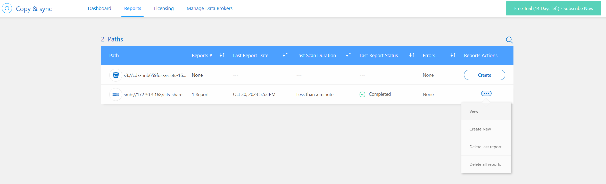
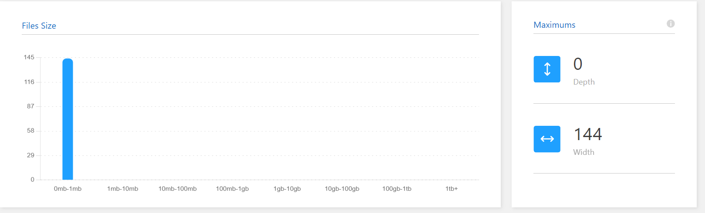
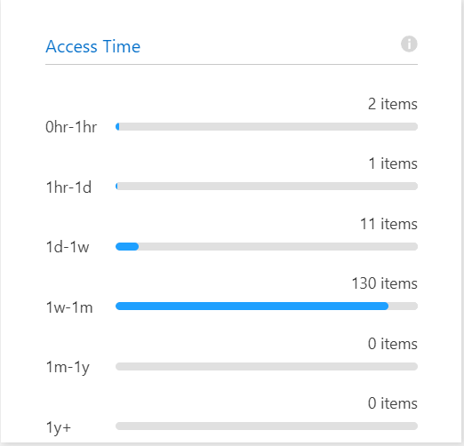
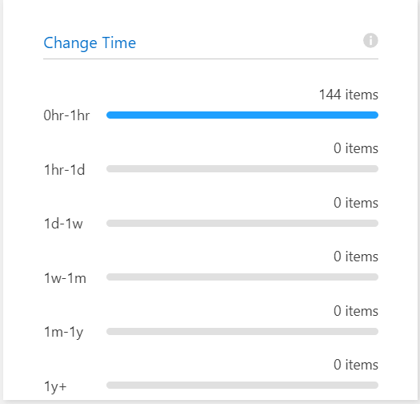
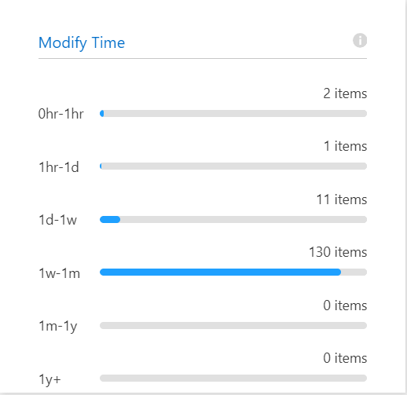

## 구성을 조정하기 위한 보고서 생성 및 보기
각 보고서는 동기화 관계의 경로에 대한 추가 정보를 제공합니다. 
예를 들어, 파일 시스템에 대한 보고서에는 디렉터리 및 파일 수, 파일 크기 분포, 디렉터리의 깊이와 너비 등이 표시됩니다.

## report 보기
1. Create report and view report

2. File Size  
파일들의 크기 분포를 확인합니다.  

3. Access Time  
파일들의 마지막 읽기 시간 분포를 확인합니다.  

4. Change Time  
파일들의 마지막 변경 시간에 대한 분포를 확인합니다.( change permission등)  

5. Modfiy Time  
파일들의 마지막 수정 시간에 대한 분포를 확인합니다.  

## 실습 : BlueXP에서 AWS s3 데이터를 CVO로 가져오기
- Step 1 : [Create_Data_Broker](./Create_Data_Broker.md)
- Step 2 : [Deploy_BlueXP_connector](./Create_Sync_relationship.md)
- Step 3 : [Sync_report](./Sync_report.md)