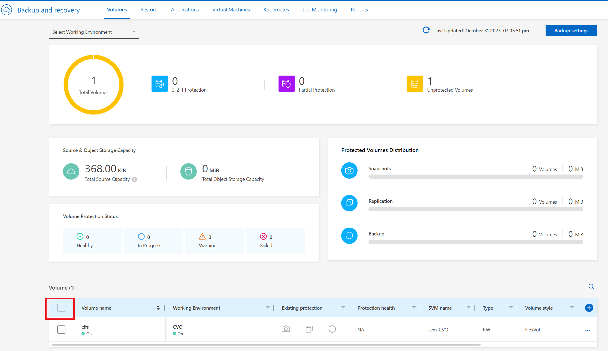

# Backup Policy
BlueXP에서 Cloud 또는 Onprem Cluster에 대한 백업정책을 한꺼번에 통합 관리 할 수 있습니다.
NetApp에서 제공하는 기본 백업 정책을 사용하여 백업을 생성하거나 사용자 정의 정책을 생성할 수 있습니다. 정책은 백업 빈도, 백업 수행 시간 및 보존되는 백업 파일 수를 제어합니다.

## BlueXP를 통해 3-2-1 Backup 정책 설정
중요한 데이터를 보호할 경우, '파일 복사는 3개(프라이머리 1개와 백업 2개)를 보관하고, 파일을 보관하는 기록 매체는 서로 다른 2종류를 채택해 복사. 그 중 1개는 오프사이트(Off-site)에 보관해야 한다'라는 규칙을 준수 하도록 간편하게 설정할 수 있습니다.

1. Backup and recovery > Volume Dashboard </br>

2. Volume Dashboard </br>
BlueXP에 등록된 모든 클러스터의 백업을 집계하여 나타냅니다.

3. Policy Management </br>

4. Alert message가 뜨면 ```continue```를 선택합니다. </br>

5. Define backup strategy </br>
아래 가이드대로 옵션을 설정합니다.
- 
- 
- 
- 
- 
- 
6. ```Save``` 를 눌러 적용합니다.
7. job monitoring Tab에서 실행중인 작업을 모니터링 합니다. </br>

8. 7번의 작업이 완료되면 Volume Tab에서 3-2-1 정책이 적용된 상태를 확인 할 수 있습니다. </br>


## 실습 : BlueXP Data Protection 기능 살펴보기
- Step 1 : [Set_SnapMirror](./Set_SnapMirror.md)
- Step 2 : [Backup_management](./Backup_management.md)
- Step 3 : [Backup_reporting](./Backup_reporting.md)

# Next
[](../Data_Protection/Backup_reporting.md)


# 참조
- [backup-schedules](https://docs.netapp.com/us-en/bluexp-backup-recovery/concept-cloud-backup-policies.html#backup-schedules)