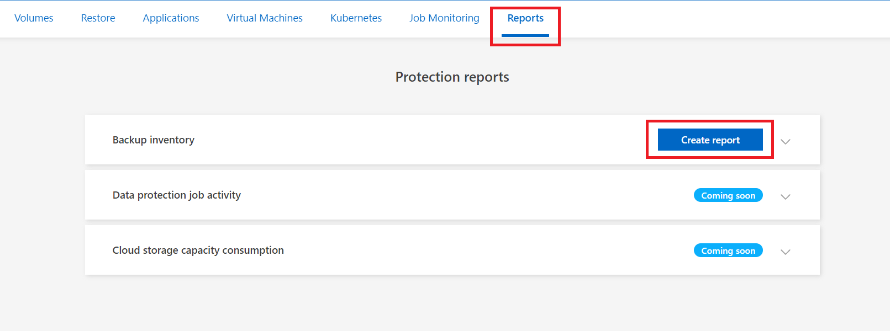
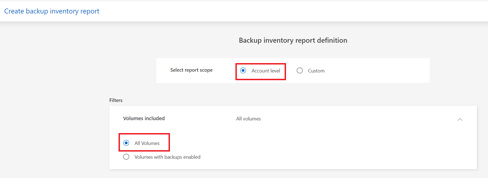
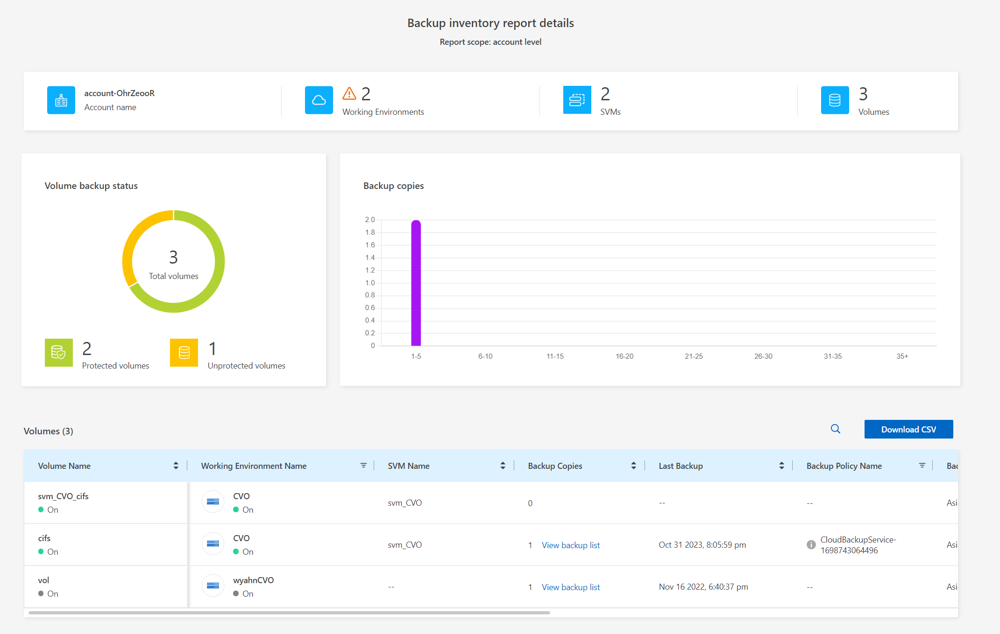

## Backup Reporting
BlueXP 백업 및 복구 보고서 탭에서 백업 인벤토리 보고서를 생성하고 해당 내용을 필터링할 수 있습니다. 백업 인벤토리 보고서를 사용하면 특정 계정, 작업 환경 또는 SVM 인벤토리에 대한 모든 백업을 볼 수 있습니다.
1. ```Backup and recovery``` > ```Reporting```

2. Backup Inventory report definition

3. Backup inventory report details


# 참조
- [bluexp-backup-recovery/task-report-inventory](https://docs.netapp.com/us-en/bluexp-backup-recovery/task-report-inventory.html)