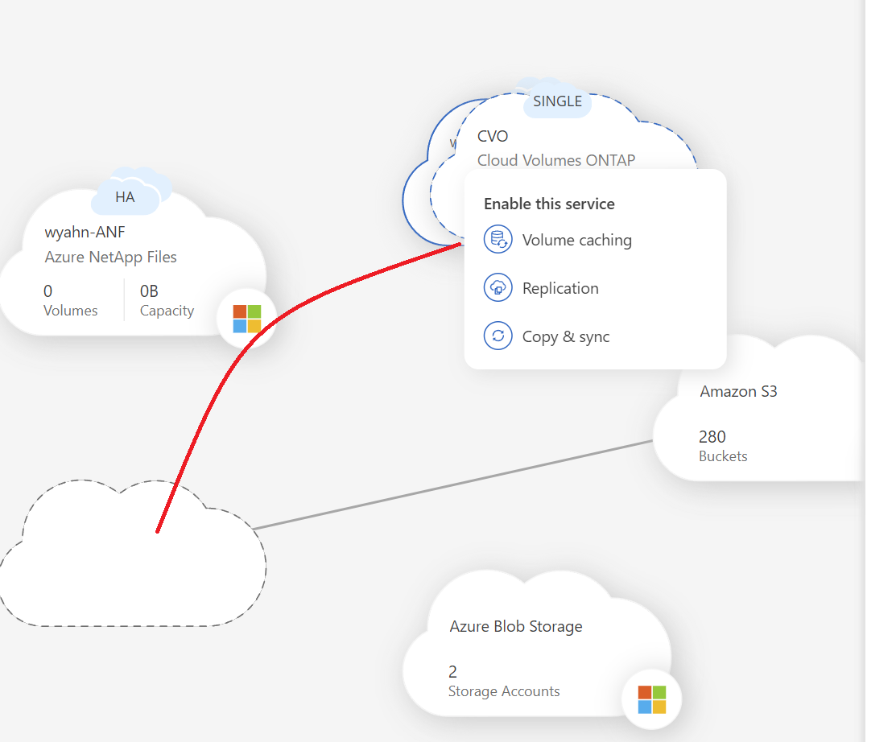
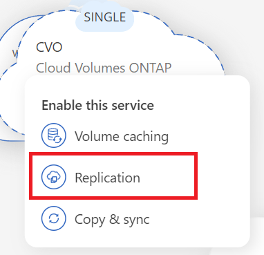
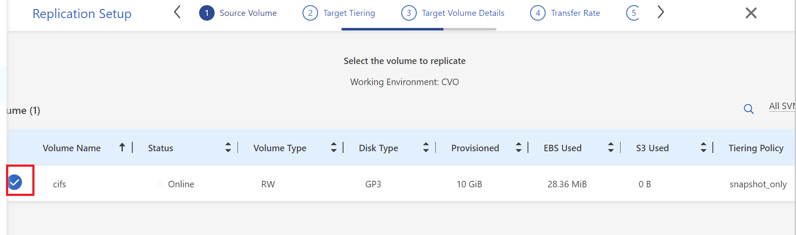
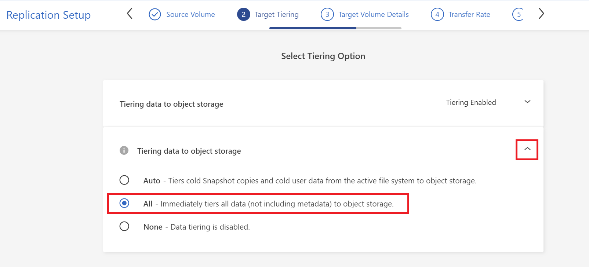
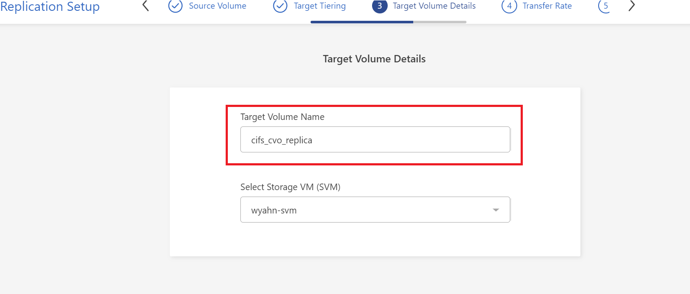
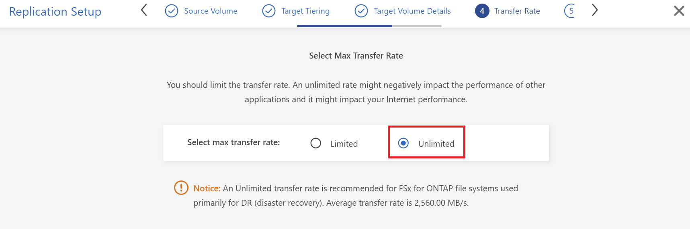
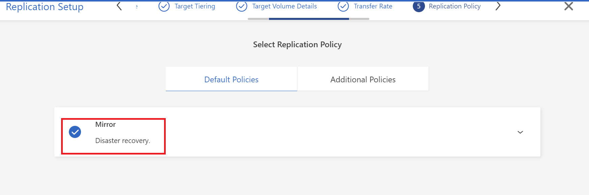

# BlueXP에서 Ontap Cluster 간 Snapmirror 설정
BlueXP를 사용하면 클러스터간 복잡한 절자를 거치지 않고 손쉽게 Ontap Smapmirror 설정을 사용할 수 있습니다.

## Snapmirror 설정
매우 간단합니다.

1. [BlueXP console](https://cloudmanager.netapp.com)에 접속합니다.
2. Canvas 화면에서 마우스 커서를 이용해 ```CVO```를 ```FSxN```위로 Drag and Drop합니다.


3. ```Repliacaion```


4. CIFS 볼륨을 선택합니다.


5. ```Tiering data to object storage```를 ```All```로 선택합니다.


6. Target Volume Details
```Target Volume Name```을 ```cifs_cvo_replica```로 설정합니다.


7. Select Max Transfer Rate 를 ```Unlimited```로 설정합니다.


8. Select Replication Policy


9. Select a Replication Schedule


10. review


11. BlueXP Replication 관리
설정이 완료되는데 수분이 소요됩니다.</br> 
각 단계 별 진행 절차를 모니터링하려면 [BlueXP Timeline](https://cloudmanager.netapp.com/timeline)을 확인하세요


### 선택 과제
각 시스템에 접속하여 Snapmirror 설정이 어떻게 적용되어 있는지 확인합니다.

# Next
[](./Backup_management.md)


