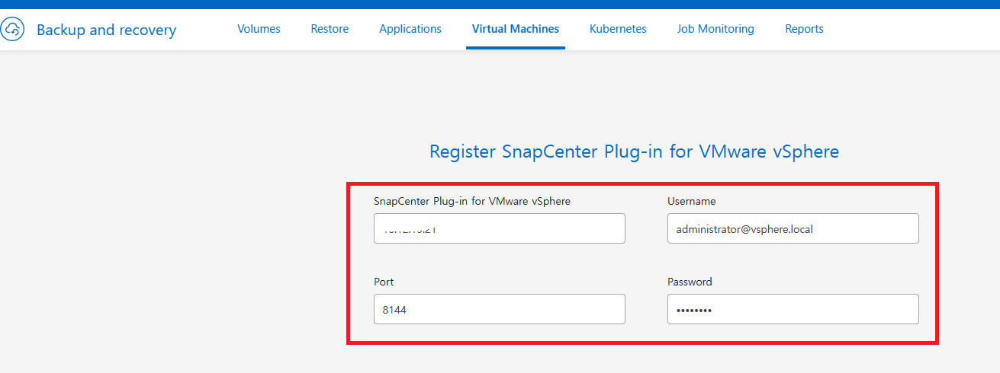
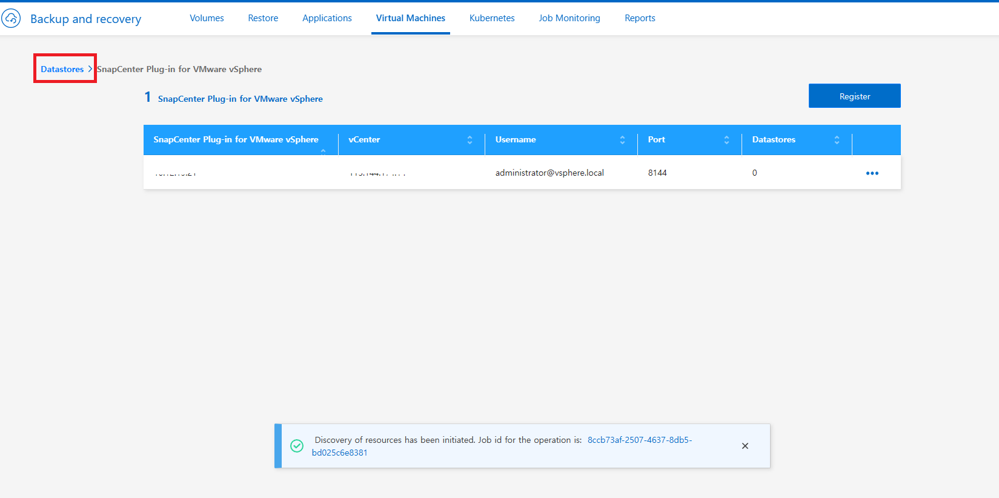
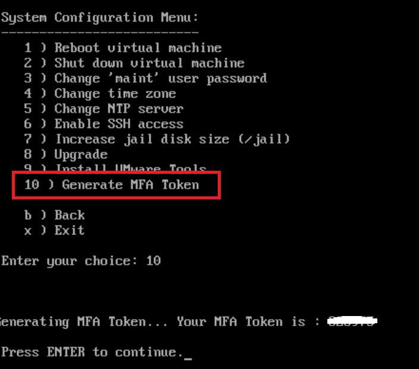

# SnapCenter Plugin 배포
 VMware vSphere 가상 어플라이언스용 SnapCenter 플러그인 배포 및 VMware vSphere용 SnapCenter 플러그인 활성화 방법에 대한 가이드 입니다.

## Pre requirement
- [requirements](https://docs.netapp.com/us-en/sc-plugin-vmware-vsphere/scpivs44_deployment_planning_and_requirements.html#host-requirements)

# Getting Start
1. 

2.

3.

# 참조
- [VMware vSphere 4.9용 SnapCenter 플러그인](https://docs.netapp.com/us-en/sc-plugin-vmware-vsphere/scpivs44_quick_start_overview.html)