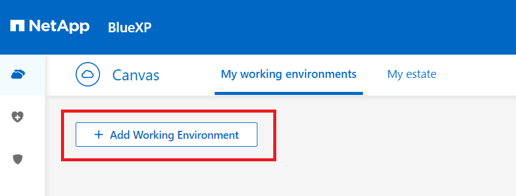
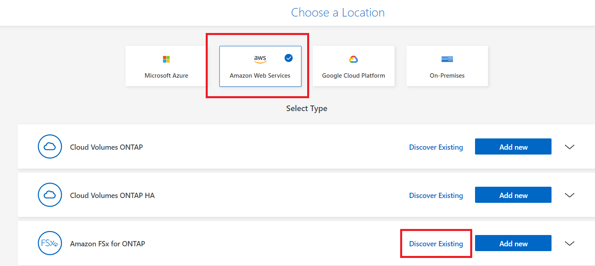
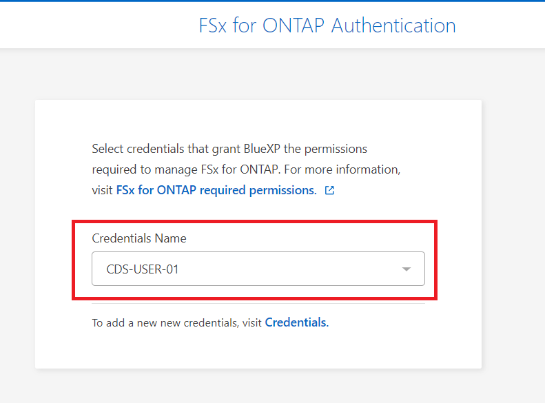
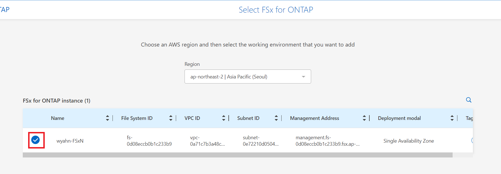
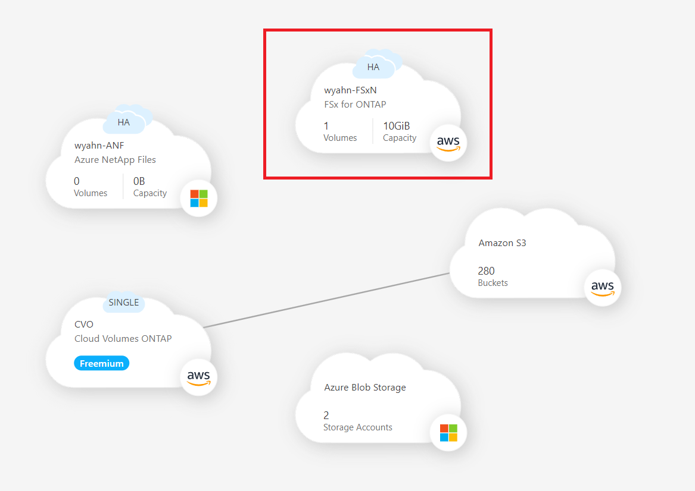
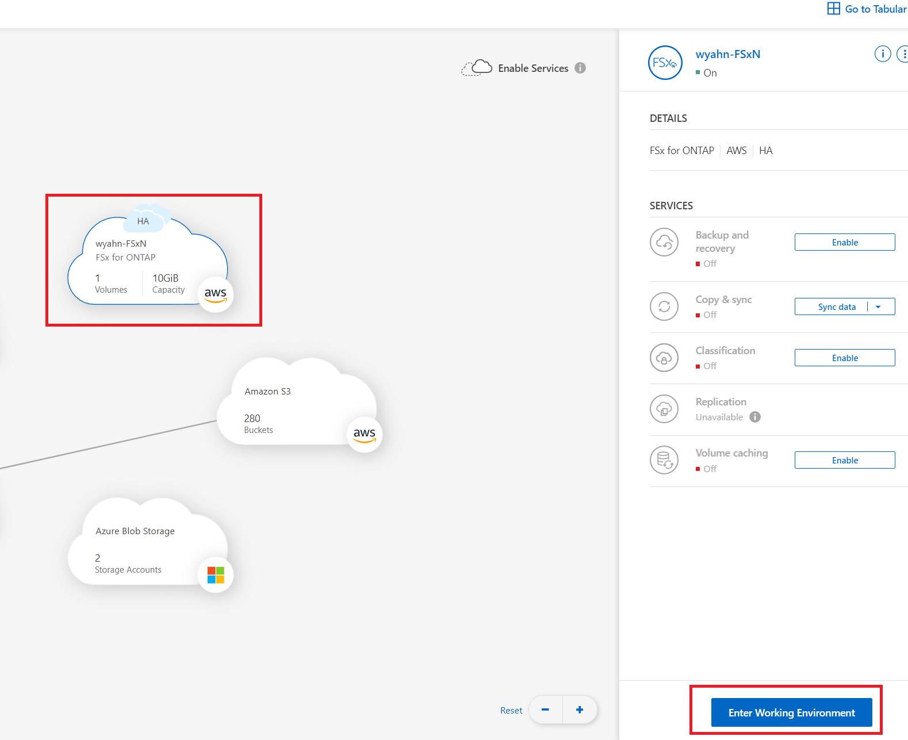
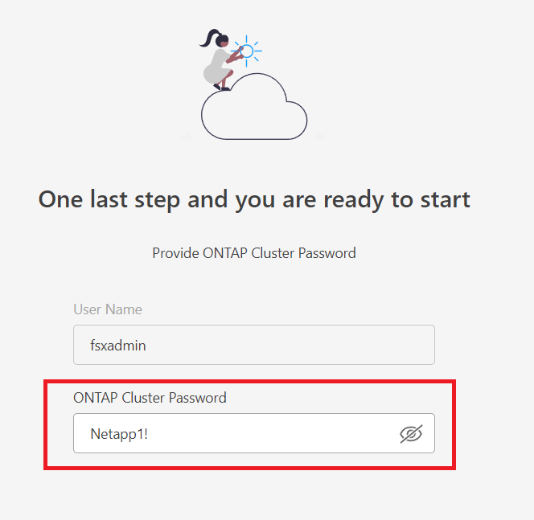

# Discover_FSxN
BlueXP는 Ontap System을 등록하여 사용할 수 있습니다. FSxN도 예외는 아닙니다.

## Quick start
1. Add Working Evciroment</br>


2. FSxN Discover Existing</br>


3. check the credentials name</br>


4. select FSx for netapp ontap</br>


5. we can see the fsxn on canvas</br>


6. click the FSxN and ```Enter Workgin Enviroment```</br>


7. insert your password</br>


## 실습
- [Discover_FSxN](./Discover_FSxN.md)
- [Create_Volume](./Create_Volume.md)

