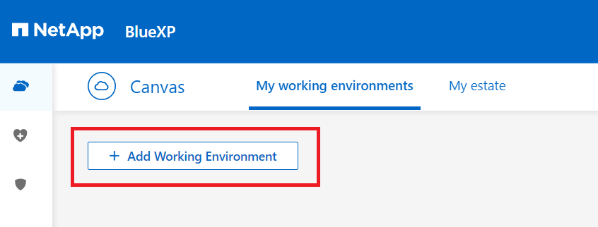
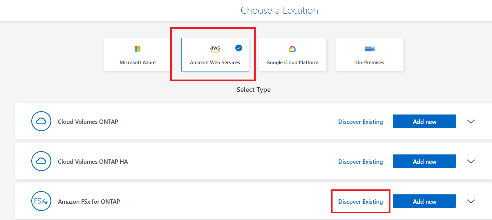
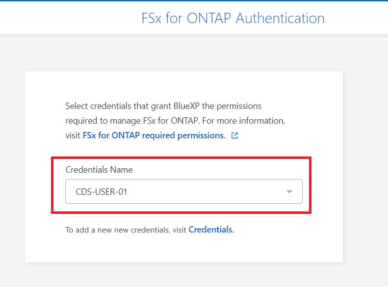
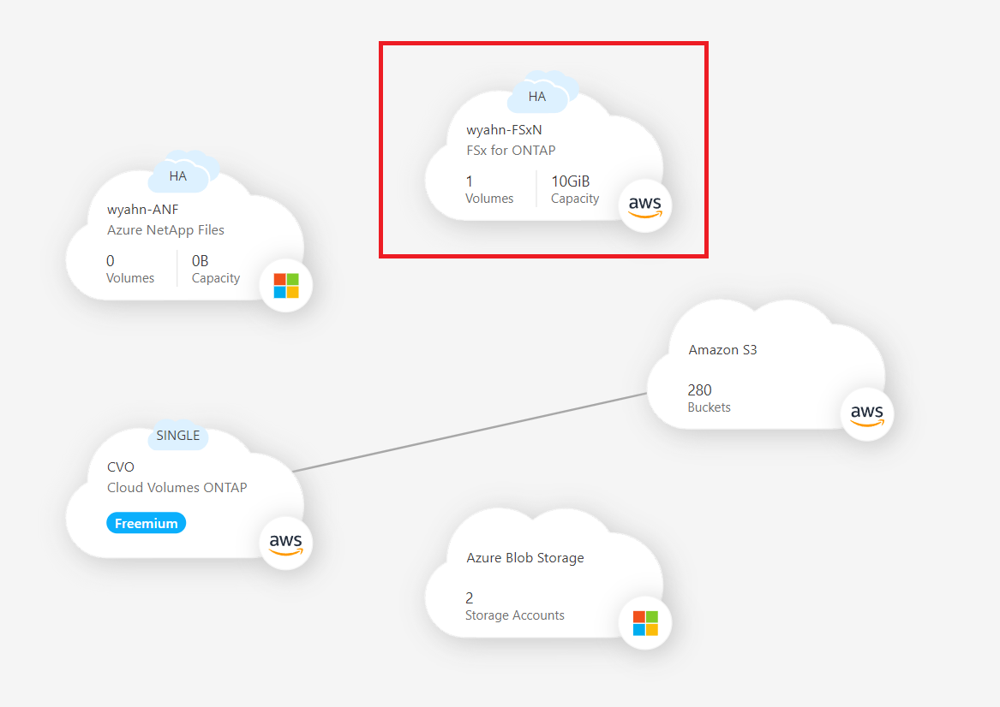
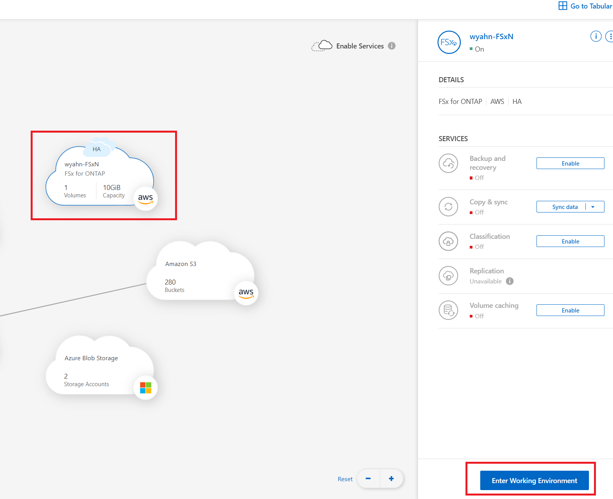
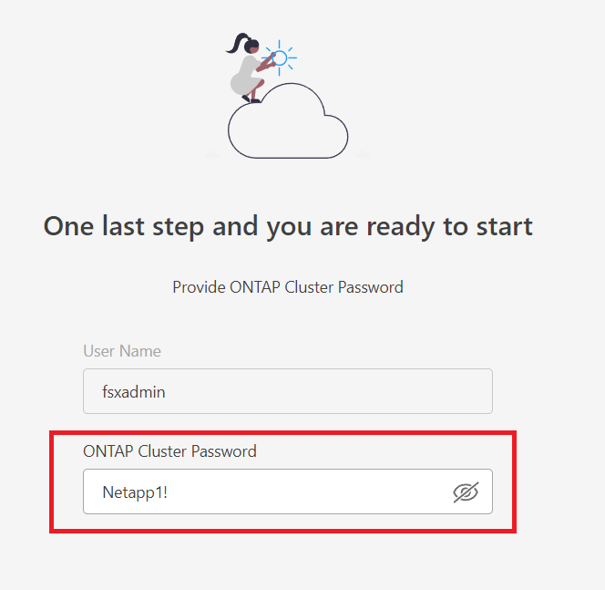

# Get started with BlueXP classification for Amazon FSx for ONTAP
BlueXP는 Ontap System을 등록하여 사용할 수 있습니다. FSxN도 예외는 아닙니다.

## Quick start
1. Add Working Evciroment 

2. FSxN Discover Existing 

3. check the credentials name 

4. select FSx for netapp ontap 

5. we can see the fsxn on canvas 

6. click the FSxN and enter Workgin Enviroment 

7. insert your password 

# 이게 답니다.
손쉽게 BlueXP를 통해 FSxN을 제어할 수 있습니다.

