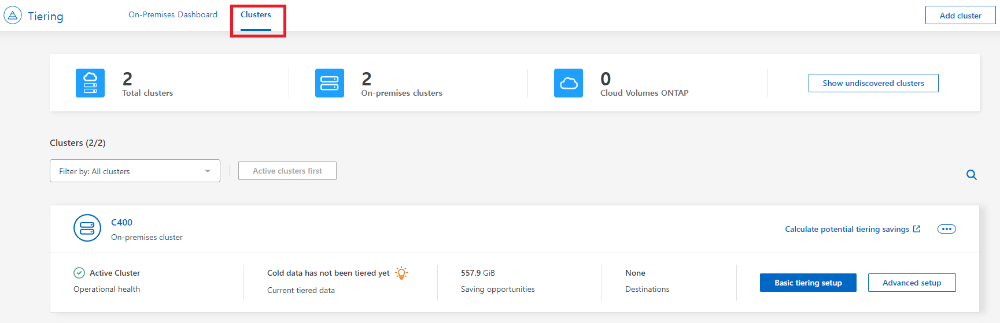
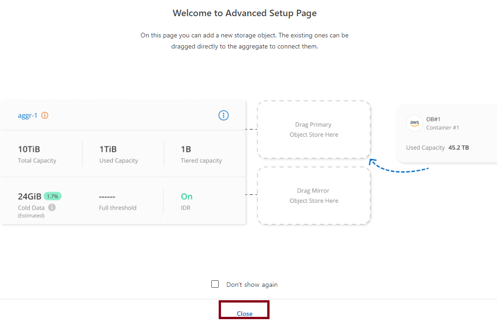
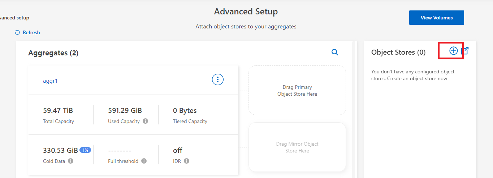
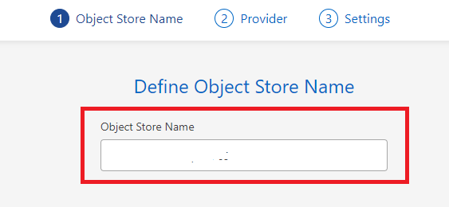
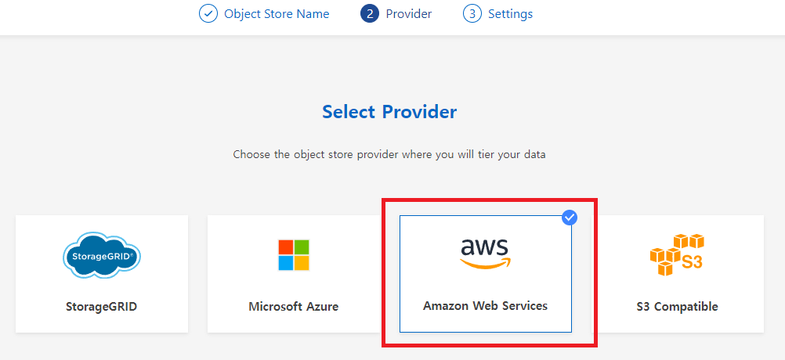
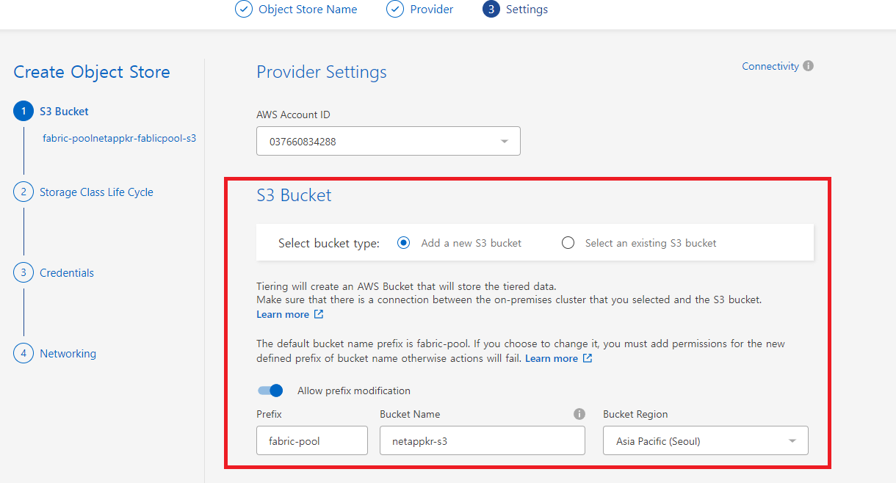
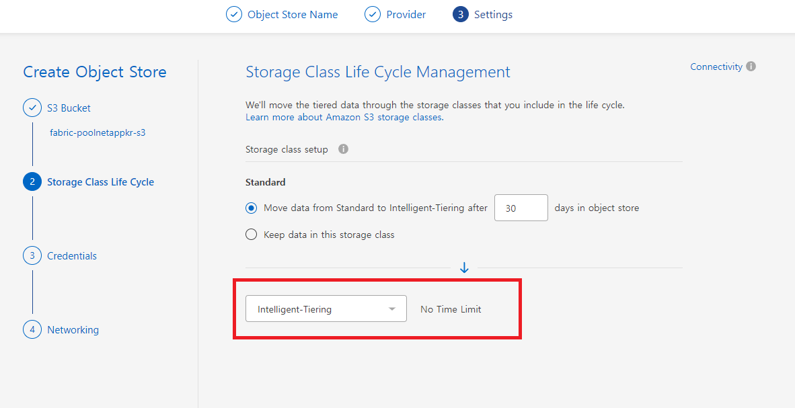
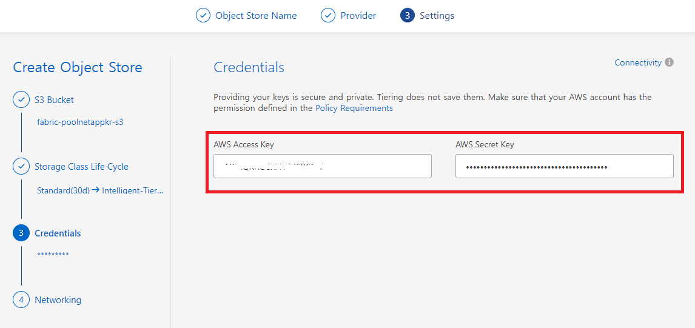
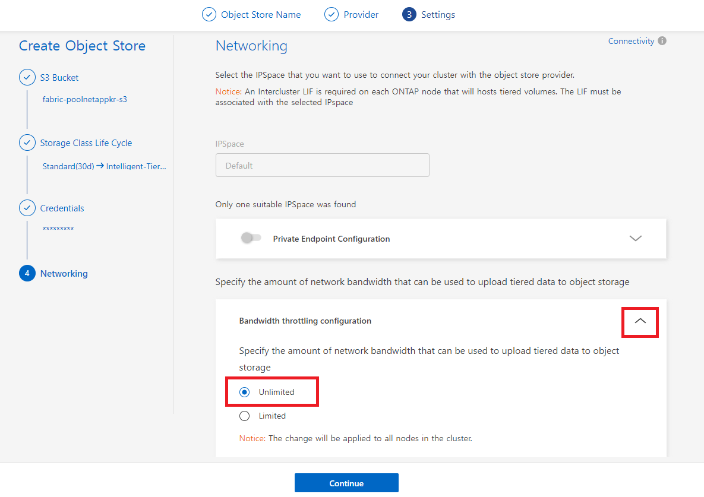

# BlueXP에서 Fablicpool 설정

## BlueXP 에서 AWS S3를 Fabricpool로 설정합니다.
1. BlueXP console에 접속합니다.
2. Tiering > Cluster Tab > Advanced Setup

3. Close

5. Object source 추가

6. Object Store Name

7. Provider 선택

8. Provider settings

9. storage life cycle manage mount

10. Credentinal

11. Networking

