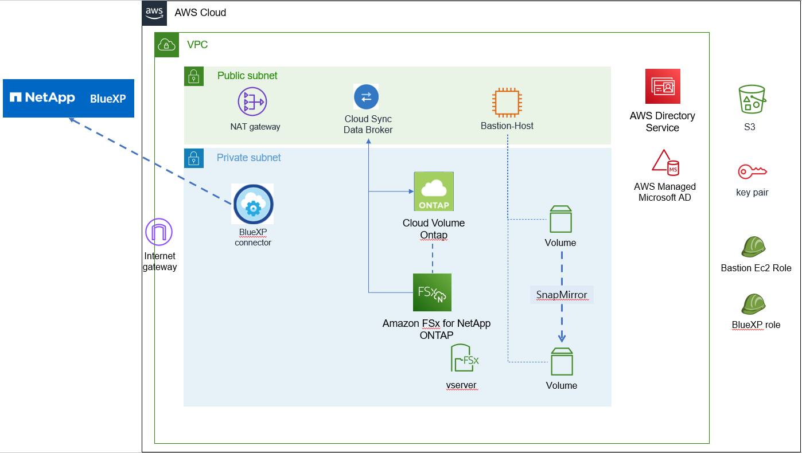

# BlueXP Hands on
BlueXP의 기능에 대해 체험해 볼 수 있는 Hands on Guide 입니다.
이 Hands on은 AWS 환경에 배포됨으로 비용이 발생합니다.
실습이 끝난 후 자원을 꼭 삭제 하세요.

## Architecture

## Prerequirement 
[사전 요구사항](./QuickStart/Lab%20prerequirement.md)을 확인 후 다음 단계를 수행하세요.

## Getting Start
- [Hands on 환경을 구성합니다.](./QuickStart/Readme.md)
- [BlueXP connector를 배포하는 방법을 알아봅니다.](./Handson/CreateBlueXPConnector/Readme.md)
- [BlueXP에서 Cloud Volume Ontap을 배포합니다.](./Handson/CVO/Readme.md)
- [AWS FSx Netapp for Ontap 과 BlueXP를 연동하는 방법을 알아봅니다.]()

## BlueXP feature
- [BlueXP에서 데이터 보호를 위한 ontap 정책을 설정합니다.]()
- [BlueXP에서 Snapmirror를 설정합니다.]()
- [BlueXP에서 EKS에 볼륨을 연결하는 방법을 알아봅니다.]()
- [BlueXP에서 Data Migration을 수행합니다.]()
- [BlueXP에서 거버넌스 및 개인 정보 보호를 위해 데이터를 관리하는 방법을 알아봅니다.]()