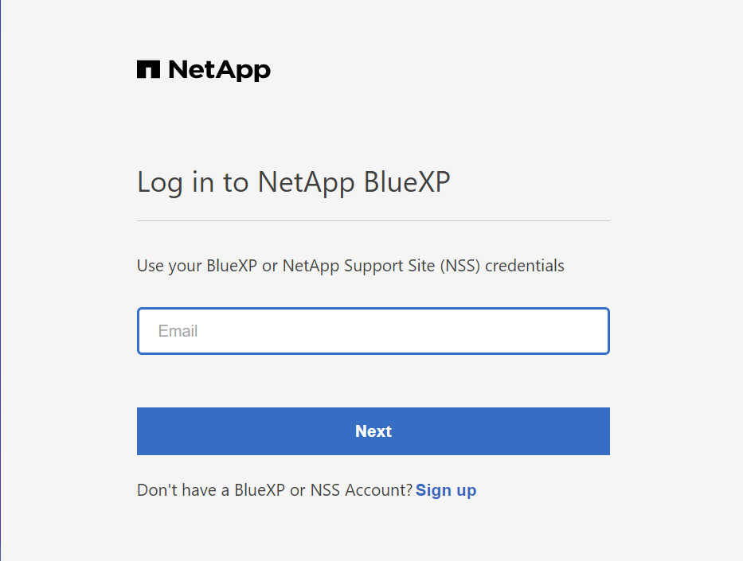
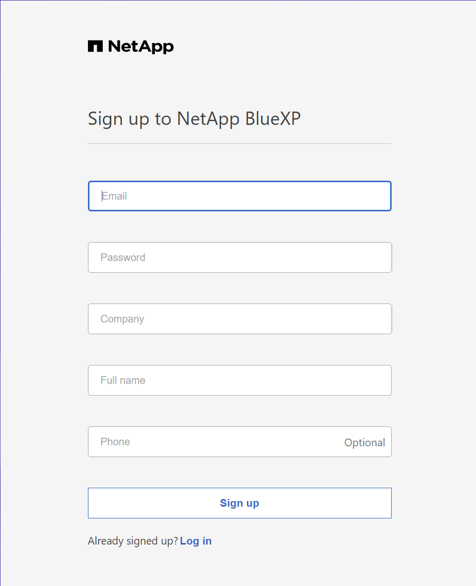

# Netapp Central 계정 생성
각 BlueXP는 NetApp Cloud Central 계정과 연결됩니다. Cloud Central 계정은 멀티 테넌시를 제공하고 격리된 작업 영역에서 사용자와 리소스를 구성할 수 있도록 합니다.

1. [BluxXP](https://bluexp.netapp.com/)에 접속 합니다.
2. 오른쪽 상단의 ```Get Started``` 를 눌러 로그인 화면으로 넘어갑니다.
로그인되어 있는 상태라면 ID/PW를 물어보는 화면이 나오지 않습니다.
3. 로그인 화면 하단 ```Sign up``` 을 클


