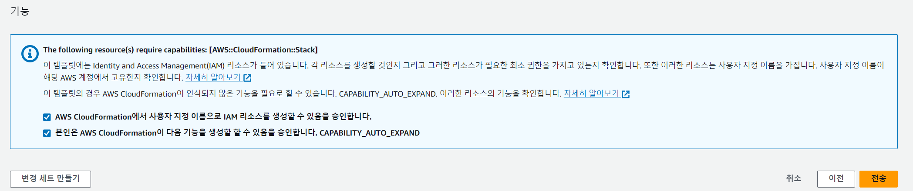

# BlueXP Handson 환경 배포

## Pre requirement
- [Lab prerequirement](./Lab_Pre_Requirement.md)

### 지원되는 리전

- "ap-northeast-2"
- "us-east-1"
- "us-east-2"
- "us-west-1"
- "us-west-2"
- "ap-northeast-3"
- "ap-southeast-2"
- "ap-northeast-1"
- "eu-central-1"
- "ap-southeast-1"
- "eu-west-1"
- "eu-west-2"
- "eu-west-3"

## CDK Asset 배포

1. AWS console > Cloudformation 콘솔을 엽니다.
2. stack 생성 버튼을 선택합니다.

- StackName: CDKToolkit
- Template URL: <https://netappkr-wyahn-s3.s3.ap-northeast-2.amazonaws.com/public/CDKToolkit.yml>

### CDKToolkit Stack Parameters

- Name : CDKToolkit
- FileAssetsBucketKmsKeyId : AWS_MANAGED_KEY
- PublicAccessBlockConfiguration : true
- Qualifier : hnb659fds </br>


3. 전부 기본값으로 진행 후 다음을 눌러 스택생성 페이지까지 이동합니다.
4. 체크박스를 모두 활성화 후 스택을 생성합니다.

- [X] AWS CloudFormation이 사용자 지정 이름으로 IAM 리소스를 생성할 수 있음을 인정합니다.

5. 스택이 완전히 배포되기까지 기다립니다.

6. Stack 세부정보 화면에서 리소스 탭을 클릭하고 s3를 검색하여 버킷을 확인하고 링크를 클릭하여 s3버킷으로 이동합니다. </br>


7. CDKToolkit 스택에서 생성된 s3에 파일을 업로드합니다.

- 그림과 같이 cdkasset.zip 파일의 압축을 풀고 하위 파일들을 모두 업로드합니다.</br>
  압축파일 : [cdkasset](./cdk_asset.zip)

- 압축파일 해제 후 s3에 파일을 업로드합니다. </br>
  s3 burketname : cdk-hnb659fds-assets-<"your aws account id">-ap-northeast-2 </br>
  

## Main Stack 배포

> ### 경고!
> 반드시 CDKToolkit Stack에서 생성된 S3 버킷에 첨부된 파일이 모두 업로드된 상태에서 진행되어야 합니다.
1. [cloudformation](https://ap-northeast-2.console.aws.amazon.com/cloudformation/home) 에 접속합니다.
2. Cloudformation 스택 생성

3. 스택 생성
- Template URL :
  ```https://netappkr-wyahn-s3.s3.ap-northeast-2.amazonaws.com/public/BlueXP/mainstack.template.json```

2. 스택 세부정보 지정
- StackName: MainStack </br>
- creator : 영문이름 ( 자신의 이니셜 또는 이름, Tag값에 이용됩니다.)
- prefix : netappkr ( 이니셜 또는 이름, 도메인,네이밍등에 이용됩니다. 영문,소문자만 입력,띄어쓰기 금지)


3. 스택 옵션 구성
모든 항목을 이미 입력된 기본값으로 설정합니다.

4. 검토
모든 체크박스를 체크 후 스택을 생성합니다.

- [X] AWS CloudFormation이 사용자 지정 이름으로 IAM 리소스를 생성할 수 있음을 인정합니다.
- [X] AWS CloudFormation에 다음 기능이 필요할 수 있음을 인정합니다. CAPABILITY_AUTO_EXPAND


> 생성완료까지 걸리는 예상 시간 </br>
> ✨  Total time: 30분

# Hands on 배포 완료
그림과 같이 2개의 메인스택과 2개의 서브스택이 배포되고 Hands-on 환경이 생성됩니다.</br>


# 다음과정

- 다음과정: [exe-1_Spot by netapp 과 AWS Account를 연결합니다.](../exercise/exercise-1/1-1_ConnectAccount.md)

# 참고문서

- [CDKv2 doc](https://docs.aws.amazon.com/cdk/v2/guide/parameters.html)
- [CDkv2 python](https://docs.aws.amazon.com/cdk/api/v2/python/aws_cdk.aws_eks/CfnAddon.html)