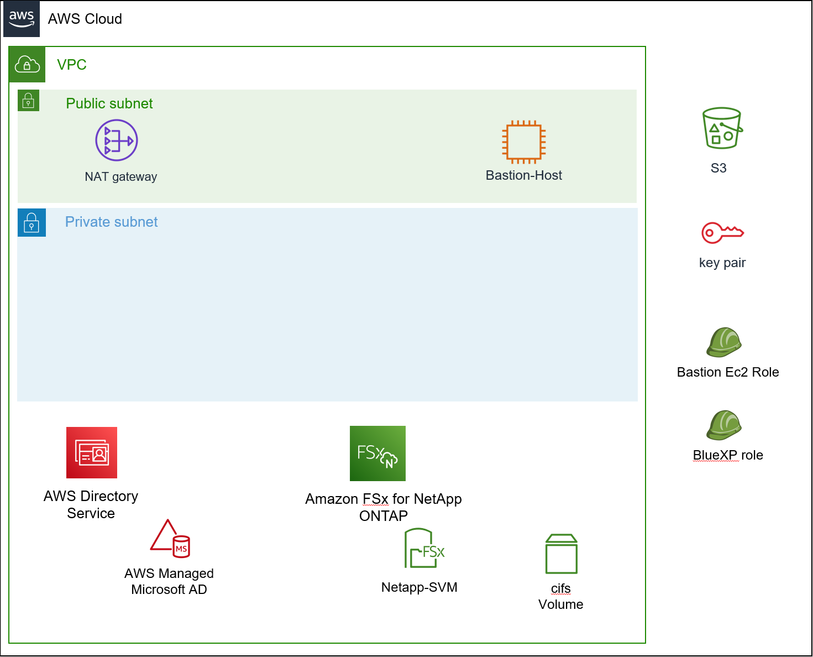

# BlueXP Hands on 환경 배포
Cloudformation을 이용해 Hands on을 생성합니다.

## Architecture

- AWS Dirctory Service : Netapp SMB 구성 및 AD 연동
- Amazon FSx for Netapp Ontap : Netapp Cloud Volume Ontap 기반 AWS Built-in service
- Bastion-Host : Ontap CLI 접속 및 CIFS 볼륨 마운트
- Nat GW : Private Subnet의 인터넷 엑세스
- Role : BlueXP 기능 수행에 대한 AWS 리소스 제어 권한 부여

## 실습
- [Lab_Pre_Requirement](./Lab_Pre_Requirement.md)
- [Deploy_Stack](./Deploy_Stack.md)

# 참고
- [Cloudformation Template 생성](https://github.com/netappkr/netappkr_AWSCDK/tree/main/BlueXP_CDK)