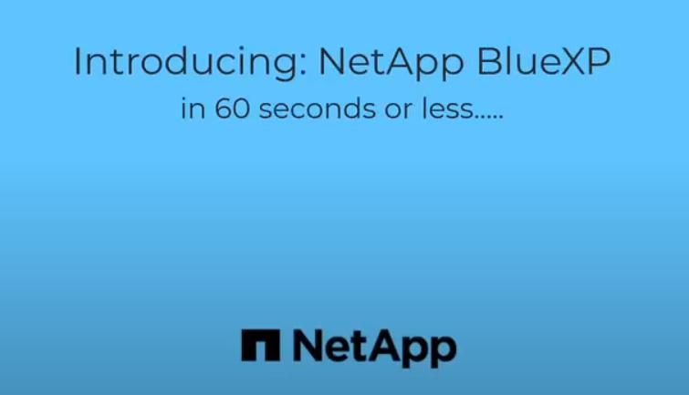

# BlueXP를 활용한 스토리지 배포 및 관리
BlueXP™는 온프레미스 및 클라우드 환경 전반에서 스토리지 및 데이터 서비스를 위한 통합된 경험을 제공합니다. 
AIOps의 강력한 성능과 더불어 유연한 소비 조건과 오늘날의 클라우드 중심 환경에 필요한 통합 보호 기능을 통해 운영 간소화를 실현합니다.

# Introducing BlueXP

## BlueXP 라이선스는 무료입니다.
BlueXP를 사용하는 소프트웨어 라이선스는 무료입니다.
OnPrem 또는 Cloud에 배포하여 BlueXP를 활용해보세요

## BlueXP Hands on
BlueXP의 기능에 대해 체험해 볼 수 있는 Hands on Guide 입니다.  
이 Hands on은 AWS 환경에 배포됨으로 비용이 발생합니다.  
실습이 끝난 후 자원을 꼭 삭제 하세요.

시작하기 전에 [사전 요구사항](./QuickStart/Lab_Pre_Requirement.md)을 확인 후 수행하세요.
- [Hands on](./Handson/readme.md)

## Demo

# 참조
- [BlueXP Q&A](https://docs.netapp.com/ko-kr/bluexp-classification/faq-cloud-compliance.html)
- [youtube BlueXP](https://www.youtube.com/@NetAppBlueXP/featured)