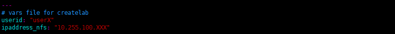
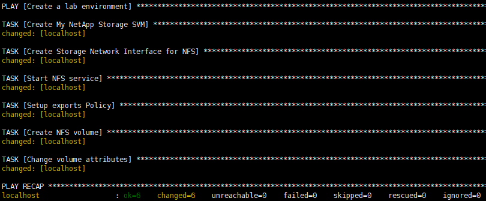
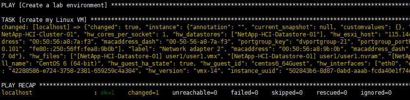
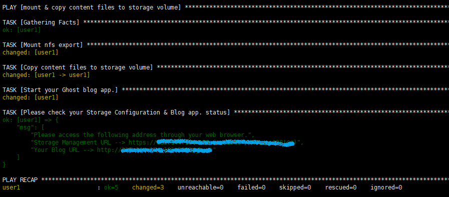
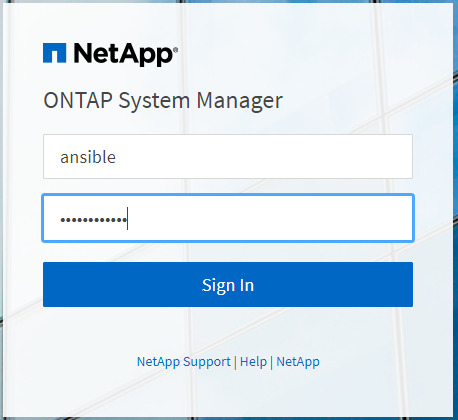
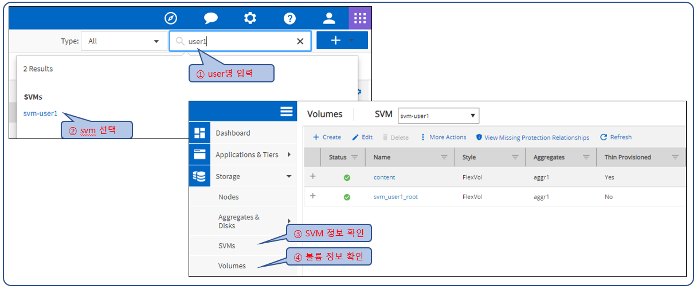

# Pre-Work for Workshop 
# - Ansible을 통해 풀 스택 온프레미스 환경을 자동화 구현
---
*version 0.9*
## Overview 
본 과정에서는 Hands-on Workshop에서 사용할 on-prem. 환경의 랩 환경을 자동화 툴([Ansible](https://www.ansible.com/))을 사용해 직접 생성/구성합니다. 

**목표결과**

  - 실습자가 사용할 Linux VM 생성 
  - 실습자가 사용할 NetApp Storage Virtual Machine(SVM) 생성 및 구성 
  - Linux VM에 Storage Volume을 NFS mount    
  - mount한 NFS volume에 Blog content Data copy 

## Task 1 : Ansible Control Node 접속 및 Module 확인 

1. SSH Client를 통해 Ansible Control Node에 접속합니다.
   - server ip : <강사 제공>
   - id : user1 ~ user15
   - Password : <강사 제공> 
          
 
2. Ansible version을 확인합니다. 
    <pre class=" language-undefined"><code class="prism language-&quot;NotActions&quot;: language-undefined">[user1@localhost ~]$ ansible --version</code></pre>
	
     <pre class=" language-undefined"><code class="prism language-&quot;NotActions&quot;: language-undefined">  ansible 2.8.1 
     config file = /etc/ansible/ansible.cfg  
     configured module search path = [u'/home/user1/.ansible/plugins/modules', u'/usr/share/ansible/plugins/modules']    
     ansible python module location = /usr/lib/python2.7/site-packages/ansible 
     executable location = /usr/bin/ansible
     python version = 2.7.5 (default, Jul 13 2018, 13:06:57) [GCC 4.8.5 20150623 (Red Hat 4.8.5-28)]
    </code></pre>

   

3. Ansible NetApp Storage module에 대한 List를 확인합니다. 

    <pre class=" language-undefined"><code class="prism language-&quot;NotActions&quot;: language-undefined">[user1@localhost ~]$ ansible-doc -l | grep -i ONTAP
	</code></pre> 

	<pre class=" language-undefined"><code class="prism language-&quot;NotActions&quot;: language-undefined"> ...  
    na_ontap_snapshot                                      NetApp ONTAP manage Snapshots  
    na_ontap_snapshot_policy                               NetApp ONTAP manage Snapshot Policy  
    na_ontap_snmp                                          NetApp ONTAP SNMP community  
    na_ontap_software_update                               NetApp ONTAP Update Software  
    na_ontap_svm                                           NetApp ONTAP SVM  
    na_ontap_svm_options                                   NetApp ONTAP Modify SVM Options  
    na_ontap_ucadapter                                     NetApp ONTAP UC adapter configuration  
    na_ontap_unix_group                                    NetApp ONTAP UNIX Group  
    na_ontap_unix_user                                     NetApp ONTAP UNIX users                                                  
    na_ontap_user                                          NetApp ONTAP user configuration and management                            
    na_ontap_user_role                                     NetApp ONTAP user role configuration and management                      
    na_ontap_volume                                        NetApp ONTAP manage volumes                                              
    na_ontap_volume_clone                                  NetApp ONTAP manage volume clones                                        
    na_ontap_vscan_on_access_policy                        NetApp ONTAP Vscan on access policy configuration                        
    na_ontap_vscan_on_demand_task                          NetApp ONTAP Vscan on demand task configuration                          
    na_ontap_vscan_scanner_pool                            NetApp ONTAP Vscan Scanner Pools Configuration                            
    na_ontap_vserver_peer                                  NetApp ONTAP Vserver peering  </code></pre>

	> **_NOTE:_**  NetApp은 3가지 OS(ONTAP,ElementOS,E-Series) 제품군이 있으며 모든 OS에 대한 Storage Module을 제공합니다. 
	> 이번 실습에는 ONTAP용 Storage Module을 사용합니다. 참고: [NetApp Module List](https://docs.ansible.com/ansible/latest/modules/list_of_storage_modules.html#netapp) 

   

4.  Ansible VMware module에 대한 List를 확인합니다. 

    <pre class=" language-undefined"><code class="prism language-&quot;NotActions&quot;: language-undefined">[user1@localhost ~]$ ansible-doc -l | grep -i vmware
	</code></pre> 

	<pre class=" language-undefined"><code class="prism language-&quot;NotActions&quot;: language-undefined"> ...  
    vmware_vcenter_settings                                Configures general settings on a vCenter server  
    vmware_vcenter_statistics                              Configures statistics on a vCenter server  
    vmware_vm_facts                                        Return basic facts pertaining to a VMware machine guest  
    vmware_vm_host_drs_rule                                Creates vm/host group in a given cluster  
    vmware_vm_shell                                        Run commands in a VMware guest operating system   
    vmware_vm_vm_drs_rule                                  Configure VMware DRS Affinity rule for virtual machine in given cluster  
    vmware_vm_vss_dvs_migrate                              Migrates a virtual machine from a standard vswitch to distributed  
    vmware_vmkernel                                        Manages a VMware VMkernel Adapter of an ESXi host  
    vmware_vmkernel_facts                                  Gathers VMKernel facts about an ESXi host  
    vmware_vmkernel_ip_config                              Configure the VMkernel IP Address  
    vmware_vmotion                                         Move a virtual machine using vMotion, and/or its vmdks using storage vMotion  
    vmware_vsan_cluster                                    Configure VSAN clustering on an ESXi host  
    vmware_vspan_session                                   Create or remove a Port Mirroring session  
    vmware_vswitch                                         Manage a VMware Standard Switch to an ESXi host  
    vmware_vswitch_facts                                   Gathers facts about an ESXi host's vswitch configurations  
    vsphere_guest                                          Create/delete/manage a guest VM through VMware vSphere	</code></pre>

    > **_NOTE:_** 참고: [VMware Module List](https://docs.ansible.com/ansible/latest/modules/list_of_cloud_modules.html#vmware) 

	 

## Task 2 : Ansible playbook을 사용하여 Lab 환경 구성  

 

1. Ansible Control Node에서 /home/userX/ansible/createlab directory로 이동합니다. 
	<pre class=" language-undefined"><code class="prism language-&quot;NotActions&quot;: language-undefined">[user1@localhost ~]$ cd ./ansible/createlab  </code></pre> 

   
		

2.  /vars/main.yml 화일을 수정합니다. 
	<pre class=" language-undefined"><code class="prism language-&quot;NotActions&quot;: language-undefined">[user1@localhost ~]$ vim vars/main.yml  </code></pre> 
	 
	> **_NOTE:_**  사용자별 변수 입력값은 아래와 같습니다.  

	| user명 | userid: | ipaddress_nfs:  |
	|--------|---------|-----------------|
	| user1  |  user1  | 10.255.100.201  |
	| user2  |  user2  | 10.255.100.202  |
	| user3  |  user3  | 10.255.100.203  |
	| user4  |  user4  | 10.255.100.204  |
	| user5  |  user5  | 10.255.100.205  |
	| user6  |  user6  | 10.255.100.206  |
	| user7  |  user7  | 10.255.100.207  |
	| user8  |  user8  | 10.255.100.208  |
	| user9  |  user9  | 10.255.100.209  |
	| user10 |  user10 | 10.255.100.210  |
	| user11 |  user11 | 10.255.100.211  |
	| user12 |  user12 | 10.255.100.212  |
	| user13 |  user13 | 10.255.100.213  |
	| user14 |  user14 | 10.255.100.214  |
	| user15 |  user15 | 10.255.100.215  |

   

3. ansible-playbook 명령을 통해 1_createSVM.yml 화일을 실행합니다.
	<pre class=" language-undefined"><code class="prism language-&quot;NotActions&quot;: language-undefined">[user1@localhost ~]$ ansible-playbook 1_createSVM.yml  </code></pre> 
 
	

	> **_NOTE:_**  [1_createSVM.yml](./files/1_createSVM.yml) 화일은 아래와 같은 NetApp Module을 수행합니다.   
	> **_NOTE:_**  <a href="./files/1_createSVM.yml" target="_blank">1_createSVM.yml</a> 화일은 아래와 같은 NetApp Module을 수행합니다.   

	  |    module명                 |                        module 기능                     |
	  |-----------------------------|--------------------------------------------------------|
	  | na_ontap_svm                | ONTAP Cluster에 svm-'user명'의 Virtual Storage를 생성   |
	  | na_ontap_interface          | NFS service용으로 사용할 Storage Interface 생성         |
	  | na_ontap_net_routes         | Virtual Storage의 route를 구성                         |
	  | na_ontap_nfs                | Storage NFS service 시작                              |
	  | na_ontap_export_policy_rule | Volume export policy 생성                             |
	  | na_ontap_volume             | export Policy를 적용한 Volume을 생성                   |
	  | na_ontap_command            | Module을 통해 Storage CLI 명령 실행                    |
	     

4. ansible-playbook 명령을 통해 2_createSVM.yml 화일을 실행합니다.

	<pre class=" language-undefined"><code class="prism language-&quot;NotActions&quot;: language-undefined">[user1@localhost ~]$ ansible-playbook 2_createLinuxVM.yml -v </code></pre> 
 
	
	> **_NOTE:_**  [2_createLinuxVM.yml](./files/2_createLinuxVM.yml) 화일은 아래와 같은 VMware Module을 수행합니다. (약 2분 소요)   

	|    module명                 |                        module 기능                     |
	|-----------------------------|--------------------------------------------------------|
	| vmware_guest                | Lab VMware 서버의 customization spec을 기반으로 'usesr명' hostname의으로 Linux VM을 생성 |
	   

5. ansible-playbook 명령을 통해 3_mountNcopy.yml 화일을 실행합니다.

	<pre class=" language-undefined"><code class="prism language-&quot;NotActions&quot;: language-undefined">[user1@localhost ~]$ ansible-playbook 3_mountNcopy.yml </code></pre> 
 
	
	> **_NOTE:_**  [3_mountNcopy.yml](./files/3_mountNcopy.yml) 화일은 아래와 같은 Module을 수행합니다.   

	|    module명                 |                        module 기능                     |
	|-----------------------------|-------------------------------------------------------|
	| mount                       | 생성된 LinuxVM에 Storage의 volume을 NFS mount          |
	| synchronize                 | 실습에 사용할 화일들을 volume에 copy                    |  
	| command                     | ghost id로 /var/lib/ghost/ 에서 ghost start 수행       |  
	| debug                       | Storage mgmt URL 정보 및 Blog URL 정보 제공            |  
	
6. mountNcopy.yml 화일 실행 결과  출력된 message를 참조하여 Web Browser를 통해 스토리지에 접속, 생성된 SVM 및 Volume 정보를 확인합니다.   
	 
	
	 

7. mountNcopy.yml 화일 실행 결과  출력된 message를 참조하여 Web Browser를 통해 Blog web page에 정상 접속되는지 확인합니다.

	 
     

### 수고하셨습니다. 실습을 위한 랩 환경 구성을 완료하였습니다. 
[메인 메뉴로 이동](https://github.com/netappkr/NDX_Handsonworkshop-/) 
<!--stackedit_data:
eyJoaXN0b3J5IjpbMTgzMjczMjIwMywxOTUwNDY4MTk1LDE1MT
E0NDk3NTVdfQ==
-->