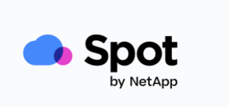

#Spot by Netapp 소개
---
Spot by NetApp은 클라우드 분석 및 권장 사항을 넘어 AWS, Azure 또는 Google Cloud의 클라우드 인프라를 자동화하고 최적화하여 SLA 지원 가용성과 성능을 가능한 한 가장 낮은 비용으로 제공합니다.
# 참조 링크
- [ Spot DOC ](https://docs.spot.io/)
- [ Spot support ](https://support.spot.io/hc/en-us)
- [ Spot Terraform ](https://registry.terraform.io/providers/spotinst/spotinst/latest/docs)